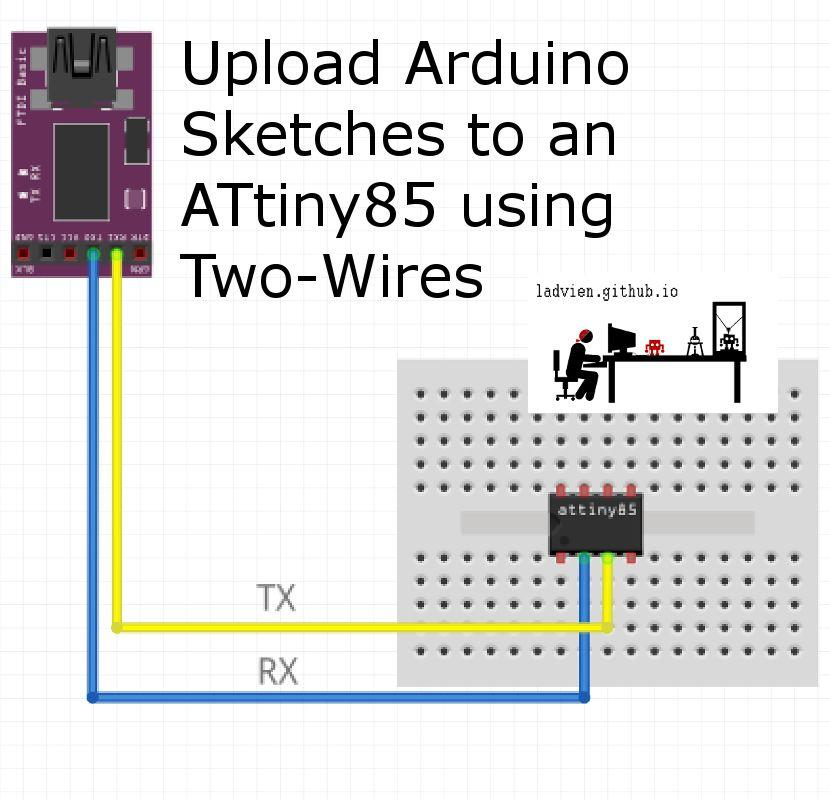
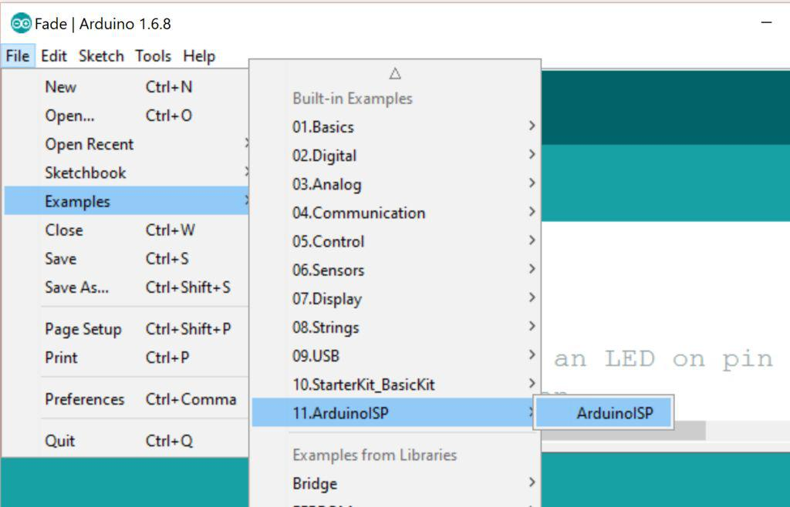
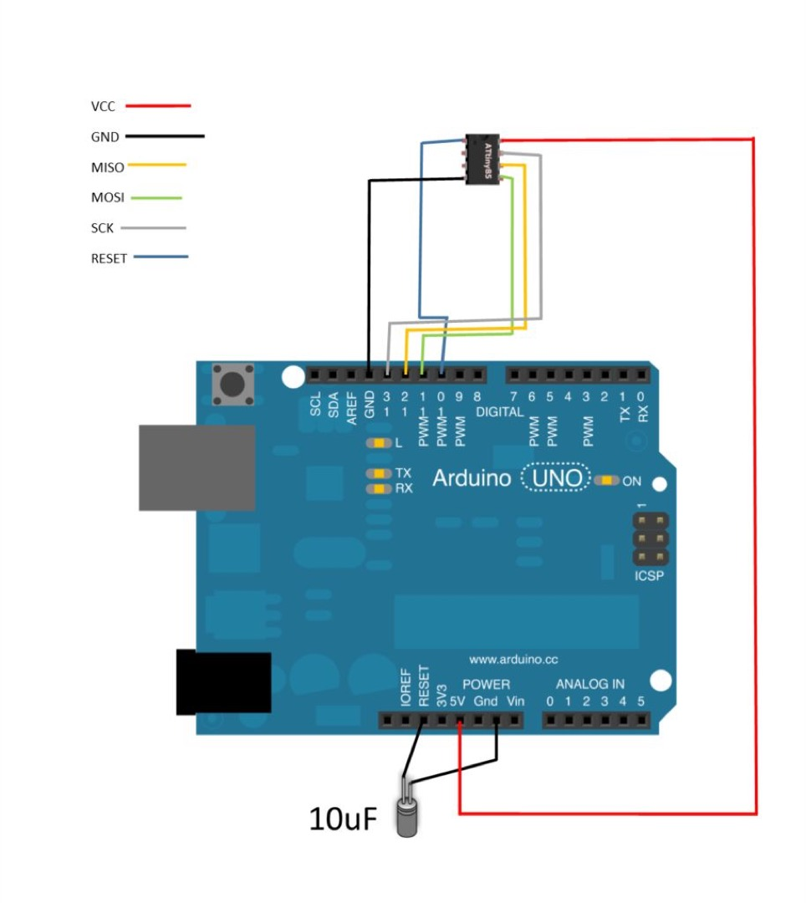
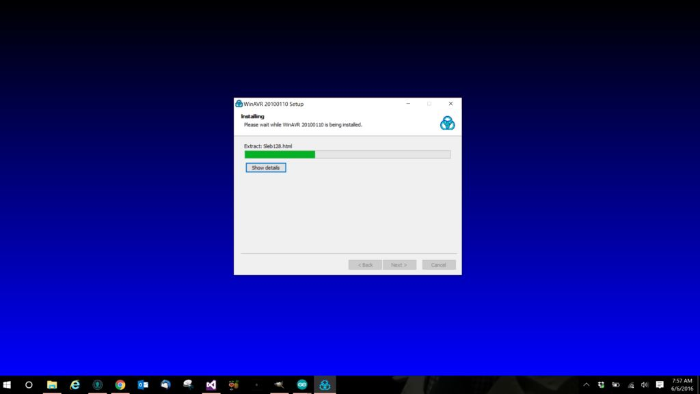

This article will show you how use a two-wire interface (UART) to upload Arduino sketches to the ATtiny85. In short, we will burn the [TinySafeBootloader](http://jtxp.org/tech/tinysafeboot_en.html) onto the ATtiny85 using an [Arduino Uno as an ISP](https://www.arduino.cc/en/Tutorial/ArduinoISP) programmer. After the initial burning of the bootloader, we can then program the ATtiny85 with any FTDI compatible USB-to-UART. And very similar steps may be followed to do the same for an ATtiny84.

There are a few requirements and a lot of setup needed:

### Prerequisites:

1. ATtiny85 / 84, or ATmega328P
2. Arduino Uno (or compatible, this will be used once to burn the bootloader to the ATtiny85)
3. [FTDI (or compatible UART)](http://www.ebay.com/itm/NF-FTDI-FT232RL-USB-to-TTL-Serial-Converter-Adapter-Module-5V-3-3V-For-Arduino-/221847346354)
4. [Arduino IDE](https://www.arduino.cc/en/Main/Software)
5. [AVRDUDE](https://sourceforge.net/projects/winavr/)

### Useful Components:

* Breadboardable Push Button
* 220-330 Ohm Resistor
* LED

### Why?

Many may ask, "Really, why would I want to go through all this trouble to install a bootloader on an ATtiny85 when it is less trouble just to use the Arduino ISP?" Good question.

This article was not meant to be independent. The entire purpose of the this is to prepare an ATtiny85 (actually, any ATtiny orATmega uCs) for wireless upload of Arduino sketches or AVR binaries.

## Step 1: Upload the ArduinoISP Sketch

There are several guides on how to use an Arduino as an ISP:

* [Programming AVR with Arduino](https://hardwarefun.com/tutorials/use-arduino-as-an-isp-programmer-to-program-non-arduino-avr-microcontrollers)
* [Using an Arduino as an AVR ISP (In-System Programmer)](https://www.instructables.com/id/Turn-Your-Arduino-Into-an-ISP/)

But outline the steps briefly, just in case.

before wiring up the Arduino Uno to the ATtiny85 you will need to install the Arduino ISP sketch onto the Arduino Uno. This is built into the Arduino IDE.

* File --> Examples --> 11. ArduinoISP --> ArduinoISP

Then hit the Upload button. Wire up the ATtiny85 After the ArduinoISP sketch has been uploaded it is time to burn our bootloader to the ATtiny85. Go ahead and wire your ATtiny85 to the Arduino Uno as shown in the image above.

## Step 2: Wire Up the ATtiny85 and Arduino

After the ArduinoISP sketch has been uploaded it is time to burn our bootloader to the ATtiny85. Go ahead and wire your ATtiny85 to the Arduino Uno as shown in the image.

## Step 3: Install AVRDUDE

Now, we will need to install AVRDude

* [WinAVR Download](https://sourceforge.net/projects/winavr/)
* [Linux Instructions](http://www.ladyada.net/learn/avr/setup-unix.html)
* [Mac Instructions](http://www.ladyada.net/learn/avr/setup-mac.html)

## Step 4: Burn the AVR Fuses
Once AVRDUDE has successfully install, open it by going to the Start Menu and typing

* cmd

This should open the Windows command prompt. Now, let's make sure AVRDUDE is installed. Type:

* avrdude

And press return. You should see output similar to what's in the image.

**Please be warned** what we are about to do has the potential of brick your ATtiny85. More specifically, if we set the fuses wrong on the ATtiny85 it might render the chip unusable. That stated, let's take a moment and talk through what we are doing.

At this point our Arduino Uno is setup as an ISP. We plan to use AVRDUDE to tell the ISP to burn the TinySafeBootloader onto our ATtiny85. In the process we will also set the fuses on the ATtiny85. These fuses are bits of memory which tell the ATtiny85 how to act. There are two will need to set to use TinySafeBoot on any ATtiny supported.

ATtiny85 & ATtiny84 (or any other ATtiny supported):

1. **SELFPRGEN** -- must be set to enable flash writes from firmware
2. **BODLEVEL** -- should be set to avoid flash corruption during unsafe device power-up.

If you are following this guide for the ATmega series the fuses need are:

1. **BOOTRST** -- activated lets the MCU jump into the Bootloader section with every hardware reset.
2. **BODLEVEL** -- should be set to avoid flash corruption during unsafe device power-up.
3. **BOOTSZ=11** -- to reserve 512 bytes for a Bootloader Section.
4. **BLB** -- set to MODE 2 or 3 to protect Bootloader section from undesirable write access by firmware.
If you don't quite trust me or if you would like to read more about fuses, here's a great explanation.

[AVR Fuses](https://embedderslife.wordpress.com/2012/08/20/fuse-bits-arent-that-scary/)

The fuse settings will be written to the ATtiny85 when when burn the bootloader by using AVRDUDE. You are welcome to calculate your own fuses using the nifty EngBedded web app:

[AVR Fuse Calculator](http://www.engbedded.com/fusecalc/)

However, I've provided the two commands you will need for the to program the ATtiny 84, 85, and ATmega328P. Copy the first command and paste it to the Windows prompt. If the command is successful, copy the second command. If both commands are successful, you should now have the TSB setup on your ATtiny or ATmega chip.

AVRDUDE command to upload:

### ATtiny**85** at **1mhz**

* avrdude -P **COM#** -b 19200 -c avrisp -p **t85** -v -e -U lfuse:w:0x62:m -U hfuse:w:0xdd:m -U efuse:w:0xfe:m

### ATtiny**85** at **8mhz**

* avrdude -P **COM#** -b 19200 -c avrisp -p **t85** -v -e -U lfuse:w:0xe2:m -U hfuse:w:0xdd:m -U efuse:w:0xfe:m

### ATtiny**84** at **1mhz**

* avrdude -P **COM#** -b 19200 -c avrisp -p **t84** -v -e -U lfuse:w:0x62:m -U hfuse:w:0xdf:m -U efuse:w:0xfe:m

### ATtiny**84** at **8mhz**

* avrdude -P **COM#** -b 19200 -c avrisp -p **t84** -v -e -U lfuse:w:0xe2:m -U hfuse:w:0xdf:m -U efuse:w:0xfe:m

### ATtmega328P at **8mhz**

* avrdude -P **COM#** -b 19200 -c avrisp -p m328p -v -e -U lfuse:w:0xFF:m -U hfuse:w:0xDA:m -U efuse:w:0x05:m

### ATmega328P at **16mhz**

* avrdude -P **COM#** -b 19200 -c avrisp -p m328p -v -e -U efuse:w:0x05:m -U hfuse:w:0xD6:m -U lfuse:w:0xFF:m

If you have any issues, please leave any questions in the comments below.

Oh! And don't disconnect the wires, leave everything as it is.  We are going to need to burn the flash memory next.

### Step 5: Installing the Bootloader

After the fuses have been set the TinySafeBootloader (TSB) is ready to be install on the respective AVR.  Now, TSB uses software serial and autobaud, so you have the option to use any pin set on the chip as TX / RX.  However, to do this, you will need to compile the firmware yourself using the TSB compiler:

* [TinySafeBootloader Firmware Compiler](http://jtxp.org/tech/tsb.zip) and Uploader (Windows)

Sadly, if you want to roll your own it must be from Windows.

That said, if you're brave and you don't mind using predefined pins, I've recompiled the bootloader for the ATtiny84, ATtiny85, and ATMega328.

* [TinySafeBootloader Firmware](https://github.com/Ladvien/TSB_and_Lumi)

**Beware** I'm not liable if these don't work.  However, if they don't, let me know in a comment below and I'll update them.

Ok! Last thing to do is to burn the firmware. Keeping the wiring the same from when we burned the fuses, now let's burn the actual firmware.

If you are using the precompiled firmware the AVRDude commands should look like this:

AVRDUDE command to upload:

### ATtiny**85**
* avrdude -P **COM#** -b 19200 -c avrisp -p t85 -v -e -U flash:w:tsb_tn85_b3b4_20150826.hex

### ATtiny**84**
* avrdude -P **COM#** -b 19200 -c avrisp -p t84 -v -e -U flash:w:tsb_tn84_a0a1_20150826.hex

### ATtmega328P
* avrdude -P **COM#** -b 19200 -c avrisp -p m328p -v -e -U flash:w:tsb_m328p_d0d1_20150826.hex

The "a0a1" portion of the firmware are the RX / TX pins.  For the precompiled firmware here are the pins:

### ATtiny**85**
* RX = 3
* TX = 4 

### ATtiny**84**
* RX = 0 / A0
* TX = 1 / A1

### ATtmega328P
* RX = 0 (RX)
* TX = 1 (TX)

Ok, that's it.  Let me know if you have questions.