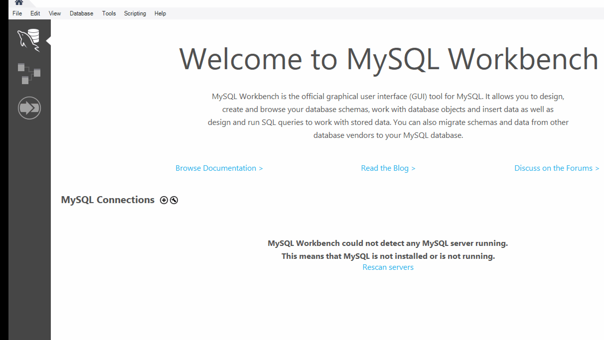

# Welcome

# Writing Style

# MySQL
## MySQL
Server / Desktop
MySQL Program
Databases
Tables
Fields

## Downloading MySQL Workbench
Prerequisties:
https://www.microsoft.com/en-us/download/details.aspx?id=30653
https://www.microsoft.com/en-us/download/details.aspx?id=48145

MySQL Workbench
https://dev.mysql.com/downloads/workbench/

## Connecting to the Server
## Show / Use Databases
## Tables
## Fields