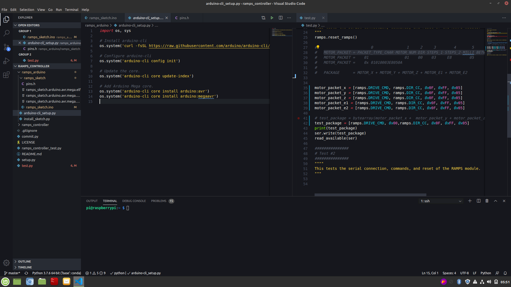

I've been working on an automated system for sorting LEGOs.  It seems like a simple enough task, however, the nuances of implementing a sorting machine reveal many complexities.  I've working solutions for a few of these challenges, such as identifying the LEGO and creating training data for supporting the classifier.  But one of the problems which has been trickier to solve seemed simple at first:  How do we get the LEGO from a container to the classifier?

The answer is easy is simple, right? A conveyor belt.  They are ubiquitous in manufacturing, so I thought, "Simple.  I toss a conveyor belt together real quick and that'll solve that."  Hah.  

But after a month and a half of failed attempts, I've created a working first iteration.


The system consists of 5 parts:

1. Raspberry Pi
2. Arduino Mega2560
3. RAMPs 1.4 with A4988s
4. Conveyor belt
5. NEMA17 Stepper Motor and Mount

Covering all of the implementation will be too much for one article, **so in this article I'll focus on the firmware for the Arduino / RAMPs.** And in a subsequent article I'll cover the physical build.

## Remote VSCode (sshfs)
I hate trying to program on computers besides my workstation.  I've also found it a bad idea to program code intended for a Raspberry Pi on my workstation.  To get the best of both worlds I use `sshfs`.  It lets me mount Raspberry Pi folders as if they were local folders.  This allows me to edit and run files on the Raspberry Pi from my workstation.



The setup is pretty simple, depending on your workstation's OS.

Luckily, DigitalOcean has already put together a multi-OS walkthrough of setting up `sshfs`

* [How To Use SSHFS to Mount Remote File Systems Over SSH](https://www.digitalocean.com/community/tutorials/how-to-use-sshfs-to-mount-remote-file-systems-over-ssh)

Once you have `sshfs` setup, you can create a directory and mount the entire Raspberry Pi to it.

For me, running Linux Mint, it was:
```
sshfs pi@192.168.1.x:/home/pi ~/rpi
```
A few notes on the above command:
* The `192.168.1.x` should be replaced with the `ip` of your Raspberry Pi
* `~/rpi` is the local directory where you are going to mount the Raspberry Pi.


## Arduino CLI Setup


## Python Convenience Scripts

## Arduino Mega2560 Firmware

### Six-Bit Communication

### Motor Polling


