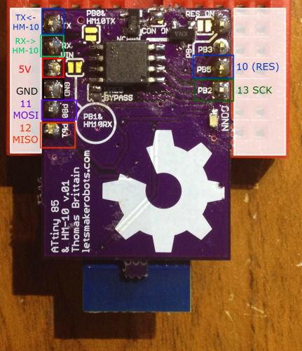
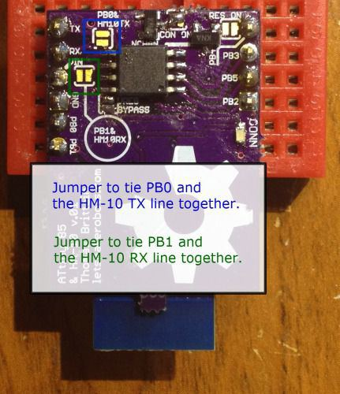
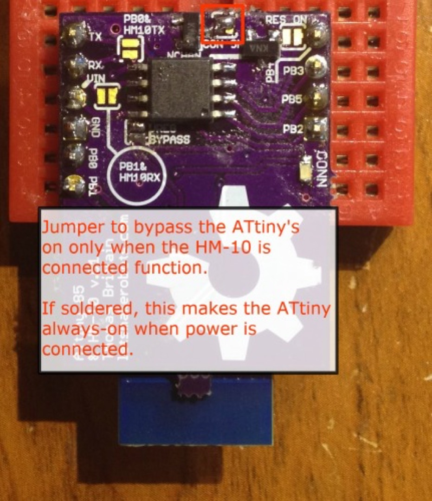
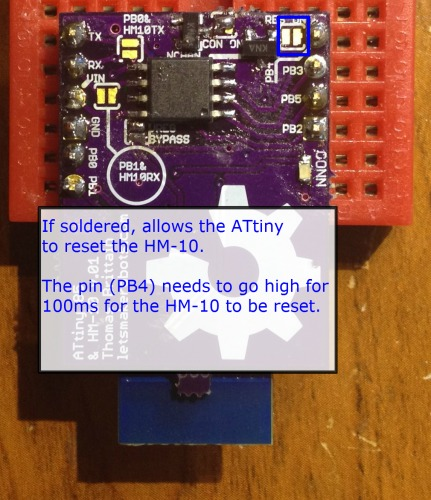
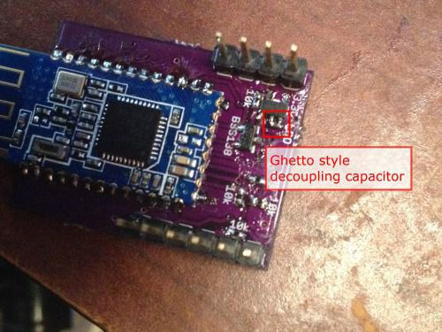

Originally posted on [www.letsmakerobots.com](www.letsmakerobots.com)

<a class="btn" href="/files/ATtiny_85__Serial_talking_to_HM_10_v4.zip" target="">ATtiny Bitsy Spider</a>

<iframe width="560" height="315" src="https://www.youtube.com/embed/wQFeiCescf0" frameborder="0" allowfullscreen></iframe>

UPDATE: Added BOM corrections. (Sorry for floating.)

Ok. Here's a finished board I've been working on for a bit.

In essence, it is a BLE node board.  It combines an HM-10 board with an ATtiny 85\.  This board builds off:

1.  [Bluetooth 4.0 (HM-10) ](http://letsmakerobots.com/node/38009)
2.  [ATtiny 85](http://letsmakerobots.com/node/39130)

The idea of the Bitsy Spider board is diminutive controller node.  I wanted it to be cheap and versatile enough to use as a node, but I think the final price is around $11 each.

Here's the ole GitHub:

*   [ATtiny Bitsy Spider](https://github.com/Ladvien/HM-10) (v.02)

The BOM:

1.  [OSHPark Board](http://www.oshpark.com/shared_projectss/dTdbdJec): $1.68 each ($5.05 minimum).
2.  1 x 20k Resistor -- 0402: $.04
3.  3 x 10k Resistor -- 0402: $.04
4.  2 x 1uF 0402 $.20
5.  3 x [BSS138](https://www.google.com/#q=bss138): $.60
6.  1 x [ATtiny 85](http://www.mouser.com/ProductDetail/Atmel/ATtiny85-20SU/?qs=8jWQYweyg6N/GXnwAe4Icw==) -- SOIC: $.80
7.  1 x [HM-10](http://imall.iteadstudio.com/im130614001.html): $6.50
8.  1 x 0603 LED $.11
9.  1 x [3.3V LDO](http://www.mouser.com/Search/ProductDetail.aspx?R=MCP1802T-3302I/OTvirtualkey57940000virtualkey579-MCP1802T-3302IOT) 300mA -- SOT-23-5 - Voltage Regulator: $.58

Total (approximate): **$10.55**

There are lots of solder-jumpers on this board, given it is meant to be versatile.  

Here is the programming pinout to use an Arduino as ISP

The board is intended to harness the serial connection of the HM-10\.  In this version I made it straight forward, you leave the jumpers between the RX/TX line of the HM-10 and the ATtiny unsoldered, program the ATtiny as many times as you like.  To test your serial connection between the ATtiny and the HM-10 simply breadboard the PCB and put jumpers like so:

**PB0 <---> TX**

** PB1 <---> RX**

This will allow you to test your code, without having to solder and unsolder.  Then, after your code is perfectish, solder the jumpers marked "PB1 & HM10 RX" and "PB0 & HM10 TX," then embed the Bitsy Spider.

This is an option that'll probably continue throughout different versions of the board.  I ran the GND connection of the ATtiny through a N-Chan MOSFET, and tied the gate of the FET to the PIO1\.  The PIO1 pin of the HM-10's function is for a Connection Status LED.  But one of the options one can set on the HM-10 is for the PIO1 to stay low unless the HM-10 has a connection.  This can be set on the HM-10 when it's in AT mode by typing:

1.  Type: **AT+PIO11**
2.  Response: OK+PIO11

When done, the ATtiny 85 will only power-up if the HM-10 has a connection.  Of course, the solder-jumper is meant to bypass this feature.

The last solder jumper controls the HM-10's reset.  If soldered, the ATtiny 85 can reset the HM-10 by sending PB4 high for ~100mS.  I added this as I hope to create a star-network with the ATtiny Bitsy Spider.  

Here's a summary explanation; the HM-10 has a time out feature after it losses connection from one HM-10 that prevents it from connecting to another for approximately 10 seconds.  So far, there is no option to bypass this "lost connection" time-out.  But resetting the HM-10 (<150mS power-cycle) bypasses this time-out.  I'll update more on this setup when I've completely tested it.  If there are questions, I've written a lot in the comments of my original [HM-10 post](http://letsmakerobots.com/node/38009).  But also feel fre to contact me.

One last thing I should mention.  

I expect one major mistake and two minors on the first run of every board I send off.  This board is no exception.  I forgot the decoupling capacitors on the voltage regulator and the HM-10\.  I've added them on the v.02 board.  Of course, this shouldn't be a major flaw, but with a capacitor on the voltage regulator it causes it to spit out 3.6v instead of 3.3v.  Major problem.  I saved this set of boards by soldering a 0402 1uF between the legs of the SOT-23-5 regulator.  Not fancy, but saved $5.
