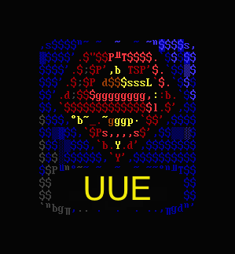
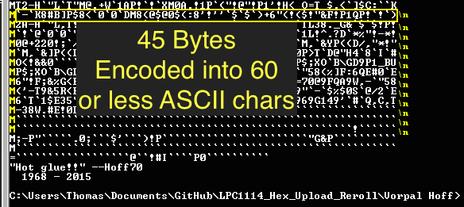

Originally posted on [www.letsmakerobots.com](www.letsmakerobots.com)

**I want to take a moment to thank [Bdk6](http://letsmakerobots.com/users/bdk6).  The man is a walking Stack Overflow, with more patience for stupid.  I doubt I'd understand any of this without his guidance.**

I thought I'd take some time away from coding my [LPC1114 Uploader](http://letsmakerobots.com/lpc1114-usb-serial-solution-rerolling-boot-uploader) and verbally process a few things I've learned.  As always, feel free to critique any of it; it'll only serve to make my code more robust in the end.  

This post will be a series of post leading up to the large post I'll make on writing the uploader.  All posts will rely on the GCC compiler.

Setting Up the GCC Compiler

I setup a C environment as basic I could.  There may be easier ways to go about this, but I wanted to use GCC to compile.  

To setup the environment:

1\. I downloaded and setup [MinGW32](http://www.mingw.org/wiki/HOWTO_Install_the_MinGW_GCC_Compiler_Suite).

2\. I added these **includes** to make the code go.


#include <stdio.h>
#include <stdarg.h>
#include <stdlib.h>
#include <windows.h>
#include <windef.h>
#include <winnt.h>
#include <winbase.h>
#include <string.h>
#include <math.h>
#include <stdbool.h>
#include <stdint.h>
#include <sys/time.h>


I used this line to build it:

**$ gcc -o main main.c**

As for editing, I've really grown to love [Sublime Text 2](http://www.sublimetext.com/2).

If you have issues**, make sure directory containing your files is in your PATH environment variable **(I go over how to add the directory to your environment variables in this [post](http://letsmakerobots.com/content/lpc1114-setup-bare-metal-arm)).

**How to Convert Hex Data to UUE**

**"What is 'UUEncoding'?"**

Unix-to-Unix encoding (UUE) is the process where **binary data is converted to a form which can be represented using ASCII character values from space (32) to underscore (95)**.  These 64 characters allow us to express any binary stream of data.

I will not spend a lot of time explaining **UUEncoding** since the [Wikipedia article is excellent](http://en.wikipedia.org/wiki/Uuencoding).

**"Why UUEncode?"**

Have you written a program to look for a particular value?  Like this,


int i;
char tCollection[32];
char c;``

if( c == 'T')
{
    Serial.print("I found a T!");
    tCollection[i] = c;
else if (c == '\r')
{
    exit();
}


You begin running your program and everything seems fine.  It is inspecting data looking for the letter T (0x54), but then, all of a sudden your program exits without reason.  You're upset, because the sensor sending you the data didn't send the exit code, which is a carriage return ('\r', or 0x13), but still, your program ended like it did.

Really, we know the reason, your program came across a random 0x13, which it interpreted as an exit command.  Maybe a different special character?

But you realize, if you are dealing with a 8-bit data stream any ASCII character _might_ be found in the incoming stream.  So, how can the communicating devices know when it is getting data, versus, when it is receiving a command?

This is where UUE comes in.  As I stated earlier, UUE is a way to represent the same 8-bit data using only hex values 0x32 through 0x95 (the two middle columns in the ASCII chart above).  This means characters 0x00 through 0x1F and 0x60 through 0x7F are free to be used for command functions.

Returning to the above example, this means we could now us the CR value to signal the end-of-transmission, since CR is 0x13.

Ok, I hope I've sold you on UUE's utility, let me attempt to explain the basics of how hexadecimal data is converted into a form which may be represented with only 64 values.

UUE conversion works with three bytes of data at a time and follows this algorithm.

1.  The individual bits of 3 HEX bytes are put into a series.
2.  The 24-bit series is then divided into four bytes of 6-bits.
3.  Then, 32 is added to the decimal value representing each of the 6-bit bytes.
4.  The resulting four values are UUEncoded bytes.

Confused as hell? I was too.  Pictures are good.  Let's follow the Wiki example and use: **Cat**

The first step is to take the binary values for each ASCII character.

*   'C' = 01000011
*   'a' = 01100001
*   't' =  01110100

This means the resulting 24-bit binary series is,

24-bit: 010000110110000101110100

This is then divided into four 6-bit bytes,

*   6-bit Byte:     1             2             3              4
*   Binary:      010000   110110    000101   110100

The new decimal values are,

*   6-bit Byte:        1             2             3              4
*   Decimal:         16           54            5             52

At this point the 6-bit (senary) byte gave me a little trouble.  I didn't understand how 6-bits were treated by the 8-bit variable I was putting them in.  For example, how could I get an **int variable** to take only 6 bits, not 8?  The trick is understanding the 8-bit variable is only the width of the allotted space provided in a register, it has no influence on what you put in it.  It finally dawned on me, I didn't need to worry about the empty bits in a register.

Examples are good:

010000     = 16 in Decimal

00010000 = 16 in Decimal

010000 = 00010000

Anyway, this is how I finally made sense of it.  As long as when I did my bit manipulations I kept unused bits of the register towards the "left" side, the my 6-bit values could be put into a 8-bit register and there value would remain the same.

Alright, back to our example.

Our next step is to add 32 to each of the decimal value of our new four bytes.

*   6-bit Byte:        1             2             3              4
*   Decimal:         16           54            5             52
*   Add 32          +32        +32          +32           +32
*   New Dec.        48          86            37            84
*   **UUE char:       0            V             %             T**

And...that's it.  Your data is now UUEncoded.  When it is sent through whatever transmission medium it wont be bothered with special character protocals.  For our Cat, we have transformed it into: **0V%T**

Let's hope for the Cat's sake, there is decoding algorithm.

**Those sharper than myself may have already noticed a couple of problems.**  For instance, what if our data doesn't come in increments of threes?  For example, how do we send **Cats?**

The answer? We make nothing up.  In the instance of Cats, we simply pad the end of the character series with two nulls on the end.  For example,

*   'C' = 01000011
*   'a' = 01100001
*   't' =  01110100
*   's' = 01110011
*   NUL = 00000000
*   NUL = 00000000

48-bit: 010000110110000101110100011100110000000000000000

*   6-bit Byte:     1               2             3              4           5               6              7              8
*   Binary:    010000    110110    000101    110100    011100    110000     000000    000000

The new decimal values are,

*   6-bit Byte:        1             2             3            4           5            6              7              8
*   Decimal:         16           54            5           52         28          48             0              0

*   6-bit Byte:        1             2             3            4           5            6              7              8
*   Decimal:         16           54            5           52         28          48             0              0
*   Add 32          +32        +32          +32        +32      +32         +32          +32         +32
*   New Dec.        48          86            37          84        60           80            32            32
*   **UUE char:       0            V             %             T        <             P            SPC        SPC**

We have turned "Cats" into "**0V%T
 **  0V%T
Hmm, what else are you going to need to know? **Oh, right, how the UUE data is stored.****

UUE stores and sends data in lines.  A line of UUE data consist of a start character, which represents how many bytes have been encoded in the line (**not** how many UUE characters are in the line) by using a 6-bit number stored as an ASCII char.  The line of UUE data ends with a new line character (i.e., '\n').  Lastly, a UUE line is limited to 45 bytes of data.  This means, the maximum amount of data characters in on line of UUE should be no more than 60\.  Or, 62, if you count the start character and the end character.

Again, examples are good.  For our Cats, the line would look something like this,

*   $ **0V%T
> 2) & 0x3f);
		uue_char[1] = (((byte_to_encode[0] << 4) | ((byte_to_encode[1] >> 4) & 0x0f)) & 0x3f);
		uue_char[2] = (((byte_to_encode[1] << 2) | ((byte_to_encode[2] >> 6) & 0x03)) & 0x3f);
		uue_char[3] = (byte_to_encode[2] & 0x3f);

		for (int i = 0; i < 4; i++)
		{
			// 5. Replace ' ' with '''
			if (uue_char[i] == 0x00)
			{
				UUE_data_array[UUEncoded_array_index] = 0x60;
			}
			else
			{
				UUE_data_array[UUEncoded_array_index] = (uue_char[i] + ' ');
			}

			UUEncoded_array_index++;
		}

		// Data bytes left.
		bytes_left = (hex_data_array_size - hex_data_array_index);

		if (uue_length_char_index == 0 && bytes_left > 0)
		{
			// NOTE: Could be simplified to include first char
			// and additional characters, using a positive index.
			// 1. Add char for characters per line.
			UUE_data_array[UUEncoded_array_index] = '\n';
			UUEncoded_array_index++;

			if(bytes_left < 45)
			{
				// Find how many characters are left.
				UUE_data_array[UUEncoded_array_index] = ((bytes_left & 0x3f) + ' ');
			}
			else
			{
				UUE_data_array[UUEncoded_array_index] = 'M';
			}
			UUEncoded_array_index++;
			uue_length_char_index = 45;
		}

	} // End UUE loop
	UUE_data_array[UUEncoded_array_index] = '\n';

	// 6. Return UUE data array (implicit) and size.
	return UUEncoded_array_index;
}

int check_sum(uint8_t * hex_data_array, int hex_data_array_size)
{
	int check_sum = 0;
	int char_index = 0;

	while(char_index < hex_data_array_size)
	{
		check_sum += hex_data_array[char_index];
		char_index++;
	}
	return check_sum;
}


*   3-8: Here, I outline in pseudo-code what I wanted to get done in this function.
*   17-25: I deal with the start character of the first line.  I do this by checking if hex data we were handed is more than the UUE line limit, 45 bytes.  If it is, I place an M as the start character (45 + 32 = 77 = ASCII **M**).  If the data we've been handed is less than 45 bytes, let's calculate the start character.  We take 65 bits of the 8-bit number representing how many bytes are here, then add 32, this will give us our start character.
*   30-96: This is the main loop where the work is done.  We loop through all the hexadecimal data provided us, encoding as we go.
*   33-48: The loop here deals with 3 bytes of data at a time.  It also checks to see if we have less than 3 bytes left, if so, it pads the remaining space with 0 (null).
*   47: This index is used in combination with the if statement found one lines 82-90\.  It is in essence repeating the beginning if statement where we determined what the start character for this line will be.
*   51-54: This is where the magic happens.  Here, we are turning the 3 bytes of 8 bits, into 4 bytes of 6 bits.  We store the resulting bits in an 8-bit variable.  But remember, we can put 6 bit data in a 8 bit jar, as long as we remember to be careful how we place the bits.
*   56-69: The resulting 6-bit characters are checked to see if they are a space character (0x20), if they are, we turn them into a grave ' '  ' character (0x60).  If they are not a space, we add 32 to the decimal value (' ' = 32 in decimal), this completes the encoding process.
*   72: We calculate how many data bytes are left, in preparation for calculating the next line's start character.
*   74-96: This loop serves two purposes.  One, to place a new-line character ('\n') at the end of our last encoded line.  Two, to calculate and load the next line's start character.
*   96: When we've reached the end of our data, we place a new-line character to mark the end.
*   112: We return the number of ASCII characters used to represent our encoded data.

And there you go.  **UUE!**

Here are some additional resources I found helpful,

1.  [Wikipedia's article on UUEncoding](http://en.wikipedia.org/wiki/Uuencoding)
2.  [NXP's Application Note on UUEncoded for their uCs](../images/UUE__app_note.pdf)
3.  [Bdk6](http://letsmakerobots.com/users/bdk6)
