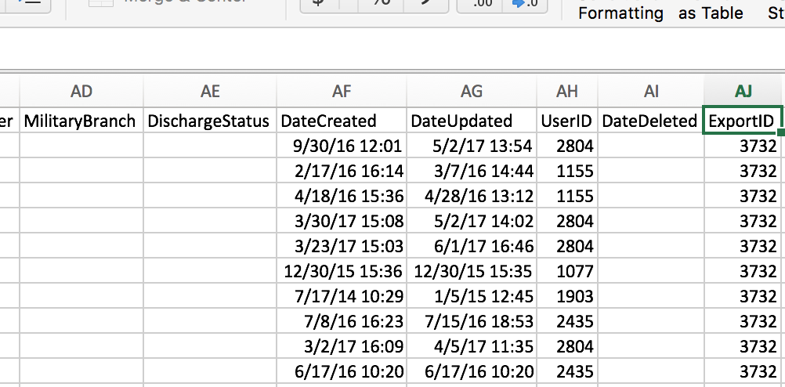

# Creating a Data Error Report by User
In this work challenge we will combine  Client and Enrollment data, then we will add a non-HMIS dataframe which contains user account information.  After these data are merged, we will then parse them for missing data elements and provide a by-user list of data errors.

## Data Needed
As stated above, the data needed are:

1. `Client.csv`
2. `Enrollment.csv`
3. A dataframe containg HMIS user contact info.

The key to this challenge literally is at the end of every HMIS CSV.  Each exported CSV contains some [metadata](https://en.wikipedia.org/wiki/Metadata) which describes how the data were produced.

The `DateCreated` should represent when the respective row was actually entered into the HMIS.  `DateUpdated` is the last time that row was modified and saved in the HMIS.  The `UserID` is the case-manager who last modified these data.  Lastly, the ExportID is the number which identifies a collection of HMIS CSVs to be in the same batch.

We are going to focus in on the `UserID` element.  Notice, you will not find the usernames, real names, email address, or really any contact information for individual HMIS users.  However, having a unique user ID in each CSV would still allow HUD to use [internal validity tests](https://en.wikipedia.org/wiki/Internal_validity) to determine the reliability of the user.

For us, we are going to take another source of data containing all of the UserIDs _and_ contact information for the users.  Now, this will probably be different each HMIS software vendor.  But each vendor should have a way to export a list of the users in the system with their `UserID`, which will allow us to join these data to the HMIS CSVs.

For those participating in the work challenge from my CoC, I'll provide a CSV with these user data.

After actual user names are joined to the CSVs, then we will begin to parse the CSVs for data errors.  If you aren't yet familiar with the term [parse](https://en.wikipedia.org/wiki/Parsing) in computer science, think of it as diagraming a setence where we make the computer do all the work.  Instead of a sentence, we will be diagraming a row of data to determine if there are any errors.

## What's an HMIS Data Error?
The HMIS Data Dictionary is specific about what a data error is.

* 8 -- Client doesn’t know
* 9 -- Client refused
* 99 -- Data not collected 
* Blank
* Incomplete response
* Non-determinable response

Here's an example of a Client.csv which contains one of each type of error.

|PersonalID                       |FirstName |LastName |DOB        |SSN         |DisablingCondition |VeteranStatus |
|:--------------------------------|:---------|:--------|:----------|:-----------|:------------------|:-------------|
|ZP1U3EPU2FKAWI6K5US5LDV50KRI1LN7 |          |Tesa     |2010-01-01 |123-45-6789 |1                  |8             |
|IA26X38HOTOIBHYIRV8CKR5RDS8KNGHV |Fela      |Falla    |1999-1-1   |4321        |1                  |1             |
|LASDU89NRABVJWW779W4JGGAN90IQ5B2 |Sarah     |Kerrigan |           |Blahblah    |99                 |0             |

Here are the data errors:

1. Tesa is first name blank
2. Sarah's DOB is blank
3. Fela's SSN is an incomplete response (must be 9 digits)
4. Sarah's SSN is non-determinable
5. Sarah's DisablingCondition was not collected.
6. Tesa refused to provide a VeteranStatus.

## The Goal
We are going to take a HMIS data and join it with a dataframe containing end-user information.  Then, we will create a query to subset the dataframe so we get a dataframe which contains _only_ rows with data errors.  Lastly, we will get counts of the types of data errors and the names end-users who've caused the most data errors.

The data elements we will look into for errors:

1. FirstName
2. LastName
3. DOB
4. VeteranStatus
5. DisablingCondition
6. RelationshipToHoH

To get this information we will need to do the following:

1. Load Client.csv, Enrollment.csv, and Users.xlsx
2. Left join the clientDf and enrollmentDf.
3. Left join the usersDf to the result of step 2.
4. Parse the data elements listed above for data errors
5. Create a dataframe which contains only rows with data errors
6. Use the SQL Count function to count the number of data errors by the element list above.
7. Use the SQL Count function to count how many times a end-users name is associated with a row containing errors.
8. Create a dataframe of these counts
9. Save the dataframe containing the error counts into an Excel file (.xlsx)

## The Resources
Below are the resources which should help for each step:

TBD