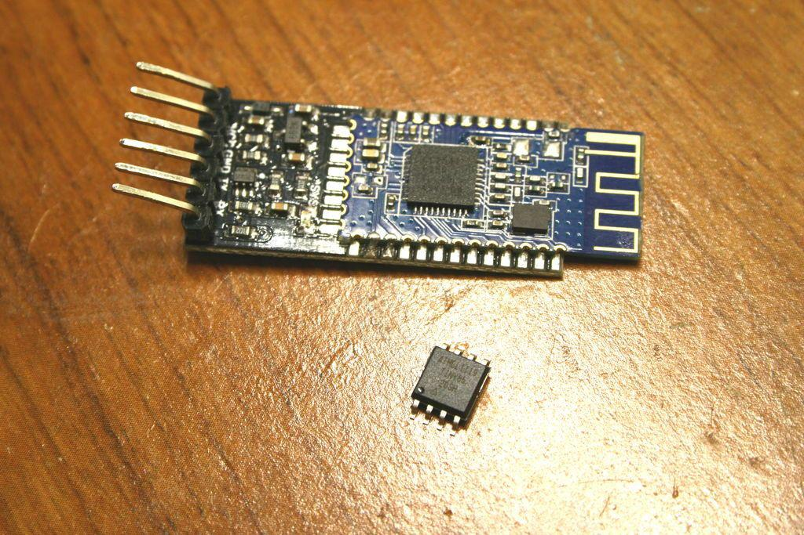
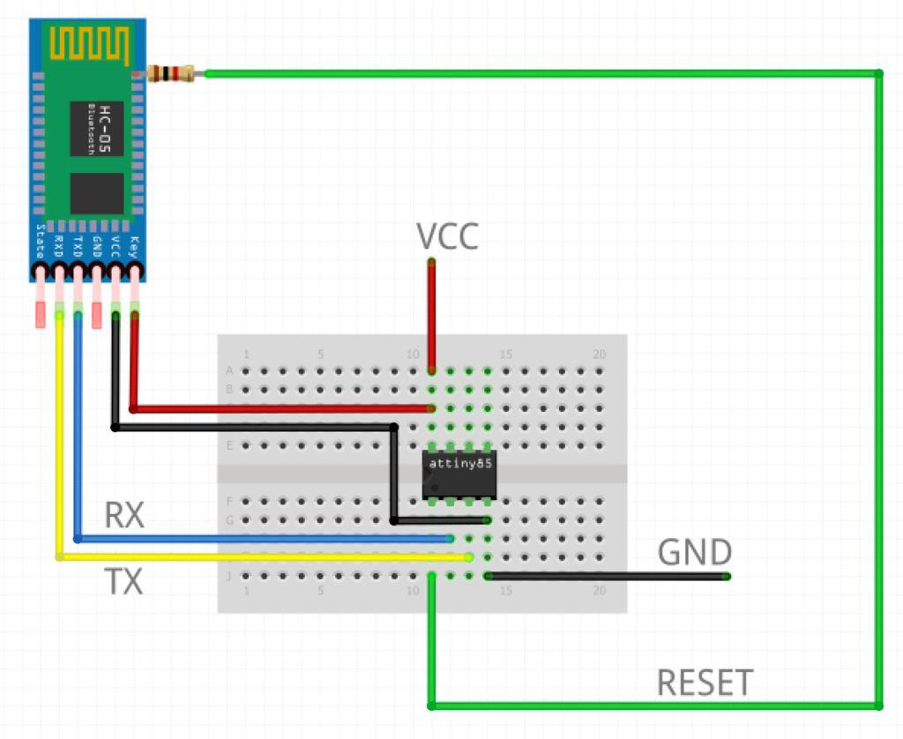
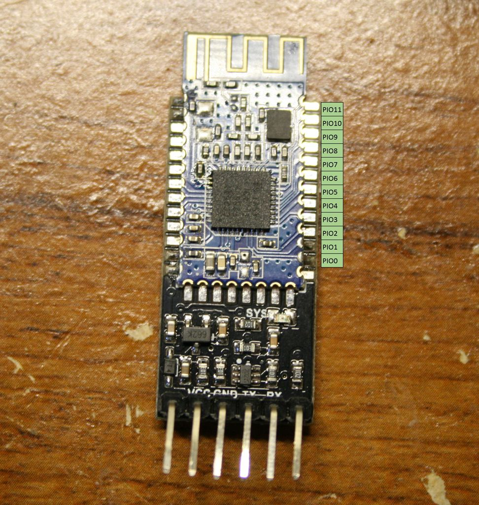
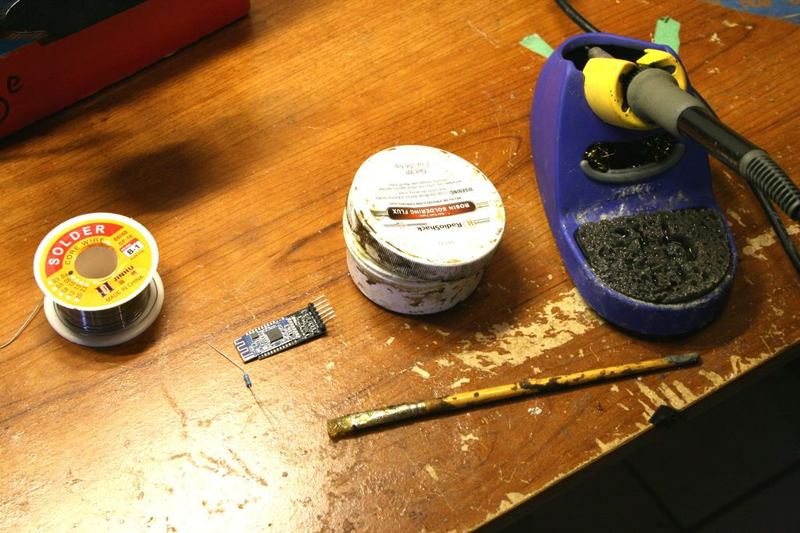
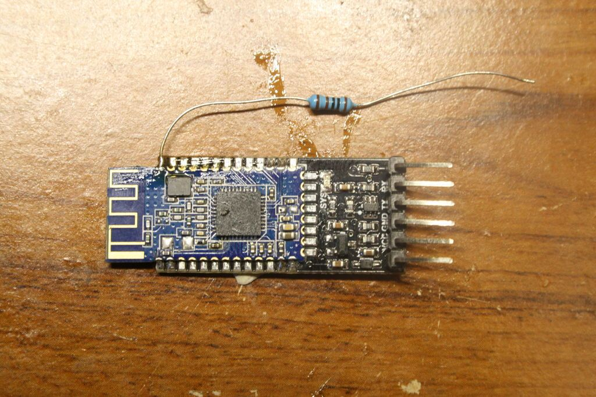
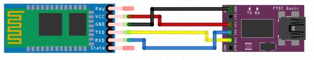
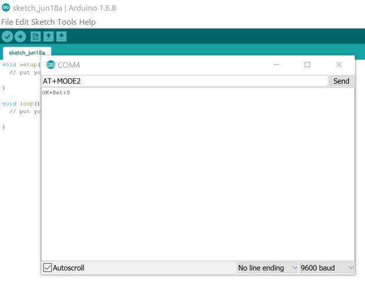
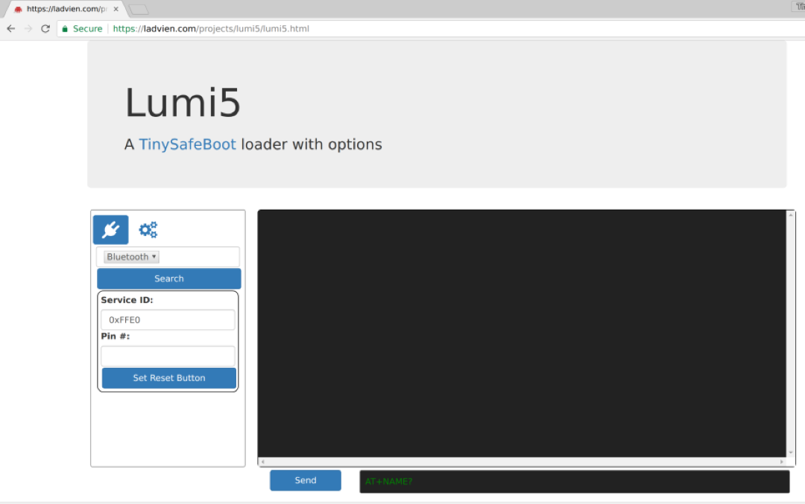

## Lumi5 -- AVR / Arduino Wireless Uploader
This article will focus on setting up the Bluetooth 4.0 module, preparing the uploader, and uploading sketches over Bluetooth 4.0

Prerequisites:

This article builds off:

[Upload Arduino Sketches to ATtiny85 with UART](https://ladvien.com/burning-tinysafeboot-using-arduino-isp/)

The above article will need to be followed to prepare your ATtiny85 and Windows computer.

1. ATtiny85 (or any ATtiny or ATmega chip)
2. Arduino Uno (or compatible, this will be used once to burn the bootloader to the ATtiny85).
3. [FTDI](http://www.ebay.com/itm/NF-FTDI-FT232RL-USB-to-TTL-Serial-Converter-Adapter-Module-5V-3-3V-For-Arduino-/221847346354) (or compatible UART).
4. Lumi (a browser based uploader for TinySafeBoot).
5. [Arduino IDE](https://www.arduino.cc/en/Main/Software)
6. [AVRDUDE](https://sourceforge.net/projects/winavr/)
7. [HM-10 or HM-11 Breakout](http://www.ebay.com/itm/Tinysine-Serial-Bluetooth-4-0-BLE-Module-iBeacon-IOS-Iphone-Andorid-/221390932333?hash=item338bed896d:g:abcAAMXQ1d1THXrR)*
8. 1k Resistor
9. Soldering iron

*Note: There are much cheaper versions of the [breakout listed on eBay](http://www.ebay.com/sch/i.html?_odkw=hm-10&_sop=15&_osacat=12576&_from=R40&_trksid=p2045573.m570.l1313.TR0.TRC0.H0.Xhm-10+breakout.TRS0&_nkw=hm-10+breakout&_sacat=12576), but beware, there are many clones which will not work with this project. The one I've listed I've verified as working. Of course, I always recommend you [roll your own breakout](https://www.instructables.com/id/How-to-Create-an-Arduino-Compatible-Bluetooth-40-M/) :)

Why?

Over-the-air uploading of programs to embedded devices is one of the more useful implementations in the history of embedded hardware. It allows the post-production and delivery of gadgets to have their behavior tweaked in reaction to end-user feedback.

Likewise, the Arduino phenomenon probably needs little explanation in this venue. However, I've personally not found many solutions for over-the-air uploading of Arduino sketches which have acceptable trade-offs. This article, along with the preceding, are nothing more than attempts to share what I've found.

## Overview:

This is simply for those who are curious on how this works, it may be skipped.

This tutorial will show you how to wirelessly upload Arduino sketches to an ATtiny85 over a PC's built in Bluetooth 4.0 hardware and an HM-10. The concept is fairly simple.

The HM-10 has firmware which allow it to monitor all incoming serial data for AT commands. It can then intercept these commands from the stream, allowing the user to remotely control the behavior of the HM-10. In short, the HM-10 allows you to send a command to send a pin HIGH or LOW.

Now, the TinySafeBootloader is a serial bootloader for the ATtiny and ATmega AVR chip sets (these are the heart of Arduino). The most important difference between the TinySafeBootloader and others is it allows serial control over the bootloader behavior, this allows programmers to write uploader software for it, which is what I've done for this project.

To the point, we will wire up an HM-10 and an ATtiny with the TSB bootloader. One of the HM-10's IO pins will be connected to the ATtiny's RESET line. This will allow us to send a command to the remote HM-10, sending the ATtiny85 into bootloader mode, upload a sketch over the Bluetooth connection, then send another command to the HM-10 to send the ATtiny85 back into program execution mode.

## Setup

### Select a Pin
You will need to select a IO pin on the HM-10 to connect the 1k resistor. Any of the pins listed above should be supported.

### Solder the 1k Resistor

After you have selected the IO pin you would like to use, solder a 1k resistor to the castellated (the half-via leads) on the HM-10.

A few notes:

This is not as hard as it looks; believe in yourself
Flux and a fine-tip iron are helpful, but required
Tweezers allow you to work angles.
[Tacky-putty](https://jet.com/product/detail/bfbbcfea4f2b450abb35083231522c2f?jcmp=pla:ggl:gen_jd_office_supplies_a3:general_office_supplies_mounting_putty_a3_other:na:PLA_344948460_23657809380_pla-154643897340:na:na:na:2&code=PLA15&ds_c=gen_jd_office_supplies_a3&ds_cid&ds_ag=general_office_supplies_mounting_putty_a3_other&product_id=bfbbcfea4f2b450abb35083231522c2f&product_partition_id=154643897340&gclid=Cj0KEQjw4pO7BRDl9ePazKzr1LYBEiQAHLJdR-oUE22XqS7e9hLmUcQZfVej2JZ1BSIbo7coDJ3onLcaAtHF8P8HAQ&gclsrc=aw.ds) helps hold the board in place, leaving both hands free to hold components.

<iframe width="560" height="315" src="https://www.youtube.com/embed/BqkU3-iWdIU" frameborder="0" allow="autoplay; encrypted-media" allowfullscreen></iframe>

### Configure the HM-10 Firmware for Remote Uploading

Before the uploader will work, the HM-10 must be set as a peripheral device and remote transmission mode.

1. Connect the FTDI chip to the HM-10 breakout, as shown.
2. Open the Arduino IDE.
3. Select the COM port connected to your FTDI chip
4. Open the Serial terminal
5. Make sure the terminal is set to, "No line ending"
6. Type AT+ROLE0 and hit "Send". The response "OK+Set:0" come up.
7. Now, type AT+MODE2 and hit "Send. The response should be "OK+Set:2".

Optional:

1. You can set the HM-10's baud rate up to 57,600 (it gets iffy above this rate). This allows the bootloader to run more quickly. Here are the commands:
* AT+BAUD0 = 9600
* AT+BAUD1 = 19200
* AT+BAUD2 = 38400
* AT+BAUD3 = 57600

2. You can change the name of your device using "AT+NAMExxxxxxxx".

### Wire It Up

The following connections will need to be made:

VCC should be 5V

### Compile a Sketch to Upload

In the Arduino IDE, write a program you want to upload to your wireless TSB setup. *However*, instead of using the Arduino to upload the file, we are going to use it only to compile.  To do this, go to *Sketch -> Export Compiled Binary*  Then, select *Sketch -> Show Sketch Folder*.  In this folder there will be two .HEX files.  You want the one which does not have "..._with_bootloader.ino".  (Since, we already have a bootloader installed on our ATtiny.)

### Connect to the HM-10 Module from Lumi5

I've provided a web based uploader for TinySafeBoot.  A couple of notes, it only works in Chrome on Linux and Mac.

Before attempting to use the uploader, please open Chrome and type:


chrome://flags/#enable-experimental-web-platform-features


To get Chrome's "experimental" Bluetooth LE web API to work we have to turn it on.  Go ahead and select *Enable*.

### Lumi5
Go ahead and navigate to:

* [Lumi5](https://ladvien.com/projects/lumi5/lumi5.html)

This is the work-in-progress web based TinySafeBoot loader I've been working on.  The HM-10 uploader is functional, though.  

Turn on your HM-10.  Select *Bluetooth* from the dropdown box and hit *Search*.  If all has gone well, then you will see the name of your HM-10 module listed.  Go ahead and connect to it.

Now, in the *Pin #* box, type the pin number corresponding with the pin on your HM-10 which you are using to reset the TinySafeBootloader.

Select the multi-gear button.  This should give you a bootloader handshake button.  Try it.  It may take a couple of tries, but you should see the bootloader respond with the device signature and memory information.

If all went well, go ahead and click the Upload File button.  Select the compiled HEX file from the *Compile a Sketch* step and hit upload.

Cross your fingers.  It should respond with tell you it has written the file.  

**Important**: Go ahead and refresh the webpage and reconnect.  Once you've reconnected, the program you uploaded should be running.

We setup the HM-10 to hold the reset line low when the module is not connected, this is to save power.  But it can be frustrating if your unaware of the setup, as it's difficult to troubleshoot.  "Why the heck isn't the program running!?"

Please, *please* be kind and provide feedback.  This is a work-in-progress, using a lot of custom hardware and experimental code.

List any questions below and I'll try to troubleshoot ASAP.
