[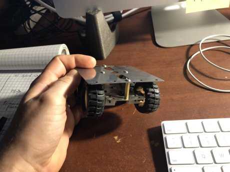{: .float-left}](https://ladvien.com/images/1b1_frame.jpg) Not too long ago there was a post on Hackaday about a little four-wheeled bot made with a Raspberry Pi and some eBay motor drivers.

[Raspberry Pi Zero Drives Tiny RC Truck](https://hackaday.com/2018/01/24/raspberry-pi-zero-drives-tiny-rc-truck/)

I really liked the little chassis, ordered one, and was happy to find it was delivered with the motors already mounted.  (As I become an aged hacker, it's the little time savers which are genuinely appreciated.)

On buying the chassis I'd already decided to use one of my Raspberry Pi Zero W's (rp0w) to control the bot.  I really like Arch Linux on the rp0w.  It's light weight and the packages are well curated.  Again, it's the little time savers.  I liked the combination even more since I found a way to set the rp0w headlessly, which meant I could go from SD card to SSH'ing into little Linux board.

* [Headless Arch Linux on Raspberry Pi Zero W](https://ladvien.com/installing-arch-linux-raspberry-pi-zero-w/)

Coincidentally, I purchased several DRV8830 modules from eBay.  This is a sad story -- I've played with the DRV8830 chip a long time ago:

* [Kobold](https://ladvien.com/kobold/)

 Because Sparkfun did a great job of documenting the IC and creating an Arduino library to go with it.  I was disheartened to find Sparkfun and EOL'ed the boards.

* [MiniMoto Boards](https://www.sparkfun.com/products/retired/11890)

Probably because buttholes like me kept buying them off eBay.  I've got some mixed feelings here -- one of them is guilt.

[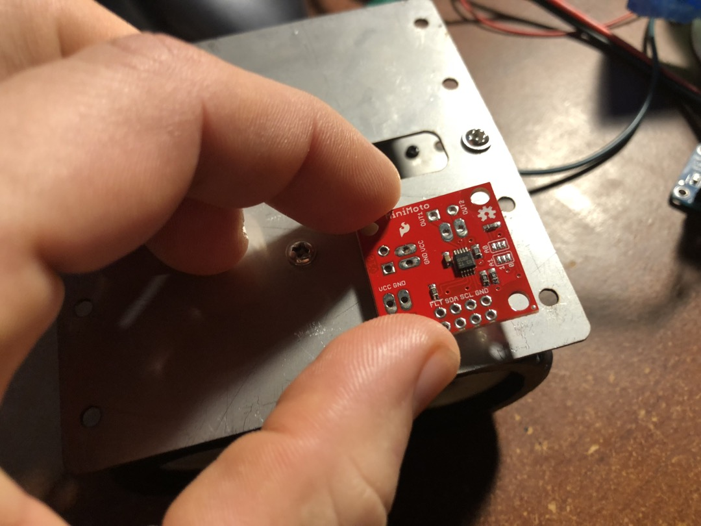{: .float-right}](../images/1b1_holes_line_up.jpg)
Anyway, I was surprised to find the mounting holes on the DRV8830s matched a set on the chassis. I decided to attempt using one module to drive two motors, thereby only needing two DRV8830 modules to drive the entire bot.

I've had some thermal paste lying about for years--it works nicely as an adhesive.  Also, I was hoping to use the chassis to heatsink the motor drivers.
<div style="clear: both;"></div>

[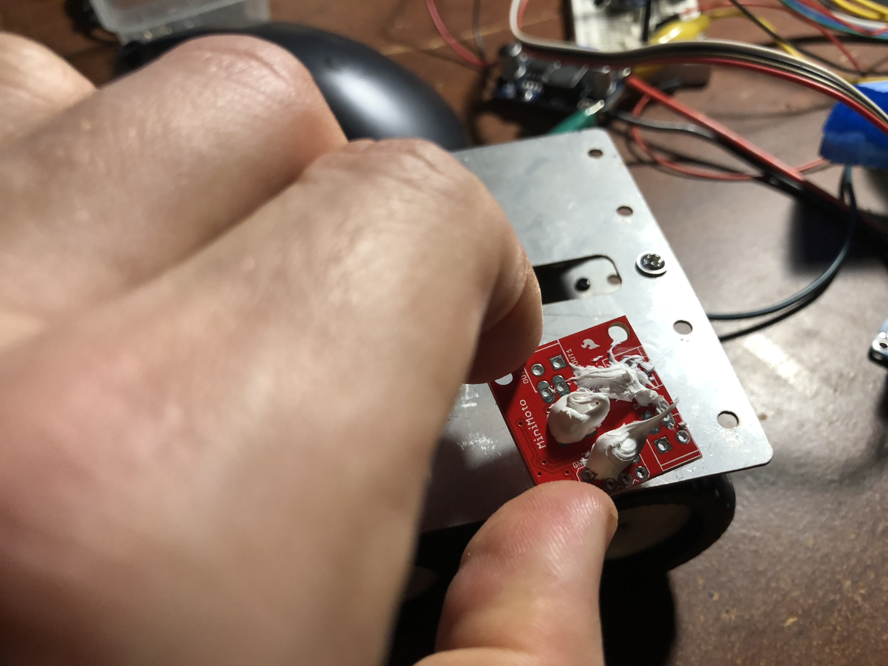{: .thumbnail}](https://ladvien.com/images/1b1_thermal_paste.jpg)
[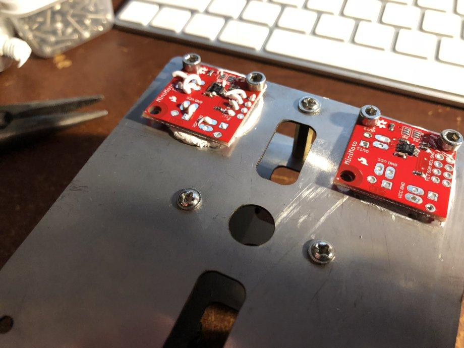{: .thumbnail}](https://ladvien.com/images/1b1_board_latched_down.jpg)
[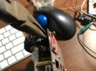{: .thumbnail}](https://ladvien.com/images/1b1_screw_it_down.jpg)
[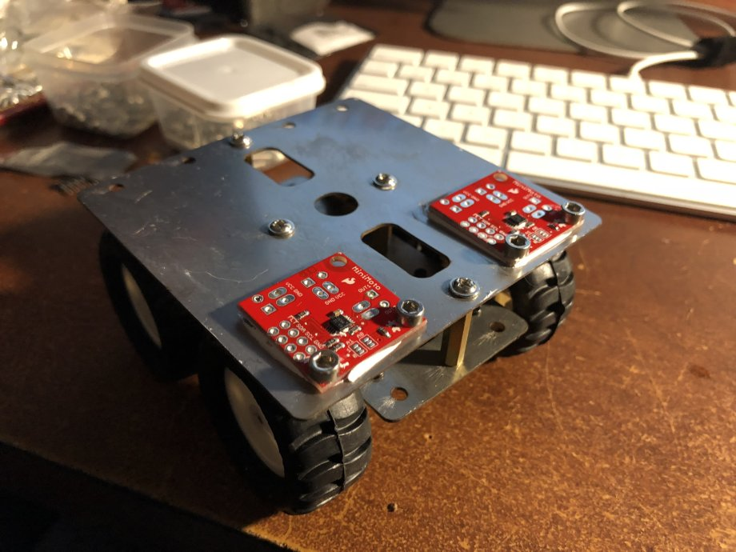{: .thumbnail}](https://ladvien.com/images/1b1_boards_latched_down2.jpg)


<div style="clear: both;"></div>

A bit of a tangent.  At work one of the skills which is useful for our team is being able to work with APIs.  For awhile I've wanted to learn NodeJS, since it seems to be the goto framework for solid back-end business applications.  It doesn't hurt StackOverflow's Developer Survey for the last few years has shown JavaScript is a solid language to stay sharp on.  Specifically, being able to work within the NodeJS framework makes one pretty darn marketable.

* [StackOverflow's 2018 Develop Survey](https://insights.stackoverflow.com/survey/2018)

Ok, for these reasons I decided to build this bot using NodeJS.  I've written a separate article on setting up NodeJS, working with i2c-bus, and porting the DRV8830 Sparkfun library to NodeJS.

* Not yet written (shesh, been busy.  Judge much? :P)

[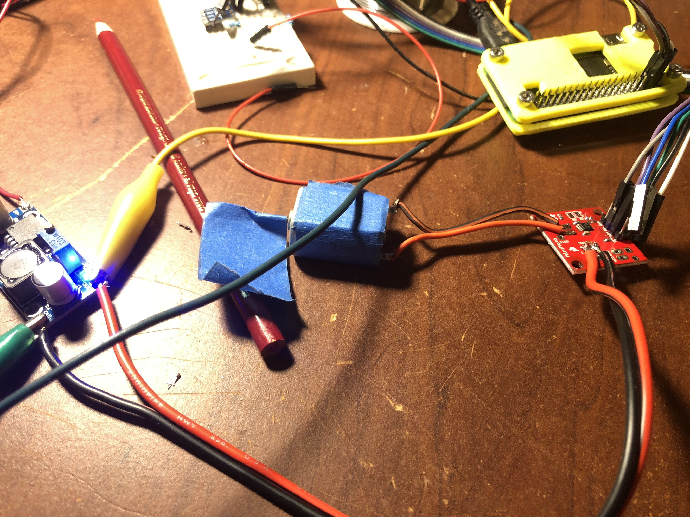{: .float-left}](https://ladvien.com/images/1b1_test_drv8830.jpg)
It didn't take time at all to get the little motor spinning using NodeJS largely due to Michael Hord's (Sparkfun) MiniMoto library. (Again, some guilt here.)

* [NodeJS DRV8830 Library](https://github.com/Ladvien/drv8830)

I drove the motor shown using two series Li-Ion batteries connecting to a buck converter set to output ~5.0v.  The motor spun nicely and pulled around 200mA.  However, the real test would be connecting to _two_ geared motors per DRV8830.

<div style="clear: both;"></div>



'use strict';
var i2c = require('i2c-bus'), i2c1 = i2c.openSync(1);
var sleep = require('sleep');
var drv8830 = require('./drv8830');

const motorAddressOne = 0x61;
const motorAddressTwo = 0x67;

var motor1 = new drv8830(motorAddressOne, i2c1);
var motor2 = new drv8830(motorAddressTwo, i2c1);

motor1.drive(50);
motor2.drive(50)
sleep.msleep(3500);
motor1.drive(-50);
motor2.drive(50);
motor1.stop()
motor2.stop()


[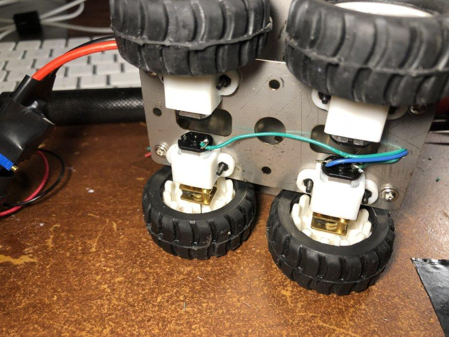{: .float-right}](https://ladvien.com/images/1b1_wiring_the_motors.jpg)

It was time to wire up the chassis motors and create a test of the system.  The wire used was some eBay single core aluminum wire (the cheap stuff).  Wiring was pretty straightforward.

However, I did make a little i2c bus board from perfboard and JST connectors.  Adding both ceramic and electrolytic decoupling capacitors for smoothing and to aid peak discharge.

Note the heaping amount of heatsink goop on the underside of the perfboard, this was a hacker's solution to galvanically isolating the perfboard from the steel chassis.

<div style="clear: both;"></div>

[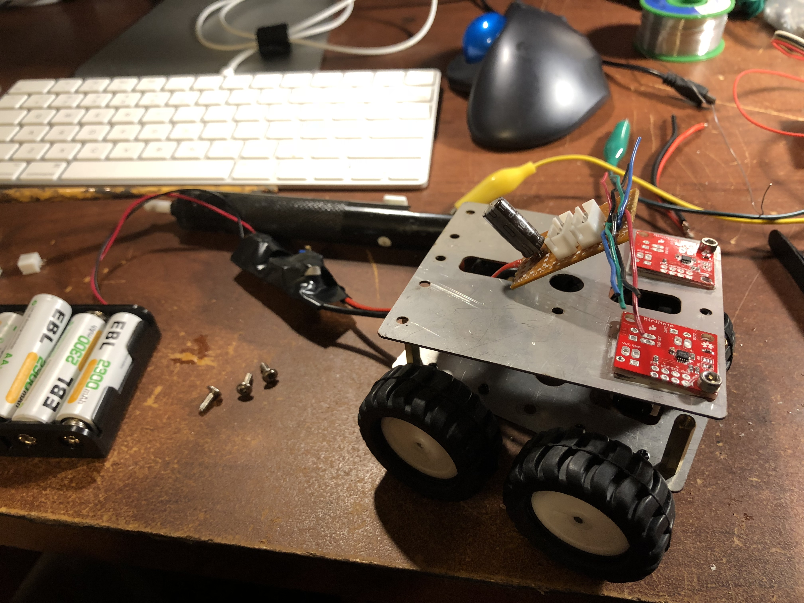{: .thumbnail}](https://ladvien.com/images/1b1_making_a_interface.jpg)
[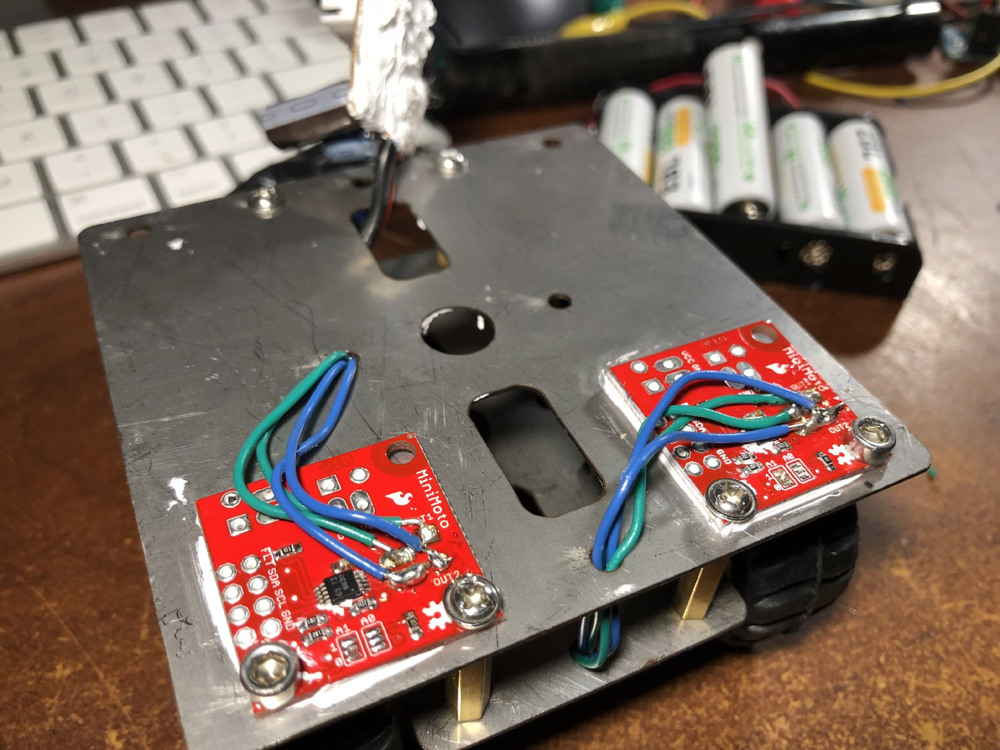{: .thumbnail}](https://ladvien.com/images/1b1_wiring_motors_2.jpg)
[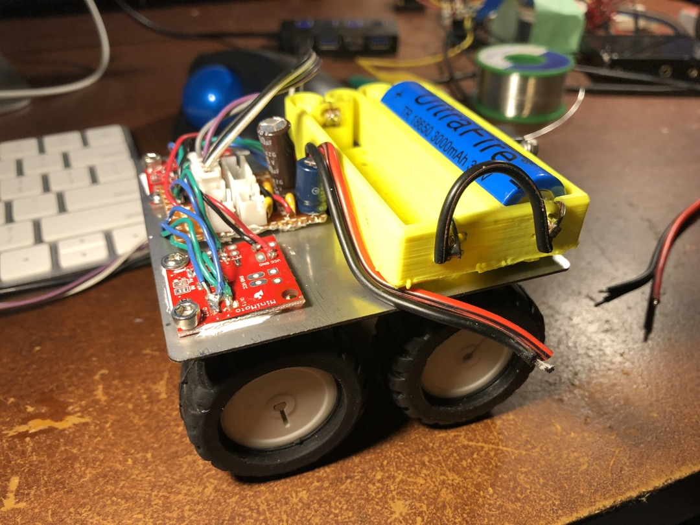{: .thumbnail}](https://ladvien.com/images/1b1_adding_power.jpg)
<div style="clear: both;"></div>

### One-B-One Schematic
```
+--------------+                    +------------------+           +------------------+
|              |                    |                  |           |                  |
|              +--+LEAD1+----+OUT1+-+                  |VCC----+5V-+                  |
|              |                    |                  |           |                  |
| Motor 1      +--+LEAD2+----+OUT2+-+   DRV8830+A      +----GND----+  Buck Regulator  |
|              |                    |                  |           |                  |
|              |                    |                  |           |                  |
|              |                    |                  |           |                  |
+--------------+                    +-----+---+--------+           +--+--+------------+
                                          |   |                       |  |
                                      SDA1|   | SCL1               5V |  | GND
                                          |   |                       |  |
                                          |   |                       |  |
                                          |   |                       |  |
                                          |   |                       |  |
                                     +----+---+--------+              |  |
                                     |                 |              |  |
                                     |                 |              |  |
                        +----+VCC2+--+  ADUM1250ARZ    ++VCC1+--------+  |
                        |            |                 |                 |
                        |   ++GND2+--+                 ++GND1+-----------+
                        |   |        |                 |
                        |   |        +----+--+---------+
                        |   |             |  |
                        |   |         SDA1|  | SCL2
                        |   |             |  |
                        |   |             |  |
                        |   |             |  |
                  +-----+---+-------------+--+-------+

                            Raspberry Pi Zero W
```

[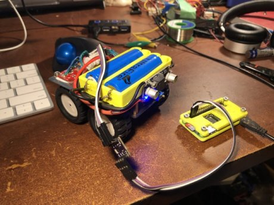{: .float-left}](https://ladvien.com/images/1b1_power_and_isolated.jpg)
The ADUM1250ARZ is a bi-directional galvanic isolator for digital communication up to 1mbs.  It's the first chip I ever designed a PCB for and it's still my favorite.  Essentially, the ADUM1250 seperates the rp0w from the noisy motors -- and more importantly, if I screw something up on the motor side, won't kill my rp0w. *The ADUM1250 is not necessary for most people, just me*

* [ADUM1250 (Mouser)](https://www.mouser.com/_/?Keyword=ADUM1250ARZ&FS=True)
* [Eagle Breakout PCB](https://github.com/Ladvien/Ladviens-Eagle-Files/tree/master/ADUM1250ARZ%202-sided)
* [Datasheet](http://www.analog.com/media/en/technical-documentation/data-sheets/ADUM1250_1251.pdf)
* [_Very_ Old Work with the IC](https://ladvien.com/arduino-to-rpi-optoisolated-i2c/)

<div style="clear: both;"></div>
[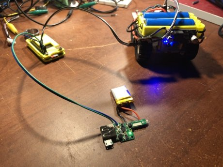{: .float-right}](../images/1b1_no_strings.jpg)
The last bit I had to figure out was the the Raspberry Pi's power.  I attempted to use a single Li-Ion battery and a boost regulator to power it, but the regulator's I bought were DOA.

Then I remembered the load-sharing and boost converter circuit salvaged from a battery bank.  The charge circuit was built for Li-Po chemistry and the only Li-Po I had lying about was a 350mA.  I wired it up and was surprised the whole thing worked, with the added benefit of being able to charge the rp0w battery without disconnecting it.  _Booyah!_

The last bit I did for the video.  I pulled the `npm` package keypress and wrote this little program.


'use strict';
var i2c = require('i2c-bus'), i2c1 = i2c.openSync(1);
var sleep = require('sleep');
var drv8830 = require('./drv8830');
var keypress = require('keypress');

const motorAddressOne = 0x61;
const motorAddressTwo = 0x67;

var motor1 = new drv8830(motorAddressOne, i2c1);
var motor2 = new drv8830(motorAddressTwo, i2c1);

// var speed = 63;
var turnSpeed = 33;
var driverSideSpeed = 63;
var passangerSideSpeed = 63; 

// make `process.stdin` begin emitting "keypress" events 
keypress(process.stdin);
 
// listen for the "keypress" event 
process.stdin.on('keypress', function (ch, key) {  
  if (key && key.ctrl && key.name == 'c') {
    process.stdin.pause();
  }
  switch(key.name) {
        
    case 'w':
        motor1.drive(driverSideSpeed);
        motor2.drive(passangerSideSpeed);
        break;
    case 's':
        var motors = [motor1, motor2];
        setDriveWithAcceleration(motors, driverSideSpeed, 10);
        break;
    case 'd':
        motor1.drive(turnSpeed);
        motor2.drive(turnSpeed*-1);
        break;
    case 'a':
        motor1.drive(turnSpeed*-1);
        motor2.drive(turnSpeed);
        break;
    default:
        motor1.stop();
        motor2.stop();
  }

});
process.stdin.setRawMode(true);
process.stdin.resume();

var setDriveWithAcceleration = function(motors, desiredSpeed, accelTimeMilliSec) {
    for(var i = 0; i < desiredSpeed; i++){    
        motors[0].drive(i);
        motors[1].drive(i);
        sleep.msleep(accelTimeMilliSec);
    }
}


Then, I shot the following video and called it donesies.

<div style="clear: both;"></div>
<div class="flex-video">
<iframe src="https://www.youtube.com/embed/PmRkM8vABuI" frameborder="0" allowfullscreen></iframe></div>
