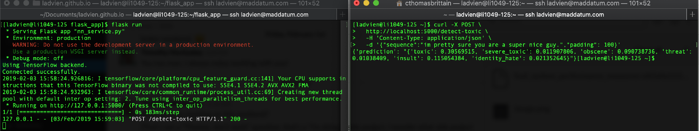
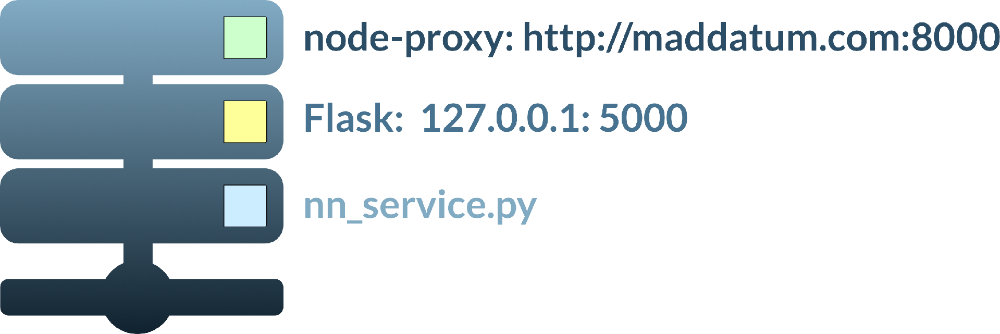

We're almost done.  In the previous articles we've used a local machine to train a CNN to detect toxic sentiment in text.  Also, we prepared a small (1GB RAM) server to use this pre-trained network to make predictions.  Now, let's finish it and create a webservice where anyone can access our awesome magical algorithm.

### Prediction Service
On your remote server, navigate to your `flask_app` folder and create a file called `nn_service.py`. The following code creates an HTTP request endpoint `/detect-toxic` and it exposes to other programs running on the server.  A bit more explanation after the code.

```
cd /home/my_user/flask_app
nano nn_service.py
```
Enter the following:
```python
from flask import Flask, request
application = Flask(__name__)

from keras.models import load_model
from keras.preprocessing.sequence import pad_sequences
import numpy as np
import pymongo
import json

# Parameters
mongo_port = 27017
embedding_collection = 'word_embeddings'
word_embedding_name = 'glove-wiki-gigaword-50'
pad_length = 100

# Globals
global model, graph

# Connection to Mongo DB
try:
    mong = pymongo.MongoClient('127.0.0.1', mongo_port)
    print('Connected successfully.')
except pymongo.errors.ConnectionFailure:
    print('Could not connect to MongoDB: ' + e)

db = mong[embedding_collection]
coll = db[word_embedding_name]

# Load Keras Model
model = load_model('/home/my_user/flask_app/models/tox_com_det.h5')
model._make_predict_function()

# Start flask
if __name__ == '__main__':
    application.run(host='127.0.0.1')

@application.route('/detect-toxic', methods=['POST'])
def sequence_to_indexes():
    with open('nn_service.log', 'w+') as file:
        file.write('here')
    if request.method == 'POST':
        try:
            sequence = request.json['sequence']
        except:
            return get_error('missing parameters')
        response = {
            'prediction': prediction_from_sequence(sequence, pad_length)
        }
        return str(response)

def get_word_index(word):
    index = ''
    try:
        index = coll.posts.find_one({'word': word})['index']
    except:
        pass
    return index

def get_error(message):
    return json.dumps({'error': message})

def prediction_from_sequence(sequence, pad_length):
    sequence = sequence.lower()
    sequence_indexes = []
    for word in sequence.split():
        try:
            index = int(get_word_index(word.strip()))
        except:
            index = 0
        if index is not None:
            sequence_indexes.append(index)
    sequence_indexes = pad_sequences([sequence_indexes], maxlen=pad_length)
    sample = np.array(sequence_indexes)
    prediction = model.predict(sample, verbose = 1)
    prediction_labels = ['toxic', 'severe_toxic', 'obscene', 'threat', 'insult', 'identity_hate']
    prediction_results = str({prediction_labels[0]: prediction[0][0],
                              prediction_labels[1]: prediction[0][1],
                              prediction_labels[2]: prediction[0][2],
                              prediction_labels[3]: prediction[0][3],
                              prediction_labels[4]: prediction[0][4],
                              prediction_labels[5]: prediction[0][5]
                            })
    return prediction_results
```
What's going on?  Well, it's an extension of code I've detailed in earlier parts of this series.  However, there are a couple of new pieces.

First, we are connecting to our MongoDB database containing the contextual word-embeddings.  This database is used to look up words, which have been sent to our service endpoint.

The only route in this server is a `POST` service.  It takes one argument: `sequence`.  The sequence is the text the webservice consumer would like to have analyzed for toxic content.  The endpoint calls the `prediction_from_sequence()`.  Inside the function, the word indexes are pulled from the `word_embeddings` database.  After, the newly converted sequence is padded to the needed `100` dimensions. Then, this sequence is passed to our CNN, which makes the prediction. Lastly, the prediction is converted to JSON and returned to the user.

Before we go much further, let's test the script to make sure it actually works.  Still in the `flask_app` directory type, replacing `my_user` with your user name and `name_of_flask_app.py` with the name of your Flask app:
```bash
echo "# Flask variables" &>> /home/my_user/.bashrc
echo "export FLASK_APP=name_of_flask_app.py" &>> /home/my_user/.bashrc
```
This sets `FLASK_APP` variable, which is used when executing the `Flask` webservice.

Ok, we should be able to test the app fully now:
```bash
flask run
```
You should be greeted with something similar to:
```
 * Serving Flask app "nn_service.py"
 * Environment: production
   WARNING: Do not use the development server in a production environment.
   Use a production WSGI server instead.
 * Debug mode: off
Using TensorFlow backend.
Connected successfully.
2019-02-03 15:53:26.391389: I tensorflow/core/platform/cpu_feature_guard.cc:141] Your CPU supports instructions that this TensorFlow binary was not compiled to use: SSE4.1 SSE4.2 AVX AVX2 FMA
2019-02-03 15:53:26.398145: I tensorflow/core/common_runtime/process_util.cc:69] Creating new thread pool with default inter op setting: 2. Tune using inter_op_parallelism_threads for best performance.
 * Running on http://127.0.0.1:5000/ (Press CTRL+C to quit)
```
Great! We're on the home stretch.  

I've prepared a `curl` statement to test the server.  You will need to leave the Flask program running and open a second terminal to your server.  When the second terminal is up paste in the following, replacing the "sequence" with something nasty or nice.
```
curl -X POST \
  http://localhost:5000/detect-toxic \
  -H 'Content-Type: application/json' \
  -d '{"sequence":"im pretty sure you are a super nice guy.","padding": 100}'
```
You _should_ get back an appropriate response:


### NodeJS and node-http-proxy
It gets a bit weird here.  Usually, one will setup a Flask server with `uwsgi` or `gunicorn` combined with `nginx`.  However, I found the `uwsgi` middle-ware was creating two instances of my project, which would not fit in the microserver's RAM.  I spent _a lot_ of time creating a server the `proper` only to be disheartened when I discovered `uwsgi` was creating two instances of the `nn_service.py`, thereby attempting to load two of the CNNs into memory.  Our poor server.  I gave up on "proper" and went with what I describe below.  However, I've created a bash script to completely setup a server for you the "proper" way. I've added it to the Appendix.

I've opted to run Flask and serve it with a `nodejs` server as a proxy.  


The `nodejs` is atypical, but I found it probably the most simple to setup.  So, eh.

Let's install NodeJS on the server.
```
sudo yum install -y nodejs
```
Now move to the directory containing your flask_app and initialize a node project.
```
cd /home/my_user/flask_app
npm init
```
You will be prompted to enter the project--take your time to fill it out or skip it by hitting return repeatedly.

Once the project has been setup, let's install the [node-http-proxy](https://github.com/nodejitsu/node-http-proxy) package.  It will allow us to create a proxy server sitting on top of our Flask service in a couple of lines of code.

Still in your project directory:
```
npm install node-http-proxy
nano server.js
```
Inside the server file place:
```js
var http = require('http'),
    httpProxy = require('http-proxy');
httpProxy.createProxyServer({target:'http://localhost:5000'}).listen(8000);
```
Alright, before testing our Flask webservice we need to allow `8000` port access and allow `HTTP / HTTPS` request on the firewall.
```
firewall-cmd --permanent --zone=public --add-service=http
firewall-cmd --permanent --zone=public --add-service=https
sudo firewall-cmd --zone=public --add-port=8000/tcp --permanent
sudo firewall-cmd --reload
```
You can test the whole proxy setup by opening two terminals to your server.  In one, navigate to your Flask app and run it:
```
cd /home/my_user/flask_app
flask run
```
In the other navigate to the `node` proxy file and run it:
```
cd /home/my_user/flask_app/proxy
node server.js
```
Now, you should be able to make a call against the server. _This time_, run the `curl` command from your local machine--replacing the `my_server_ip` with your server's IP address:
```
curl -X POST \
  http://my_server_ip:8000/detect-toxic \
  -H 'Content-Type: application/json' \
  -d '{"sequence":"im pretty sure you are a super nice guy.","padding": 100}'
```
You should get a response exactly like we saw from running the `curl` command locally.

### Daemonize It
The last bit of work to do is create two daemons.  One will keep the Flask app running in the background.  The other, will keep the proxy between the web and the Flask app going.

One caveat before starting, because daemons are loaded without the `PATH` variable all file references must use absolute paths.

At the server's command prompt type:
```
sudo nano /etc/systemd/system/nn_service.service
```
And add the following replacing `my_user` with your user name:
```
[Unit]
Description=Flask instance to serve nn_service
After=network.target

[Service]
User=my_user
Group=my_user
WorkingDirectory=/home/my_user/flask_app
ExecStart=/usr/local/miniconda/bin/flask run

[Install]
WantedBy=multi-user.target
```
This will create a service.  It will run the program pointed to by `ExecStart`, in our case `flask run`, inside the directory pointed by `WorkingDirectory`.

Save and exit.

Now, let's create the `nn_service_proxy.service` daemon:
```
sudo nano /etc/systemd/system/nn_service_proxy.service
```
And enter the following replacing `my_user` with your user name:
```
Description=Proxy to Flask instance to serve nn_service
After=network.target

[Service]
User=my_user
Group=my_user
WorkingDirectory=/home/my_user/flask_app/node
ExecStart=/usr/bin/node /home/my_user/flask_app/node/nn_service_proxy.js

[Install]
WantedBy=multi-user.target
```
Great! We're ready to enable and start them.
```
sudo systemctl enable nn_service.service
sudo systemctl enable nn_service_proxy.service
sudo systemctl start nn_service.service
sudo systemctl start nn_service_proxy.service
```
Alright, you can now check the system journal to make sure they loaded correctly:
```
sudo journalctl -xe
```
But, it _should_ be good.  If something goes wrong, definitely ask questions in the comments.  Otherwise, we should be ready to test our full functioning toxic text detection webservice!
```
curl -X POST \
  http://my_server_ip:8000/detect-toxic \
  -H 'Content-Type: application/json' \
  -d '{"sequence":"im pretty sure you are a super nice guy.","padding": 100}'
```
Wow! What a journey right.  But pretty damn cool.  We now have a webservice which can be called by anyone who wants to check text to see if it contains toxic sentiment.  I didn't have an application when starting this project, but I'm learning webscraping with a friend, and I think it'll be great to pass text off to this webservice and have it flagged if contains nasty content.

### "Proper" Flask Webservice Setup
I've written a script to setup the webservice for you.  First, you will need to be logged into your Centos 7 server as root.

Then type:
```
yum install -y wget
wget http://ladvien.com/assets/centos_nn_webservice.sh
chmod +x centos_nn_webservice.sh
```
What this script does:

1. Sets up a new user
2. Adds Miniconda to the PATH variable.
3. Adds Flask environment variables (needed to run app).
4. Updates the server.
5. Creates the flask_app directories
6. Opens the needed ports
7. Installs `nginx`
8. Creates a `nginx` .conf file with information to proxy `uwsgi` service.
9. Installs `uwsgi` creates a .ini file for wrapping the Flask app.
10. Creates and enables a `uwsgi` daemon.
11. Creates and enables a `Flask` daemon.
12. Installs Miniconda, tensorflow, and sets Python to 3.6.8.
13. Installs MongoDB
14. Enables remote editing from VSCode ([info](https://ladvien.com/visual-studio-code-raspberry-pi/))

We're about to execute the script, **but there's a critical step I wanted to explain first.  The script is going to take several commandline arguments.  If these are wrong, it'll royally jake up your server.**

```
./centos_nn_webservice.sh user_name user_password flask_app_name flask_port
```

* **user_name** This will be the user who provides the webservice
* **user_password** The user's password.  You'll need this to `ssh` into the server as this  user.
* **flask_app_name** This is the name of your app.  Everything from the Python script to the daemon will be labeled with this name.
* **flask_port** This is the port which will be exposed to the web.

Ok, replace all of the above commandline arguments with the ones you prefer and execute it.  Cross your fingers or yell at me in the comments.
