The last two articles have been getting oriented to SQL, however, the information in them will disappear quickly if we don't give you a way to practice on data meaningful to you.  Let's face it, as much fun as it is to find out random employees salaries, those don't mean anything to _you_.  

This article will show you how to setup a copy of MySQL Server on your PC, connect to it, load data from a CSV, and query those data.  There's a lot to get done, so let's get started.

# Local MySQL Server Setup
Each of the three operating systems are a little different on how you must go about setting up a local copy of MySQL Server.  Unfortunately, Windows is the most complex.  Anyway, feel free to skip to the appropriate section

* [Windows](https://ladvien.com/data-analytics-mysql-localhost-setup/#windows)
* [Max](https://ladvien.com/data-analytics-mysql-localhost-setup/#mac)

## Windows
First, download the MySQL MSI Installer.

* [MySQL Server Windows Installer](https://dev.mysql.com/downloads/installer/)

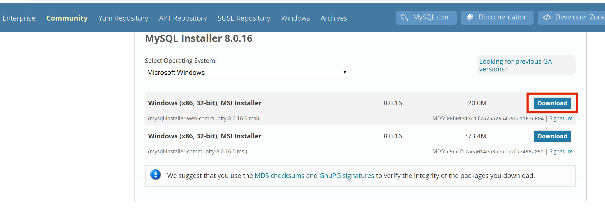

After you've downloaded it, open the the file.

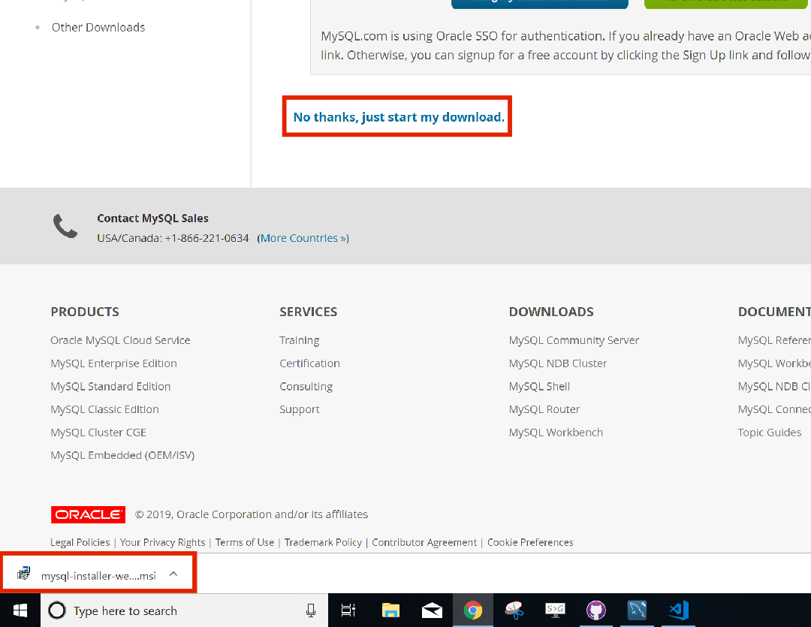

If you are prompted to "Upgrade" go ahead and say "Yes"

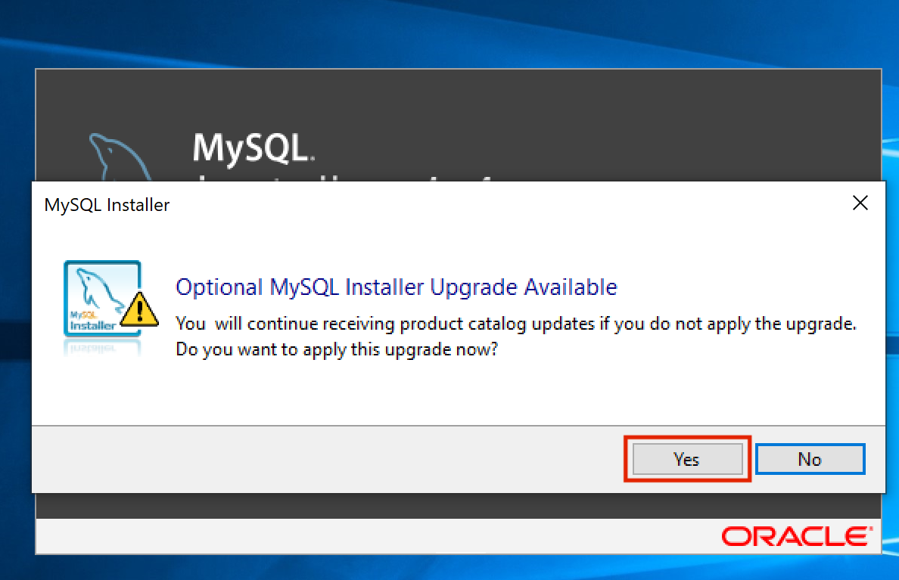

The installer is a bit confusing, but don't worry, most everything is fine left on its default.

Click on MySQL Server then the Add button.  Add "MySQL Server" and "Connector/OBDC x64."  Then click "Next."  You will see a Installation summary, click on "Execute" and wait for the download to finish and then install wizard to begin.

As I stated, most of the install wizard questions we will leave as default.

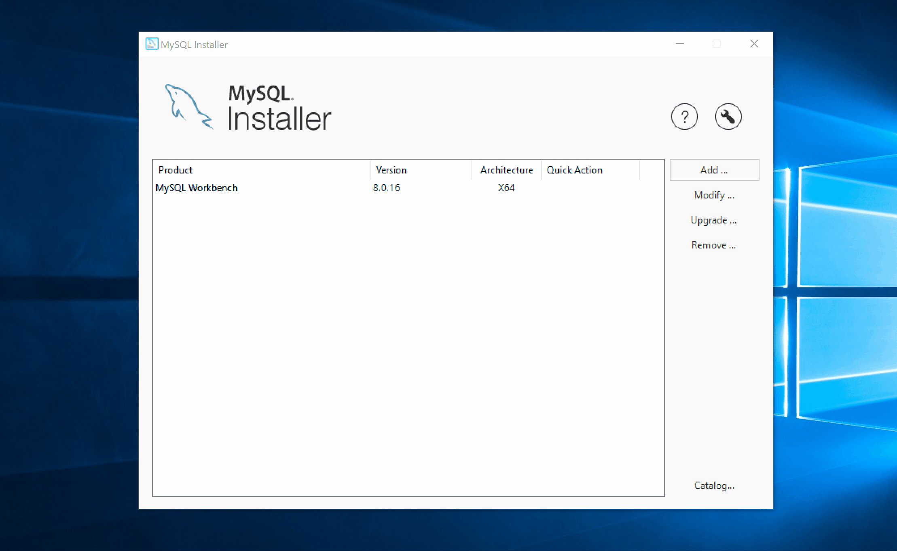

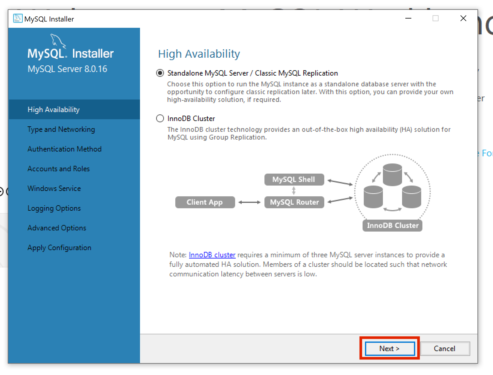

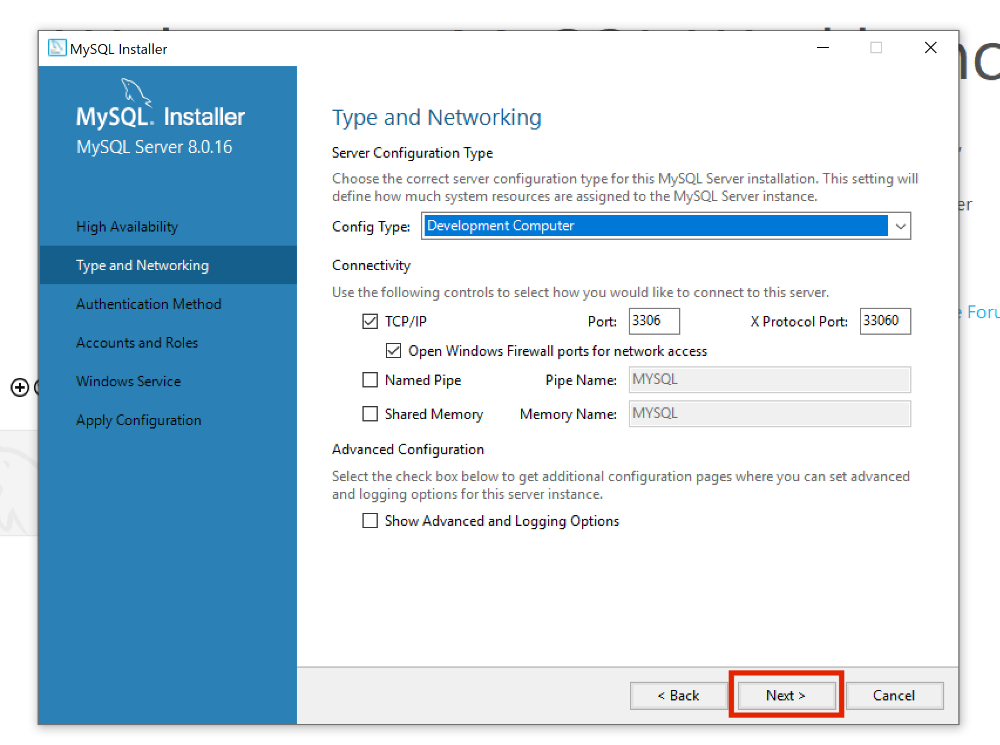

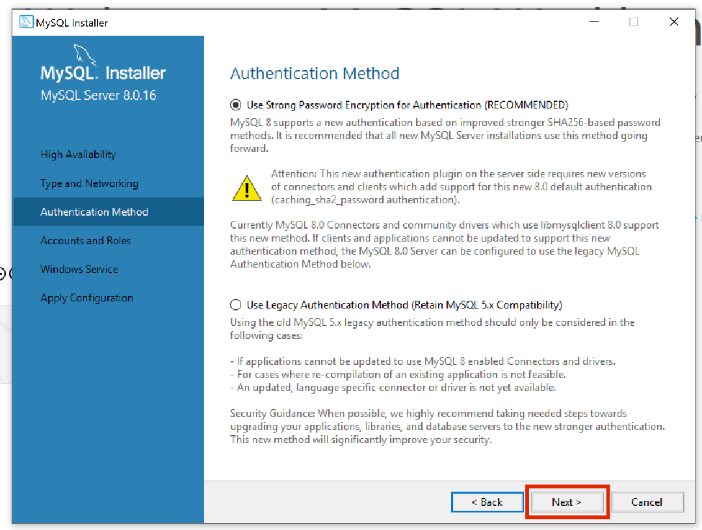

On the "Accounts and Roles" section you will need to decide on your password for the SQL Server on your local PC.  I obviously didn't pick a great one.  MySQL Server will automatically setup a user with the name of `root` and a password you set here.  This `root` user will permissions to do anything to the server.

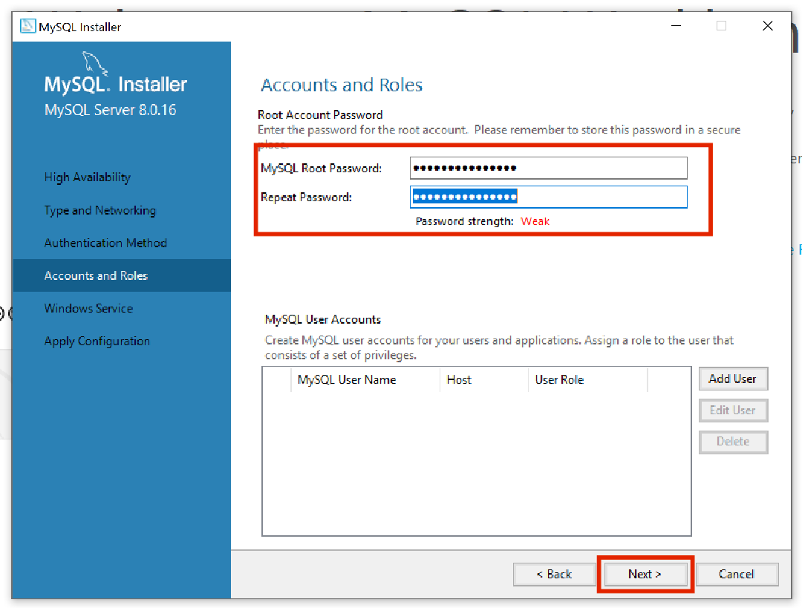

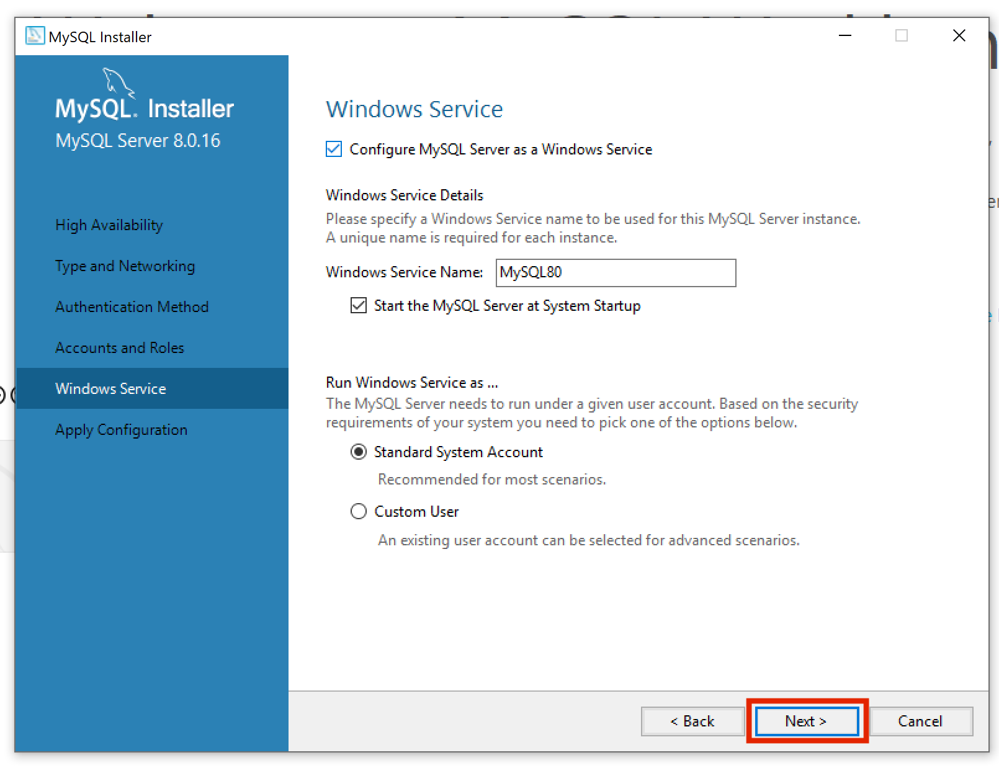

Execute the installer and let it finish.
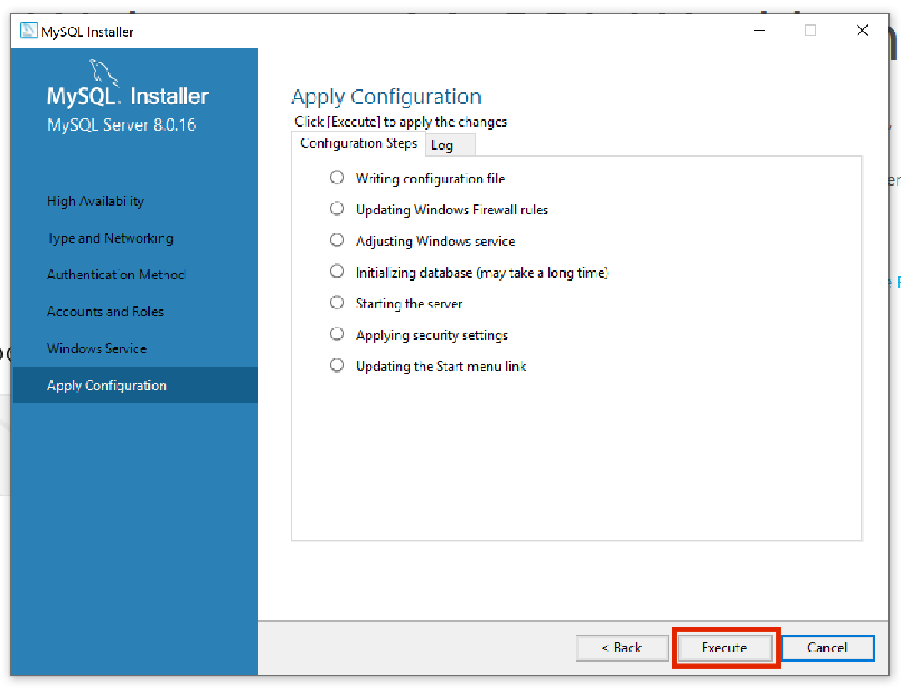

Once it finishes you should now have MySQL Server installed on your local PC. Skip to the last section to test it out.

## Mac
Mac's a bit simpler.

* [MySQL Server Mac Installer](https://dev.mysql.com/downloads/mysql/)

Download the `.dmg` installer.
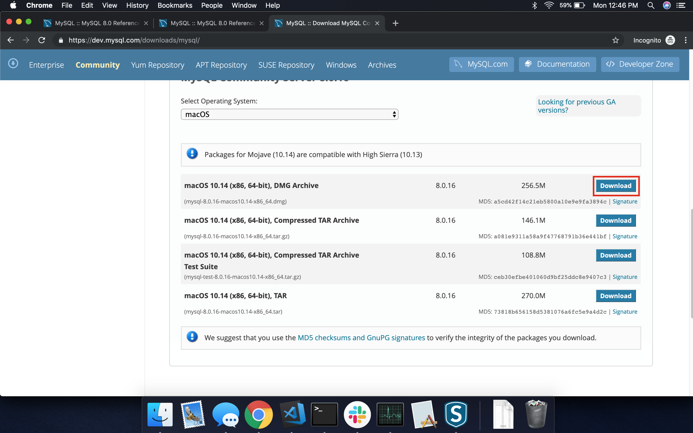

Click on "No thanks, just start my download" and when the download is finished, double click on it.
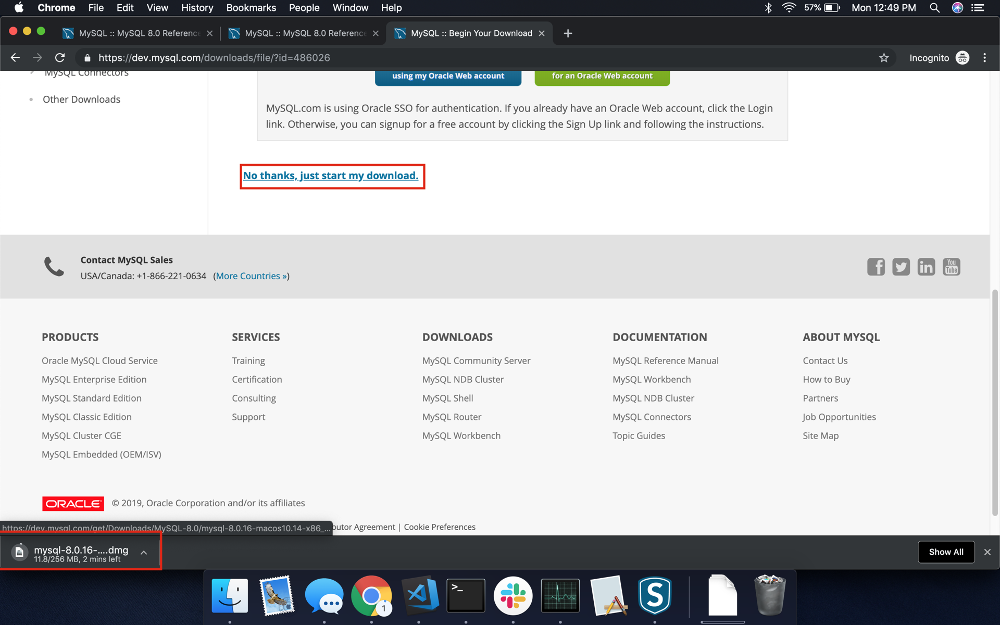

Double click on the installer.  You will need to enter your system password for the installer to setup MySQL Server, but you will also need to provide the MySQL Server `root` user a password.  Don't consfuse the two, unless you plan for them to be the same.

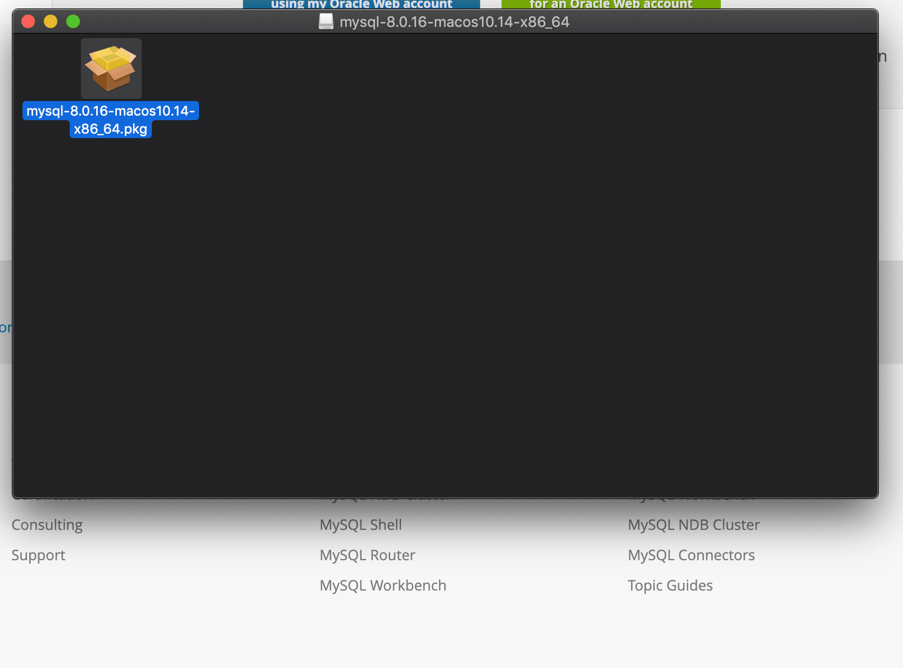

Once it finishes you should now have MySQL Server installed on your Mac. Skip to the last section to test it out.

# Testing your Local SQL Server
Go ahead and open MySQL Workbench and let's connect to this new local server.

Click on the "New Connection" icon and leave everything default, except the "Connection Name," here enter `localhost`.
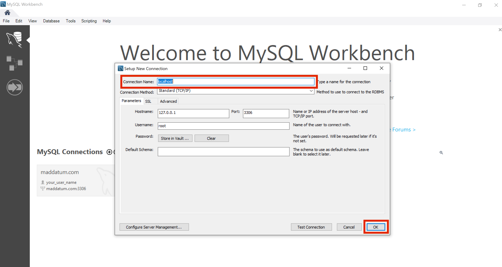

Double click on the new connection and enter the password you created during installation.  *Voila!*

Let's run a command to make sure everything is working.
```sql
SHOW databases;
```
You should see:
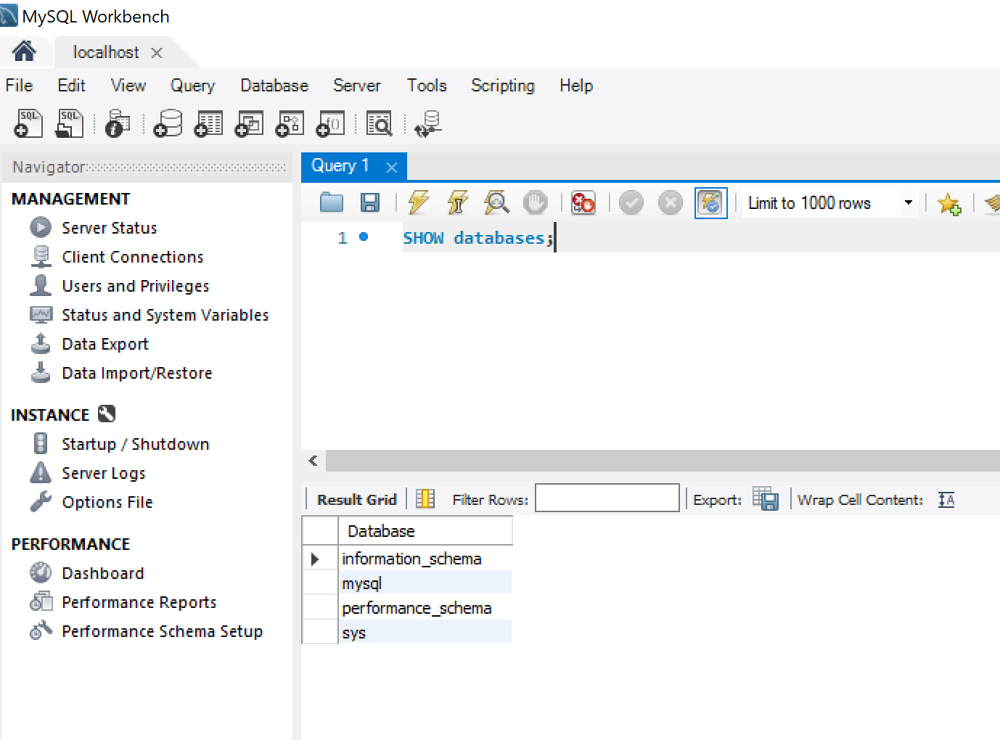
