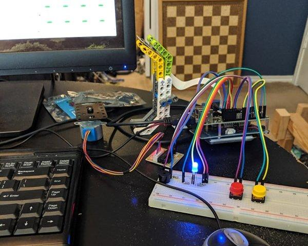
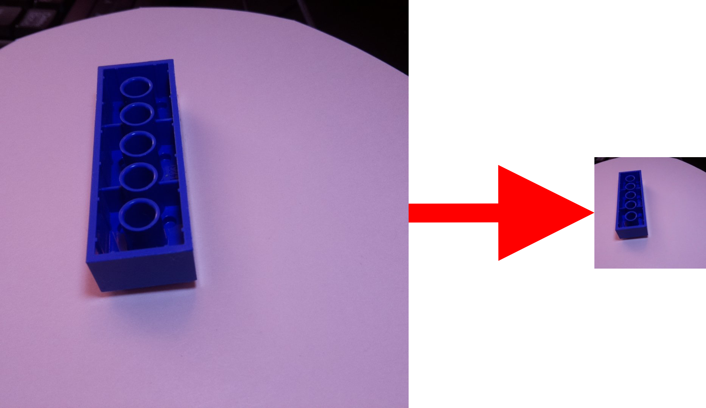

[{: .float-right}](https://ladvien.com/lego_classifier/lego_classifier_comic.png) I've a robot friend.  To be clear, the friend is not a robot, rather, we build robots together.  One of the projects we tossed about is building a LEGO sorting machine.  Rockets--again, not a robot--teaches robotics to kids.  For their designs, LEGOs are the primary component.  Unfortunately, this results in much time spent to preparing for an event.

He mentioned to me, "What we really need is a sorting machine."  I remained skpetical for some time, but finally, I warmed up to the idea when he started talking about incorporating a deep neural-netowrk.  More specifically, a convultional neural-network (CNN).  

Anyway, these blog posts are our journal in build the LEGO sorter. 

One last note to the reader: I won't spend much time on explaining parts of the work where it is better documented elsehwere.  For example, Convolutional Neural Networks are well documented by, um, everyone?  

Instead, I'm going to focus on stuff which I've found everyone else omitting.  Like, deploying the neural-network to do some work. This one bugged me, because everyone loves to say, "Dude, my classifier has a validation accuracy of 99.999%!"  That's great, but as I found out, validation accuracy doesn't always translate well into _production accuracy._

## The Idea
It was pretty straightfoward to begin with.  We'd find some images of LEGOs on the internet and then train a CNN to classify LEGOs by there part code.  It was a bit naive, but if knew the full amount of work a project like this would ahead of time I doubt anyone would do it.

Anyway, we began with searching the webs.  Google told us about several other folks doing something similiar.  I'm not going to list them all, only what I considered the best:

* [Lego Sorter using TensorFlow on Raspberry Pi](https://medium.com/@pacogarcia3/tensorflow-on-raspbery-pi-lego-sorter-ab60019dcf32)

This is an _extremely_ well documented project by [Paco Garcia](https://medium.com/@pacogarcia3).

So, after reading a few articles, we figured we could do this.  We just need the data.  After a bit of searching we found these existing datasets:

* [Kaggle: Database of Lego "Images" (they are rendered from models)](https://www.kaggle.com/joosthazelzet/lego-brick-images)
* [Kaggle: Lego vs Generic Brick](https://www.kaggle.com/pacogarciam3/lego-vs-generic-brick-image-recognition#example_Lego_1x4_crop0.jpg)

I wasn't happy about these datasets.  Their structures weren't great and they were not designed to help train a classifier.  But then, Rockets found Paco had actually opened his dataset to the public:

* [Kaggle: Lego Brick Sorting (best)](https://www.kaggle.com/pacogarciam3/lego-brick-sorting-image-recognition?fbclid=IwAR303nIR4revbYVmW7YfC_4Frnqu3yn5gOi_HP7elJ4h1_a7uXDE1MVtacw)

One bit more, Paco also made Classifier Code: used public:

* [11 Class Tensorflow Model](https://github.com/pacogarcia3/lego-11class-tensorflow)

Paco, you are a robot friend, too! 

Alright, we were encouraged by Paco.  We knew the project would be possible.  However, we didn't want to step on [brownfield](https://en.wikipedia.org/wiki/Brownfield_(software_development)).  We needed the green. Or if you don't speak dev, we didn't want to do this the easy way and replicate Paco's work.  We wanted to really beat ourselves up by doing everything from scratch.

## Creating a Dataset
As I stated before, I didn't like any datasets but Paco's.  It was real images and meant to train a classifier.  But, they weren't the LEGOs we wanted to classify.  Rockets's LEGO projects involve a lot of technic bricks, which didn't seem to be in Paco's mix.  So, we set out to create our own (yanno, the hard way).

The first attempt creating training images was by rendering images from `.stl` files found on the internet using the Python version of [Visualization Toolkit](https://vtk.org/).  I won't cover it here since it was a fail and as I'll create an article later about the stuff we tried and didn't work.

{: .float-left} Anyway, while I was working on it Rockets had a brilliant plan.  He created an instrument to take pictures of a LEGO on a spin plate.  It used a Raspberry Pi, Pi Cam, and stepper motor, and unicorn farts.

Then Rockets began taking pictures of 10 classes of LEGOs. Not sure how long this took him, but he shortly pinged me letting me know he had 19,000 images. (Ok, ok, he might be _part_ robot.) 

I'm not going to attempt explaining the build, as I believe Rockets will do this shortly.  Besides, about the only part I understand is the unicorn flatulence.


Alright! Now I needed to get my butt in gear and fix up the software.
<div style="clear: both;"></div>

## Preprocessing Code
Before we could start training a CNN on Rockets's images we needed to do some preprocessing.  First, the images came in at full resolution, but we needed to crop them, as the CNN would expected a square image.  Of course, the image would need to be cropped as not to lose the target data (the LEGO).

For example


Also, the trainer would be expecting a file structure something like this:

```bash
data
├── test
│   ├── 2456
│   │     └── 2456_0001.jpg
│   │     └── 2456_0002.jpg
│   │     └── 2456_0003.jpg
│   │     └── ....
│   ├── 3001
│   ├── 3002
│   ├── 3003
│   ├── 3004
│   ├── 3010
│   ├── 3039
│   ├── 32064
│   ├── 3660
│   └── 3701
└── train
    ├── 2456
    ├── 3001
    ├── 3002
    ├── 3003
    ├── 3004
    ├── 3010
    ├── 3039
    ├── 32064
    ├── 3660
    └── 3701
```
Therefore, I've written a Python script to do the following

1. Take a path where images are stored in subfolders with the name of the class.
2. Load the image
3. Resize the image to specified size
4. Crop from the center of the image out
5. Create train and test folder
6. Create subfolders in train and test with the class name
7. Shuffle the images in the process
8. Save the cropped file in the appropriate folder, depending what percentage of images you want to withhold for testing.

## Preprocessing Code: Needed Libraries
```python
import os
import glob
import cv2
import random
```
The only non-standard Python library we are using is:

* [OpenCV](https://pypi.org/project/opencv-python/)

This may be a bit tricky depending on which OS you are using and whether you are using Anaconda or straight Python.  However, the following is what we used:

```bash
pip install https://pypi.org/project/opencv-python/
```

If you have any troubles load the `cv2` library, it probably means there was an issue installing OpenCV.  Just let me know in the comments and I can help debug.

## Preprocessing Code: Processing Parameters
The following control the the flow of preprocessing

* `dry_run`: if set to true, it does not save the images, but does everything else
* `gray_scale`: converts the images to grayscale.
* `root_path`: the root folder of the project
* `show_image`: shows the before and after of the image.
* `output_img_size`: adjust this to the size of your desired output image
* `grab_area`: the total area of the original image to take before resizing
* `train_test_split`: the rate of test images to withhold
* `shuffle_split`: should the images be shuffled in the process
* `part_numbers`: a list of all the class folders contained in the input


```python
#####################
# Parameters
#####################     

dry_run                 = False # If true, will print output directory.
gray_scale              = True

root_path               = './data/'
input_path              = f'{root_path}raw/size_1080/'
output_path             = f'{root_path}cropped/'

show_image              = False

output_img_size         = (300, 300)
grab_area               = 500
train_test_split        = 0.3
shuffle_split           = True

part_numbers            = [
                           '2456',
                           '3001',
                           '3002',
                           '3003',
                           '3004',
                           '3010',
                           '3039',
                           '3660',
                           '3701',
                           '32064'
                        ]
```
Start of the loop.  It is going to loop over every file it finds in the first input class folder, crop it, then save the result.

```python
for part_number in part_numbers:

    part_input_path  = f'{input_path}{part_number}/'
    
    # Get input file paths.
    image_files = glob.glob(f'{part_input_path}*.jpg')
    num_files = len(image_files)

    # Image index.
    index = 0

    # If true, the images will be loaded and then split at random.
    if shuffle_split:
        file_index = random.sample(range(1, num_files), num_files - 1)
    else:
        file_index = range(1, num_files)
        
    for file_num in file_index:
        
        index += 1
        
        input_file_path = f'{input_path}{part_number}/{str(file_num).zfill(4)}.jpg'
        print(f'LOADED: {input_file_path}')
        # Crop raw image from center.
        img = cv2.imread(input_file_path)

        c_x, c_y = int(img.shape[0] / 2), int(img.shape[1] / 2)
        img = img[c_y - grab_area: c_y + grab_area, c_x - grab_area: c_x + grab_area]
         
        # Resize image
        img = cv2.resize(img, output_img_size, interpolation = cv2.INTER_AREA)
        
        if gray_scale:
            img = cv2.cvtColor(img, cv2.COLOR_BGR2GRAY)
        
        # Show to user.
        if show_image:
            cv2.imshow('image', img)
            cv2.waitKey(0)
            cv2.destroyAllWindows() 

        # Determine if it should be output to train or test.
        test_or_train = 'train'        
        if index < int(num_files * train_test_split): 
            test_or_train = 'test'
        
        # Prepare the output folder.
        color = ''
        if gray_scale:
            part_output_folder = f'{output_path}gray_scale/{test_or_train}/{part_number}/'
        else:
            part_output_folder = f'{output_path}color/{test_or_train}/{part_number}/'
            
        # Make the output directory, if it doesn't exist.
        if not os.path.exists(part_output_folder):
            os.makedirs(part_output_folder)

        # Create part path.
        part_image_path = f'{part_output_folder}{part_number}_{index}.jpg'
        
        # Output
        if dry_run:
            print(f'Would have saved to: {part_image_path}')
        else:
            print(f'SAVED: {part_image_path}')
            cv2.imwrite(part_image_path, img)
```

## Classifier Code:

Full code may be found here:
* [CNN LEGO Trainer (Python)](https://github.com/Ladvien/lego_sorter/blob/master/lego_classifier_gpu.py)

### Classifier Code: Needed Libraries
```python
import tensorflow as tf


# Import needed tools.
import os
import matplotlib.pyplot as plt
import json
import numpy as np
from scipy import stats

# Import Keras
import tensorflow.keras
from tensorflow.keras.layers import Dense,Flatten, Dropout, Lambda
from tensorflow.keras.layers import SeparableConv2D, BatchNormalization, MaxPooling2D, Conv2D, Activation
from tensorflow.compat.v1.keras.preprocessing.image import ImageDataGenerator
from tensorflow.keras.callbacks import ModelCheckpoint, EarlyStopping, TensorBoard, CSVLogger, ReduceLROnPlateau
from tensorflow.keras.preprocessing import image

# Tensorboard
from tensorboard import program
import webbrowser
import time
```

### Classifier Code: Parameters
```python
continue_training       = False
initial_epoch           = 0
clear_logs              = True

input_shape             = (300, 300, 3) # This is the shape of the image width, length, colors
image_size              = (input_shape[0], input_shape[1]) # DOH! image_size is (height, width)
train_test_ratio        = 0.2
zoom_range              = 0.1
shear_range             = 0.1

# Hyperparameters
batch_size              = 16
epochs                  = 40
steps_per_epoch         = 400
validation_steps        = 100 
optimizer               = 'adadelta' 
learning_rate           = 1.0
val_save_step_num       = 1

path_to_graphs          = './data/output/logs/'
model_save_dir          = './data/output/'
train_dir               = './lego_id_training_data/gray_train/'
val_dir                 = './lego_id_training_data/gray_test/'
```

### Classifier Code: Helper Functions
```python
if clear_logs:
  !rm -rf data/output/logs/*

def make_dir(dir_path):
    if not os.path.exists(dir_path):
        os.mkdir(dir_path)
    

def show_final_history(history):
    fig, ax = plt.subplots(1, 2, figsize=(15,5))
    ax[0].set_title('loss')
    ax[0].plot(history.epoch, history.history['loss'], label='Train loss')
    ax[0].plot(history.epoch, history.history['val_loss'], label='Validation loss')
    ax[1].set_title('acc')
    ax[1].plot(history.epoch, history.history['acc'], label='Train acc')
    ax[1].plot(history.epoch, history.history['val_acc'], label='Validation acc')
    ax[0].legend()
    ax[1].legend()
```


### Classifier Code: Data Preparation
```python
#################################
# Create needed dirs
#################################
make_dir(model_save_dir)

#################################
# Data generators
#################################

# These Keras generators will pull files from disk
# and prepare them for training and validation.
augs_gen = ImageDataGenerator (
    shear_range = shear_range,  
    zoom_range = shear_range,        
    horizontal_flip = True,
    validation_split = train_test_ratio
)  

train_gen = augs_gen.flow_from_directory (
    train_dir,
    target_size = image_size, # THIS IS HEIGHT, WIDTH
    batch_size = batch_size,
    class_mode = 'sparse',
    shuffle = True
)

test_gen = augs_gen.flow_from_directory (
    val_dir,
    target_size = image_size,
    batch_size = batch_size,
    class_mode = 'sparse',
    shuffle = False
)

#################################
# Save Class IDs
#################################
classes_json = train_gen.class_indices
num_classes = len(train_gen.class_indices)
```


### Classifier Code: Building the Model
```python

def test_model(opt, input_shape):
    model = tf.keras.models.Sequential()
    model.add(tf.keras.layers.Conv2D(32, (3, 3), input_shape = input_shape))
    model.add(tf.keras.layers.Activation('relu'))
    model.add(tf.keras.layers.Dropout(0.2))
    model.add(tf.keras.layers.MaxPooling2D(pool_size=(2, 2)))
    
    model.add(tf.keras.layers.Conv2D(64, (3, 3)))
    model.add(tf.keras.layers.Activation('relu'))
    model.add(tf.keras.layers.Dropout(0.2))
    model.add(tf.keras.layers.MaxPooling2D(pool_size=(2, 2)))
    
    model.add(tf.keras.layers.Conv2D(128, (3, 3)))
    model.add(tf.keras.layers.Activation('relu'))
    model.add(tf.keras.layers.Dropout(0.2))
    model.add(tf.keras.layers.MaxPooling2D(pool_size=(2, 2)))
    
    model.add(tf.keras.layers.Flatten())  # this converts our 3D feature maps to 1D feature vectors
    model.add(tf.keras.layers.Dense(256))
    model.add(tf.keras.layers.Activation('relu'))
    
    model.add(tf.keras.layers.Dropout(0.2))
    
    model.add(tf.keras.layers.Dense(num_classes, activation = 'softmax'))
    return model

#################################
# Create model
#################################

def get_optimizer(optimizer, learning_rate = 0.001):
    if optimizer == 'adam':
        return tensorflow.keras.optimizers.Adam(lr = learning_rate, beta_1 = 0.9, beta_2 = 0.999, epsilon = None, decay = 0., amsgrad = False)
    elif optimizer == 'sgd':
        return tensorflow.keras.optimizers.SGD(lr = learning_rate, momentum = 0.99) 
    elif optimizer == 'adadelta':
        return tensorflow.keras.optimizers.Adadelta(lr=learning_rate, rho=0.95, epsilon=None, decay=0.0)

selected_optimizer = get_optimizer(optimizer, learning_rate)

model = test_model(selected_optimizer, input_shape)
model.summary()

model.compile(
    loss = 'sparse_categorical_crossentropy',
    optimizer = selected_optimizer,
    metrics = ['accuracy']
)
```


### Classifier Code: Creating Callbacks
```python
best_model_weights = model_save_dir + 'base.model'

checkpoint = ModelCheckpoint(
    best_model_weights,
    monitor = 'val_loss',
    verbose = 1,
    save_best_only = True,
    mode = 'min',
    save_weights_only = False,
    period = val_save_step_num
)

earlystop = EarlyStopping(
    monitor='val_loss',
    min_delta=0.001,
    patience=10,
    verbose=1,
    mode='auto'
)

tensorboard = TensorBoard(
    log_dir = model_save_dir + '/logs',
    histogram_freq=0,
    batch_size=16,
    write_graph=True,
    write_grads=True,
    write_images=False,
)

csvlogger = CSVLogger(
    filename = model_save_dir + 'training.csv',
    separator = ',',
    append = False
)

reduce = ReduceLROnPlateau(
    monitor='val_loss',
    factor=0.5,
    patience=40,
    verbose=1, 
    mode='auto',
    cooldown=1 
)

callbacks = [checkpoint, csvlogger, tensorboard]
```


### Classifier Code: Training
```python
if continue_training:
    model.load_weights(best_model_weights)
    model_score = model.evaluate_generator(test_gen, steps = validation_steps)

    print('Model Test Loss:', model_score[0])
    print('Model Test Accuracy:', model_score[1])


history = model.fit_generator(
    train_gen, 
    steps_per_epoch  = steps_per_epoch, 
    validation_data  = test_gen,
    validation_steps = validation_steps,
    epochs = epochs, 
    verbose = 1,
    callbacks = callbacks
)
```