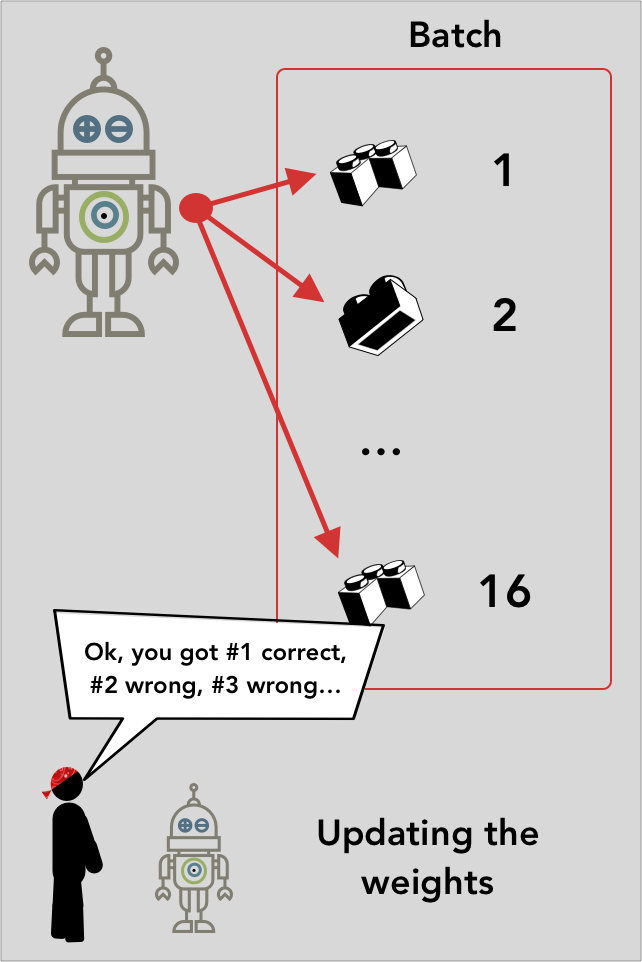

This article is part of a series.  It should explain the code used to train our convolutional neural-network (CNN) LEGO classifier.

If you want to code along with this article, we've made it available in Google's Colab:

* [Lego Classifier](https://colab.research.google.com/drive/1gD51CXRngVZhTO9464aFKHV2pejsVPcx)

Or if you want to run the code locally:

* [lego_sorter](https://github.com/Ladvien/lego_sorter)

It's a WIP, so comment below if you run into any issues.

## Classifier Code:
Our code started with a notebook found on Kaggle:

* [Lego Brick Images Keras CCN](https://www.kaggle.com/twhitehurst3/lego-brick-images-keras-cnn-96-acc)

However, there problems in the code.  I rewrote most of it, so I'm not sure how much of the original is left.  Still, cite your sources!

Some of the issues were:
* It used a model more complex than needed.
* The code format was a mess.
* Mismatch of target output and loss.

It was the last one which is _super_ tricky, but critical.  It's a hard to catch bug which inaccurately reports high accuracy.  I'll discuss it more below, but it's a trap I've fallen into myself. Regardless of the issues, it was good jump-starter code, since we've never worked with a CNN.

### Project Setup (local only)
If you are running this code locally, you will need to do the following.

Enter the command prompt and navigate to your home directory.  We're going to clone the project repository (repo), then, clone the data repo inside the project folder. 
```
git clone https://github.com/Ladvien/lego_sorter.git
cd lego_sorter
git clone https://github.com/Ladvien/lego_id_training_data.git
```
Then, open your Python IDE, set your directory to `./lego_sorter`, and open `lego_classifier_gpu.py`.

Lastly, if you see a cell like this:
```bash
!git clone https://github.com/Ladvien/lego_id_training_data.git
!mkdir ./data
!mkdir ./data/output
!ls
```
Skip or delete them, they are need when running the Colab notebook.  Of course, if you are running the Colab notebook, make sure to execute them.

### Classifier Code: Needed Libraries

Below is the code we used.  Reviewing it, I see some ways to clean it up, so know it may change in the future.

Here's a breakdown of why the libraries are needed:

* `tensorflow` -- Google's main deep-learning library, it's the heart of the project.
* `keras` -- a library abstracting a lot of the details from creating a machine learning model.
* `json` -- we write the classes to file for use later.
* `tensorboard` -- a library for visualizing your training session.
* `webbrowser` -- this is opens your webrowser to Tensorboard.

```python

# Import needed tools.
import os
import matplotlib.pyplot as plt
import json
import numpy as np
from scipy import stats

# Import Keras
import tensorflow as tf
import tensorflow.keras
from tensorflow.keras.layers import Dense,Flatten, Dropout, Lambda
from tensorflow.keras.layers import SeparableConv2D, BatchNormalization, MaxPooling2D, Conv2D, Activation
from tensorflow.compat.v1.keras.preprocessing.image import ImageDataGenerator
from tensorflow.keras.callbacks import ModelCheckpoint, EarlyStopping, TensorBoard, CSVLogger, ReduceLROnPlateau
from tensorflow.keras.preprocessing import image

# Tensorboard
from tensorboard import program
import webbrowser
import time
```
If you are following along with this code locally and need help setting up these libraries, just drop a comment below.  I got you.

### Classifier Code: Parameters
The parameters sections is the heart of the training, I'll explain what the parameters are doing and highlight those you might want to tweak.

```python
continue_training       = False
initial_epoch           = 0
clear_logs              = True

input_shape             = (300, 300, 3) # This is the shape of the image width, length, colors
image_size              = (input_shape[0], input_shape[1]) # DOH! image_size is (height, width)
train_test_ratio        = 0.2
zoom_range              = 0.1
shear_range             = 0.1

# Hyperparameters
batch_size              = 16
epochs                  = 40
steps_per_epoch         = 400
validation_steps        = 100 
optimizer               = 'adadelta' 
learning_rate           = 1.0
val_save_step_num       = 1

path_to_graphs          = './data/output/logs/'
model_save_dir          = './data/output/'
train_dir               = './lego_id_training_data/gray_train/'
val_dir                 = './lego_id_training_data/gray_test/'
```
#### Parameters: Training Session
The first few parameters help continue from an interrupted training session.  For example, if your session is interrupted at epoch 183, then you could set `continue_training` = `True` and `initial_epoch` = 184, then execute the script.  This should then load the last best model and pick back up training where you left off.  Lastly, if you set `clear_logs` = `True` then it clears the Tensorboard information.  So, if you continue a session, you will want to set this to `False`.

This section is a WIP and there are several issues.  First, the Tensorboard logs should be saved in separate folders and shouldn't need to be cleared.  Also, when continuing a training session, it resets the best validation score (tracked for saving your model before overfitting) resulting in a temporary dip in performance.

#### Parameters: Image Data
The `input_shape` refers to the dimensions of an image: height, width, and color (RGB) values.  `image_size` comes from the `input_shape`.

Note, one issue I had early on with `image_size`.  I tried non-square images (which hurt training and aren't recommended for CNNs) and found the hard way most of the image parameters for width and height reverse their order.  

For example, this is what's needed:
```python
...
    val_dir,
    target_size = (height_here, width_here),
...
```
I was expecting:
```python
...
    val_dir,
    target_size = (width_here, height_here),
...
```
It bit me hard, as most frameworks I've used expect width first and then height.  I mean, even when we talk screen resolution we list width *then* height (e.g., `1920x1080`). Just be aware when using rectangle images.  Always RTFM (because, apparently, I didn't).

The `train_test_ratio` controls how many images are held back for testing the model.  I'd have to run through the code again, but I don't think this is needed.  As the preprocessing script created a folder with validation images.  Hmm, I'll add it to my [tech debt](https://en.wikipedia.org/wiki/Technical_debt) list.

The `zoom_range` parameter controls how far the script should zoom in on the images.  And, lastly, `shear_range` controls how much of the images to clip from the edges before feeding them to the CNN.

[{: .float-right}](https://ladvien.com/lego_classifier/batch.png)
#### Parameters: CNN Hyperparameters
A "hyperparameter" is what machine-learning engineers call parameters which may impact the outcome of training a neural-net.

* [What are Hyperparameters?](https://towardsdatascience.com/what-are-hyperparameters-and-how-to-tune-the-hyperparameters-in-a-deep-neural-network-d0604917584a)

Here are the hyperparamters we've exposed:

`batch_size` refers to the number of photos a neural-net should attempt predictions on before updating the weights of each [perceptron](https://towardsdatascience.com/what-the-hell-is-perceptron-626217814f53).  **Note**, the highest batch size is usually limited by your GPU RAM.  Locally, I use a `GTX 1060` with 6GB of RAM--I couldn't get a batch bigger than around 16.  YMMV.

`steps_per_epoch` are the number of batches to go through before considering one epoch complete. An `epoch` is an arbitrary number representing how many `batches` * `steps_per_epoch` to go through before considering the training complete.

So, the length of training would be `training schedule = epochs * steps_per_epoch * batch_size`

`validation_steps` is the number of batches from the training data to use for validating the current weights.  This will be used when we `fit` (train) our classifier and when we `evaluate` it.

`optimizer` is the name of the optimizer used.  This is the heart of training, as it is responsible for deciding how the the weights should be updated after each batch.

I've setup the code to only use one of three optimizers, either `adam`, `adagrad`, `sgd`.

```python
def get_optimizer(optimizer, learning_rate = 0.001):
    if optimizer == 'adam':
        return tensorflow.keras.optimizers.Adam(lr = learning_rate, beta_1 = 0.9, beta_2 = 0.999, epsilon = None, decay = 0., amsgrad = False)
    elif optimizer == 'sgd':
        return tensorflow.keras.optimizers.SGD(lr = learning_rate, momentum = 0.99) 
    elif optimizer == 'adadelta':
        return tensorflow.keras.optimizers.Adadelta(lr=learning_rate, rho=0.95, epsilon=None, decay=0.0)
```

Here is more information on optimizers.

Easy to read:
* [Stochastic Gradient Descent](https://en.wikipedia.org/wiki/Stochastic_gradient_descent)
* [Adam](https://machinelearningmastery.com/adam-optimization-algorithm-for-deep-learning/)
* [Adagrad](https://databricks.com/glossary/adagrad)

Primary source:
* [Adam](https://arxiv.org/abs/1412.6980)
* [Adagrad](http://www.jmlr.org/papers/volume12/duchi11a/duchi11a.pdf)

The primary reason, as I understand it, to use `adagrad` over `adam`, is `adagrad`'s `learning_rate` will naturally modify itself to be more conducive to optimal convergence.

However, there are many optimizers.  A lot of them available in Keras:

* Stochastic Gradient Descent (SGD)
* RMSprop
* Adagrad
* Adadelta
* Adam
* Nadam
* Adamax

Keras' docs on optimizers:

* [Keras Optimizers](https://keras.io/optimizers/)

The `learning_rate` controls how drastically the optimizer should change the perceptrons's weights when they have made an incorrect prediction.  Too high, it won't converge (learn) too low and it will take a while.

You will find a lot of documentation saying, "The default learning rate of an optimizer is best, it doesn't need to be changed."  I've found this advice to be true, well, mostly.  I did run into an issue when using `adam`'s default setting of `0.001` in this project.  The neural-net just didn't learn--I had to drop it to around `0.0001`, which did much better. 

A starter read on learning rate:

* [How to pick the best learning rate](https://medium.com/octavian-ai/which-optimizer-and-learning-rate-should-i-use-for-deep-learning-5acb418f9b2)

It's not exhaustive.  If you interested in tweaking the optimizer or learning rate, Google and read as much as possible.

Lastly, `val_save_step_num` controls how many training epochs should pass before the validator tests whether your model is performing well on the test set.  We have the code setup such if the validator says the model is performing better than any of the previous tests within this training session, then it will save the model automatically.

### Classifier Code: Data Preparation
The `make_dir` allows making a directory, if it doesn't already exist.  We then use it to create our model save directory.

```python
def make_dir(dir_path):
    if not os.path.exists(dir_path):
        os.mkdir(dir_path)

# Create needed dirs
make_dir(model_save_dir)
```

The next bit saves the classes the `train_gen` found to a file.  This is useful later when we are trying to quickly deploy the model to production.

```python
# Save Class IDs
classes_json = train_gen.class_indices
num_classes = len(train_gen.class_indices)
```
This saves one object to a `json` file.  The key (e.g., "2456") represents the code provided by LEGO.  And the value is the numeric class assigned by the classifier.
```json
{
    "2456": 0,
    "3001": 1,
    "3002": 2,
    "3003": 3,
    "3004": 4,
    "3010": 5,
    "3039": 6,
    "32064": 7,
    "3660": 8,
    "3701": 9
}
```
We can do the following after we've trained the model:
```python
predicted_lego_code = json_classes[model.predict()]
```
And the model will return the LEGO class it has identified.


### Classifier Code: Data Generator
When dealing with CNNs, often, the training data are too large to fit in RAM, let alone GPU RAM, at once.

Instead, a `DataGenarator` is used.  A `DataGenerator` is class provided by `Keras`, it loads training data in manageable chunks to feed to your model during training. Let's run through using it.

We initialize `ImageDataGenerator` -- a subclass of `keras`' `DataGenerator`.  Then, we create two `flows`, one for loading data from the training folder into the model.  The other is the same, however, it loads data from the test folder.  The latter will be used to validate the model.

Parameters used in our `ImageDataGenerator`:
* `shear_range` -- this controls how much of the images' edge is trimmed off as a percentage of the whole image.  This is useful for quickly reducing the size of images (thereby increasing training speed).
* `zoom_range` -- is how far to zoom in before feeding the image to the model.
* `horizontal_flip` -- if this is set to `true`, the images are randomly mirrored horizontally.  This essentially doubles your training images. Though, it shouldn't be used in all cases.  If the target has a "handediness" to it, then this would destroy accuracy.  A simple example of this downfall would be training a CNN to determine whether baseball player is left or right handed.
* `validation_split` -- determines the percentage of images held back for validation.
  
```python
# These Keras generators will pull files from disk
# and prepare them for training and validation.
augs_gen = ImageDataGenerator (
    shear_range = shear_range,  
    zoom_range = shear_range,        
    horizontal_flip = True,
    validation_split = train_test_ratio
)  
```
Now,the parameters of the `ImageDataGenerator.flow_from_directory` methods:

* `target_size` -- this one bit me.  It's the size of your images as a tuple (e.g., "(150, 150)").  **It expects height _then_ width.**
* `batch_size` -- this is the number of images loaded into the GPU RAM and trained on before updating the weights. 
* `class_mode` -- **an import argument.**  This sets up the targets for the model's attempt at prediction.  `sparse` indicates the targets will be `LabelEncoded`.

Below lies a tale of woe I keep hinting at.  

If you have more than one class to predict, like us, you have two options.  Either `sparse` or `categorical`.

**Sparse**

| target|
|:-----:|
| 1     |
| 2     |
| 3     |
| 2     |

**Categorical**

| 1|  2 | 3 |
|:--|:-:|--:|
| 1 | 0 | 0 |
| 0 | 1 | 0 |
| 0 | 0 | 1 |
| 0 | 1 | 0 |

However, this is where the bug in the original code was.  It had setup the targets as categorical, however, it used `binary_crossentropy` as the loss function.  This error is difficult to catch--it's the machine-learning equivalent of the "there" and "their" error.

With the mismatch of targets and loss function there's no help either.  The model will still compile and train without problems.  But the cruel combination of `categorical` targets and `binary_crossentropy` leads to an extremely high accuracy but an _extremely_ bad production accuracy.  The problem is the loss function is _only_ looking at column `1` in the `categorical` table above.  If the model model predicts it is `1` when the first column is `1` then it thinks its "correct."  Otherwise, if the model predicts a `0` when column `1` is `0`, then the model still thinks its correct.  After all, "it wasn't `1`."  And to be clear, the model isn't wrong--we've just given it the wrong target labels. 

This is the quintessential ["hotdog, not a hotdog"](https://medium.com/@timanglade/how-hbos-silicon-valley-built-not-hotdog-with-mobile-tensorflow-keras-react-native-ef03260747f3) problem.

In short, if you feel your model quickly trains to an accuracy too good to be true, it is.  

```python
train_gen = augs_gen.flow_from_directory (
    train_dir,
    target_size = image_size, # THIS IS HEIGHT, WIDTH
    batch_size = batch_size,
    class_mode = 'sparse',
    shuffle = True
)

test_gen = augs_gen.flow_from_directory (
    val_dir,
    target_size = image_size,
    batch_size = batch_size,
    class_mode = 'sparse',
    shuffle = False
)
```

### Classifier Code: Building the Model
Close to done.  I'm not going to go over the design of a CNN for two reasons.  I'm still learning what it all means and there are _much_ better explanations elsewhere.

* [Getting Started with Convolutional Neural Networks](https://medium.com/abraia/getting-started-with-image-recognition-and-convolutional-neural-networks-in-5-minutes-28c1dfdd401)

However, there are a couple of things important to us.

* `num_classes` is the number of LEGOs we are trying to classify.
* `activation` on the last layer controls the type of output from the CNN.  It will need to correspond with the `optimizer` and will need to correspond to the `class_mode` setting of the the `DataGenerators`.
* `build_model` is a convenience function.  It allows us to quickly build a Keras CNN model and return it to be used.
* `model.summary` outputs a text diagram of the model.
* `model.compile` prepares the entire model for training.  

```python
def build_model(opt, input_shape, num_classes):
    model = tf.keras.models.Sequential()
    model.add(tf.keras.layers.Conv2D(32, (3, 3), input_shape = input_shape))
    model.add(tf.keras.layers.Activation('relu'))
    model.add(tf.keras.layers.Dropout(0.2))
    model.add(tf.keras.layers.MaxPooling2D(pool_size=(2, 2)))
    
    model.add(tf.keras.layers.Conv2D(64, (3, 3)))
    model.add(tf.keras.layers.Activation('relu'))
    model.add(tf.keras.layers.Dropout(0.2))
    model.add(tf.keras.layers.MaxPooling2D(pool_size=(2, 2)))
    
    model.add(tf.keras.layers.Conv2D(128, (3, 3)))
    model.add(tf.keras.layers.Activation('relu'))
    model.add(tf.keras.layers.Dropout(0.2))
    model.add(tf.keras.layers.MaxPooling2D(pool_size=(2, 2)))
    
    model.add(tf.keras.layers.Flatten())  # this converts our 3D feature maps to 1D feature vectors
    model.add(tf.keras.layers.Dense(256))
    model.add(tf.keras.layers.Activation('relu'))
    
    model.add(tf.keras.layers.Dropout(0.2))
    
    model.add(tf.keras.layers.Dense(num_classes, activation = 'softmax'))
    return model

#################################
# Create model
#################################

selected_optimizer = get_optimizer(optimizer, learning_rate)

model = build_model(selected_optimizer, input_shape, num_classes)
model.summary()

model.compile(
    loss = 'sparse_categorical_crossentropy',
    optimizer = selected_optimizer,
    metrics = ['accuracy']
)
```

### Classifier Code: Creating Callbacks
Before we execute training we should setup of Keras callbacks.

* [Keras callbacks](https://keras.io/callbacks/)

These pre-written callback functions will be passed to the model and executed at important points throughout the training session.

* `ModelCheckpoint` this method is called after the number of epochs set by `val_save_step_num`.  It runs a validation batch and compares the `val_loss` against other past scores.  If it is the best `val_loss` yet, the method will save the model and, more importantly, weights to the `best_model_weights` path.
* `TensorBoard` opens a [TensorBoard](https://www.tensorflow.org/tensorboard/r1/summaries) session for visualizing the training session.

```python
best_model_weights = model_save_dir + 'base.model'

checkpoint = ModelCheckpoint(
    best_model_weights,
    monitor = 'val_loss',
    verbose = 1,
    save_best_only = True,
    mode = 'min',
    save_weights_only = False,
    period = val_save_step_num
)

tensorboard = TensorBoard(
    log_dir = model_save_dir + '/logs',
    histogram_freq=0,
    batch_size=16,
    write_graph=True,
    write_grads=True,
    write_images=False,
)
```

Before any `KerasCallbacks` can be added to the training session, they must be gathered into a list, as it is how training method will except to receive the

```python
callbacks = [checkpoint, tensorboard]
```


### Classifier Code: Training

Gross, I need to rewrite this portion of the code.  It is a kludge way to restart a training session after interruption.

It checks if you indicated you want to continue a session.  It then loads the best saved model and evaluates it on the test data.

```python
if continue_training:
    model.load_weights(best_model_weights)
    model_score = model.evaluate_generator(test_gen, steps = validation_steps)

    print('Model Test Loss:', model_score[0])
    print('Model Test Accuracy:', model_score[1])
```

And here, we come to the end.  The following function executes the training session.  It will initialize the callbacks, then train for the number of epochs set.  Each epoch it is pulling a batch of data from the `train_gen` (`DataGenerator`), attempting predictions, and then updating weights based on outcomes.  After the number of epochs set in the `checkpoint` callback, the model will pull data from the `test_gen`, these data it has "never" seen before, and attempt predictions.  If the outcome of the test is better than the outcome of any previous test, the model will save.


```python
history = model.fit_generator(
    train_gen, 
    steps_per_epoch  = steps_per_epoch, 
    validation_data  = test_gen,
    validation_steps = validation_steps,
    epochs = epochs, 
    verbose = 1,
    callbacks = callbacks
)
```

Whew, that's it. The above model converged for me after 20 minutes to 98% validation accuracy.  However, there's lots left to do though.  As I've said before, "Just because we have high validation accuracy does not mean we will have high production accuracy."  In the future, I'll be writing about the turntable for quickly generating training data.  It's nifty.  Based on a NEMA17, RAMPS kit, and RPi with RPi Camera.  It's the bomb-dot-com.
