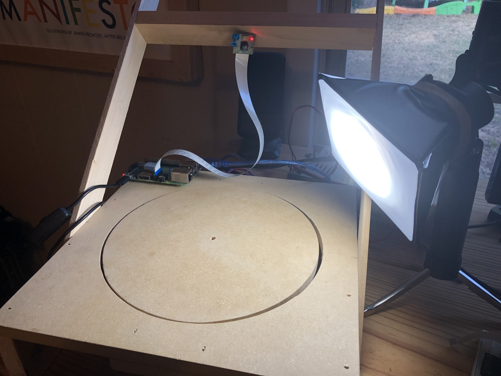

After having success with training a CNN on our initial dataset, we decided to up the game on generating training images.  My buddy Rockets built a nice little turntable and ordered a couple of NEMA17s for each of us.  His idea was we could both start generating training images.

)

I asked if he would be OK with me ordering some RAMPs boards and programming them to synchronize with the PiCamera.  I figured, it would probably be better for reproducibility if we had solid hardware, with custom firmware and software.

After a few hours of coding over a couple of weeks I was able to control the RAMPs within a Python script from either the Raspberry Pi or a desktop computer.

* [Turn Table Controller Code](https://github.com/Ladvien/lego_sorter/tree/master/turn_table)

I've listed the code parts below with a brief explanation--just in case someone would like to hack them for other projects.

## Minimum Viable Hack
Warning words, I'm an advocate of the minimum viable product, especially, when it comes to my personal hacking time.  I refer to this as the minimum viable hack.  That stated, there are known issues in the code below.  But! It does the job--so I've not addressed the issues.

Here are a few:
1. The value `0x0A` (`\n`) value is not handled as part of packet (e.g., if MILLI_BETWEEN = 10 bad things will happen).
2. The motors are always on (reduces motor life).
3. Pulse width is not adjustable without firmware update.
4. The Python code is blocking.  This makes the halt feature on the Arduino Mega side fairly useless.
5. Only RAMPs motor X is setup (this one I _will_ address later, as we will need several drivers before the end of this project).

# RAMPS Code
To move the turn table we used a RAMPs 1.4 board:

[RAMPS Kit (Amazon)](https://www.amazon.com/gp/product/B07T8L584W/ref=ppx_yo_dt_b_asin_title_o09_s00?ie=UTF8&psc=1)

Getting things going was straightforward.  I put together the hardware, installed the Arduino IDE, and looked-up the pinout for the RAMPs controller.

I wrote the firmware to receive serial commands as packet.  The packet structure (at time of writing) looks like this:

```
MOTOR_PACKET = 0x01 0x01 0x00 0x03 0xE8 0x05 0x0A
INDEX        =  1    2     3    4    5    6   7
 ```
* `first_byte` = This indicates what sort of packet type.  Right now, there is only one, but I figure we might want to control other I/O on the Arduino later.
* `second_byte` = the motor selected 1-5 (X, Y, Z,  E1, E2).
* `third_byte` = Motor direction, `0x00` is clockwise and `0x01` is counter-clockwise.
* `fourth_byte` = first chunk of the steps.
* `fifth_byte` = second chunk of the steps.  The steps variable tells the motor how many steps to move before stopping.
* `sixth_byte` = delay between steps in milliseconds.
* `seventh_byte` = the end-of-transmission (EOT) character.  I've used `\n`.
 
When the code receives an EOT character, it parses the packet and call the `writeMotor()`.  This function loops through the number of steps, delaying between each.  Each loop the function checks if a `halt` command has been received.  If it has, it stops the motor mid-move.

Again, this code isn't perfect.  Far from it.  But it does the job.

```c++
#include <avr/interrupt.h> 
#include <avr/io.h> 
// https://reprap.org/mediawiki/images/f/f6/RAMPS1.4schematic.png
// https://reprap.org/forum/read.php?219,168722

// TODO: Pulse width set by initialization.
// TODO: Setup all motors to be selected by master.
// TODO: Add a timer to shutdown motors after threshold.
//       And keep motor enabled until threshold has been met.
// TODO: Handle 0x0A values as part of packet (e.g., if MILLI_BETWEEN = 10).
// TODO: Add a "holding torque" feature; making it so motors never disable.

// For RAMPS 1.4
#define X_STEP_PIN         54
#define X_DIR_PIN          55
#define X_ENABLE_PIN       38
#define X_MIN_PIN           3
#define X_MAX_PIN           2

#define Y_STEP_PIN         60
#define Y_DIR_PIN          61
#define Y_ENABLE_PIN       56
#define Y_MIN_PIN          14
#define Y_MAX_PIN          15

#define Z_STEP_PIN         46
#define Z_DIR_PIN          48
#define Z_ENABLE_PIN       62
#define Z_MIN_PIN          18
#define Z_MAX_PIN          19

#define E_STEP_PIN         26
#define E_DIR_PIN          28
#define E_ENABLE_PIN       24

#define SDPOWER            -1
#define SDSS               53
#define LED_PIN            13

#define FAN_PIN            9

#define PS_ON_PIN          12
#define KILL_PIN           -1

#define HEATER_0_PIN       10
#define HEATER_1_PIN       8
#define TEMP_0_PIN         13   // ANALOG NUMBERING
#define TEMP_1_PIN         14   // ANALOG NUMBERING

#define MOTOR_X         0x01
#define MOTOR_Y         0x02
#define MOTOR_Z         0x03
#define MOTOR_E1        0x04
#define MOTOR_E2        0x05

#define DRIVE_CMD       (char)0x01
#define HALT_CMD        (char)0x0F
#define DIR_CC          (char)0x00
#define DIR_CCW         (char)0x01

#define COMPLETED_CMD   (char)0x07
#define END_TX          (char)0x0A
#define ACK             (char)0x06 // Acknowledge
#define NACK            (char)0x15 // Negative Acknowledge


// Determine the pulse width of motor.
#define MOTOR_ANGLE           1.8
#define PULSE_WIDTH_MICROS    360 / MOTOR_ANGLE

#define RX_BUFFER_SIZE 16

/*
  MOTOR_NUM:
      X     = 0
      Y     = 1
      Z     = 2
      E1    = 3
      E2    = 4
      
  PACKET_TYPES
      0x01 = motor_write
      0x02 = motor_halt

  DIRECTION
      0x00 = CW
      0x01 = CCW

  MOTOR MOVE PROTOCOL:
                       0               1     2     3        4       5         6
  MOTOR_PACKET = PACKET_TYPE_CHAR MOTOR_NUM DIR STEPS_1 STEPS_2 MILLI_BETWEEN \n
  MOTOR_PACKET =    01                01    00    03     E8        05         0A
  MOTOR_PACKET =    0x 01010003E8050A

  HALT         = 0x0F
*/


/* Create a structure for the motors
 *  direction_pin = pin to control direction of stepper.
 *  step_pin      = pin to control the steps.
 *  enable_pin    = pin to enable motor.
 */
struct MOTOR {
  uint8_t direction_pin;
  uint8_t step_pin;
  uint8_t enable_pin;
  uint8_t pulse_width_micros;
};

struct BUFFER {
  uint8_t data[RX_BUFFER_SIZE];
  uint8_t bufferSize;
  uint8_t index;
  boolean packetComplete;
  uint8_t shutdownThreshold;
};

/* Initialize motors */
MOTOR motorX = {
      X_DIR_PIN,
      X_STEP_PIN,
      X_ENABLE_PIN,
      PULSE_WIDTH_MICROS
};

// Urgent shutdown.
volatile boolean halt = false;
volatile static bool triggered;

/* Initialize RX buffer */
BUFFER rxBuffer;;


/* Initialize program */
void setup()
{
  Serial.begin(115200);
  
  // Initialize the structures
  motorSetup(motorX);
  rxBuffer.bufferSize = RX_BUFFER_SIZE;

  // Disable holding torque.
  digitalWrite(motorX.enable_pin, HIGH);
}

/* Main */
void loop()
{
  // If packet is packetComplete
  if (rxBuffer.packetComplete) {
    
    uint8_t packet_type = rxBuffer.data[0];

    switch (packet_type) {
      case DRIVE_CMD:
        {
          // Unpack the command.
          uint8_t motorNumber =  rxBuffer.data[1];
          uint8_t direction =  rxBuffer.data[2];
          uint16_t steps = ((uint8_t)rxBuffer.data[3] << 8)  | (uint8_t)rxBuffer.data[4];
          uint8_t milliSecondsDelay = rxBuffer.data[5];

          // Let the master know command is in process.
          sendAck();
  
          // Start the motor
          writeMotor(motorX, direction, steps, milliSecondsDelay);
        }
        break;
      default:
        sendNack();
        break;
    }
    // Clear the buffer for the nexgt packet.
    resetBuffer(&rxBuffer);
  }
}


/*  ############### MOTORS ############### */

/* Method for initalizing MOTOR */
void motorSetup(MOTOR motor) {

  // Setup motor pins
  pinMode(motor.direction_pin, OUTPUT);
  pinMode(motor.step_pin, OUTPUT);
  pinMode(motor.enable_pin, OUTPUT);

}

/* Write to MOTOR */
void writeMotor(MOTOR motor, int direction, uint16_t numberOfSteps, int milliBetweenSteps) {

    // Enable motor.
    digitalWrite(motor.enable_pin, LOW);

    // Check direction;
    switch (direction) {
      case DIR_CC:
        digitalWrite(motor.direction_pin, HIGH);
        break;
      case DIR_CCW:
        digitalWrite(motor.direction_pin, LOW);
        break;
      default:
        sendNack();
        return;
    }

    // Move the motor (but keep an eye for a halt command)
    for(int n = 0; n < numberOfSteps; n++) {
      // Interrupt motor
      if(checkForHalt()) {  
        sendAck();
        break; 
      }
      digitalWrite(motor.step_pin, HIGH);
      delayMicroseconds(motor.pulse_width_micros);
      digitalWrite(motor.step_pin, LOW);
      delay(milliBetweenSteps);
    }

    // Disable holding torque.
    digitalWrite(motor.enable_pin, HIGH);

    // Let the user know the move is done.
    sendCompletedAction();
}

// END MOTORS

/*  ############### COMMUNICATION ###############
 * 
*/
void serialEvent() {

  // Get all the data.
  while (Serial.available()) {

    // Read a byte
    uint8_t inByte = (uint8_t)Serial.read();

    // Store the byte in the buffer.
    rxBuffer.data[rxBuffer.index] = inByte;
    rxBuffer.index++;

    // If a complete packet character is found, mark the packet
    // as ready for execution.
    if ((char)inByte == '\n') {
      rxBuffer.packetComplete = true;
    }
    
  }
}

// Clear the buffer.
void resetBuffer(struct BUFFER *buffer) {
  memset(buffer->data, 0, sizeof(buffer->data));
  buffer->index = 0;
  buffer->packetComplete = false;
}

// Does not count termination char.
int packetLength(BUFFER buffer){
  for(int i = 0; i < buffer.bufferSize; i++) {
    if((char)buffer.data[i] == '\n'){ return i; }
  }
  return -1;
}

void sendAck() {
  Serial.write(ACK);
  Serial.write(END_TX);
}

void sendNack() {
  Serial.write(ACK);
  Serial.write(END_TX);
}

void sendCompletedAction() {
  Serial.write(COMPLETED_CMD);
  Serial.write(END_TX);
}

// Halt is handled outside normal communication protocol.
boolean checkForHalt() {
  if (Serial.available()){
    // Halt command has no termination character.
    if ((uint8_t)Serial.read() == HALT_CMD) {
      return true;
    }
  }
  return false;
}

// END COMMUNICATION
```
# Python RAMPS 
There are two variants of the Python code.  First, is for the Raspberry Pi.  It's where I focused coding time, as it made sense to generate training images using the same hardware (PiCamera) as would be used for production.  However, I've a simpler desktop version which uses OpenCV and a webacam

* [Raspberry Pi Turn Table](https://github.com/Ladvien/lego_sorter/blob/master/turn_table/turn_table_master_rpi.py)
* [Desktop Turn Table](https://github.com/Ladvien/lego_sorter/blob/master/turn_table/turn_table_master.py)

For the Raspberry Pi and desktop versions you will need the following:
* `Python 3.7` -- this should be standard on Raspbian Buster.

On the desktop you will need `opencv`, it can be installed using:
```bash
pip install opencv
```
In both cases you will need the custom class `ramps_control`, if you clone the repository and run your script from the `./turn_table` directory, that should be handled for you.

## What's it Do?
The turn table script initializes the camera.  It then creates a loop over the number of angles you want to take images.  

A full rotation is `3200` steps and if you ask for 60 images, then the script will rotate the turntable ~`53.33` steps.  At the end of the rotation, the script will capture an image of your target.  Then, it will rotate another `53.33` steps and take another picture.  It will do this 60 times, where it should have completed a full rotation.

```python
#!/usr/bin/env python3
# -*- coding: utf-8 -*-
"""
Created on Wed Sep 25 05:58:48 2019

@author: ladvien
"""

from picamera import PiCamera
import os
from time import sleep
import ramps_control
import serial
import glob

#################
# Parameters
#################

MILLI_BETWEEN_STEPS     = 5
IMAGES_PER_ROTATION	    = 60
FULL_ROTATION           = 3200
STEPS_BEFORE_PIC 	    = int(FULL_ROTATION / IMAGES_PER_ROTATION)

print(f'Steps per image: {STEPS_BEFORE_PIC}')

####################
# Don't Overwrite
####################
def check_existing_images(output_directory):
    existing_image_files = glob.glob(f'{output_directory}/*.jpg')
    max_file_index = 0
    for file in existing_image_files:
        file_index = file.split('/')[-1].split('_')[1].replace('.jpg', '')
        try:
            file_index = int(file_index)
            if file_index > max_file_index:
                max_file_index = file_index
        except:
            pass
    return max_file_index

#################
# Open Serial
#################
ser = serial.Serial('/dev/ttyUSB0', 115200)
print(ser.name)   

#################
# Init Camera
#################
#picam v2 resolution 3280 x 2464
camera = PiCamera()
PIC_SIZE = 1200
CAM_OFFSET_X = 0
CAM_OFFSET_Y = 0
camera.start_preview()

#################
# Init RAMPS
#################
ramps = ramps_control.RAMPS(ser, debug = False)

# Track whether the motor is at work.
motor_moving = False

# Reset the RAMPs program.
ramps.reset_ramps(False)

#################
# Main
#################

part = ''

while True:
    part_candidate = input(f'Enter part number and hit enter. (Default {part}; "q" to quit): ')

    if part_candidate.lower() == 'q':
        print('Bye!')
        quit()
    elif part_candidate != '':
        part = part_candidate

    output_directory = f'/home/pi/Desktop/lego_images/{part}' 

    if not os.path.exists(output_directory):
        os.makedirs(output_directory)

    max_file_index = check_existing_images(output_directory)

    for i in range(IMAGES_PER_ROTATION):

            success = ramps.move(ramps.MOTOR_X,
                        ramps.DIR_CCW,
                        STEPS_BEFORE_PIC,
                        MILLI_BETWEEN_STEPS)
            
            if success:
                print('Table move a success.')

                file_path = f'{output_directory}/{part}_{i + max_file_index}.jpg'
                print(file_path)
                camera.capture(file_path)
                
            # sleep(0.05)

ser.close()
camera.stop_preview()
```


# Python RAMPS Class

To increase resuability of the code, I've abstracted the RAMPs controller Python class.  This class is called by the script above.  It is block code which handles sending the commands, polling the Arduino, and reports received information.

```python
#!/usr/bin/env python3
# -*- coding: utf-8 -*-
"""
Created on Sat Sep 28 05:39:18 2019

@author: ladvien
"""
from time import sleep, time


"""
  MOTOR_NUM:
      X     = 0
      Y     = 1
      Z     = 2
      E1    = 3
      E2    = 4
      
  PACKET_TYPES
      0x01 = motor_write
      0x02 = motor_halt

  DIRECTION
      0x00 = CW
      0x01 = CCW

  MOTOR MOVE PROTOCOL:
                       0               1     2     3        4       5         6
  MOTOR_PACKET = PACKET_TYPE_CHAR MOTOR_NUM DIR STEPS_1 STEPS_2 MILLI_BETWEEN \n

"""

class RAMPS:
    DRIVE_CMD       = 0x01
    HALT_CMD        = 0x0F
    DIR_CC          = 0x00
    DIR_CCW         = 0x01
    
    COMPLETED_CMD   = 0x07
    END_TX          = 0x0A
    ACKNOWLEDGE     = 0x06
    NEG_ACKNOWLEDGE = 0x15
        
    
    MOTOR_X         = 0x01
    MOTOR_Y         = 0x02
    MOTOR_Z         = 0x03
    MOTOR_E1        = 0x04
    MOTOR_E2        = 0x05
    
    def __init__(self, ser, debug = False):
        self.ser = ser
        self.toggle_debug = debug
        self.rx_buffer_size = 256
        self.serial_delay = 0.1
        
    def toggle_debug(self):
        self.debug = not self.debug
        
    def print_debug(self, message):
        if self.toggle_debug:
            print(message)
    
    """ 
            COMMUNICATION
    """
    
    # Prepare for a serial send.
    def encode_packet(self, values):
        return bytearray(values)
    
    # Prepare a packet the slave will understand
    def prepare_motor_packet(self, motor_num, direction, steps, milli_between):
        steps_1 = (steps >> 8) & 0xFF
        steps_2 = (steps) & 0xFF
        return [self.DRIVE_CMD, motor_num, direction, steps_1, steps_2, milli_between, self.END_TX]
    
    def read_available(self, as_ascii = False):
        
        self.print_debug(f'Reading available.')
        
        # 1. Get all available data.
        # 2. Unless buffer exceeded.
        # 3. Return a list of the data.
        
        incoming_data = []
        incoming_data_size = 0
        
        while self.ser.in_waiting > 0:
            incoming_data_size += 1
            
            if incoming_data_size > self.rx_buffer_size:
                self.print_debug(f'Buffer overflow.')
                return list('RX buffer overflow.')
            
            if as_ascii:
                incoming_data.append(self.ser.readline().decode('utf-8'))
            else:
                incoming_data += self.ser.readline()

        self.print_debug(f'Completed reading available.')
        return incoming_data


    def check_for_confirm(self, command_expected):
        confirmation = self.read_available()
        if len(confirmation) > 0:
            if confirmation[0] == command_expected:
                return True
        else:
            return False

    
    """ 
            RAMPS UTILITY
    """
    
    def reset_ramps(self, print_welcome = False):

        self.print_debug(f'Reseting Arduino.')
        # Reset the Arduino Mega.
        self.ser.setDTR(False)
        sleep(0.4)
        self.ser.setDTR(True)
        sleep(2)   
        
        # Get welcome message.
        welcome_message = []
        
        while self.ser.in_waiting > 0:
            welcome_message.append(self.ser.readline().decode('utf-8') )
        
        self.print_debug(f'Completed reset.')
        if print_welcome:
            # Print it for the user.
            print(''.join(welcome_message))
            return
        else:
            return

    """ 
            MOTOR COMMANDS
    """
    def move(self, motor, direction, steps, milli_secs_between_steps):
        
        # 1. Create a list containg RAMPs command.
        # 2. Encode it for serial writing.
        # 3. Write to serial port.
        # 4. Check for ACK or NACK.
        # 5. Poll serial for completed command.
        
        packet = self.prepare_motor_packet(motor,
                                           direction,
                                           steps,
                                           milli_secs_between_steps)
        packet = self.encode_packet(packet)
        
        self.print_debug(f'Created move packet: {packet}')
        
        self.write_move(packet)
        
        # Don't miss ACK to being in a hurry.
        sleep(self.serial_delay)
        confirmation = self.read_available()
        if confirmation[0] == self.ACKNOWLEDGE:
            self.print_debug(f'Move command acknowledged.')
        
        if(self.wait_for_complete(120)):
            return True
        
        return False
    
    def wait_for_complete(self, timeout):
        
        # 1. Wait for complete or timeout
        # 2. Return whether the move was successful.
        
        start_time = time()
        
        while True:
            now_time = time()
            duration = now_time - start_time
            self.print_debug(duration)
            if(duration > timeout):
                return False
            
            if self.check_for_confirm(self.COMPLETED_CMD):
                self.print_debug(f'Move command completed.')
                return True
            
            sleep(self.serial_delay)
    
    def write_move(self, packet):        
        self.ser.write(packet)
        self.print_debug(f'Executed move packet: {packet}')
```