I'm usually writing about hacking, robotics, or machine learning, but I thought I'd start journaling thoughts on data analytics, which is how I'm paying the bills now days.  I wanted to begin with a series on MySQL, as I've some friends I feel it'd help enter the field.  But, I'll eventually expand the series to include visualizations, analysis, and maybe machine learning.  And, ultimately, I hope these articles help anyone who wants to move from manually grinding out reports in Excel to writing queries to automate almost everything.  As I often say, "knowing to code gives you data superpowers!"

I'll state up front, I'm a professional data analyst, but, if I'm confident of anything, it's there are holes in my understanding.  That stated, these articles may contain mistakes.  If you spot one, let me know in the comments and I'll get it fixed quick.

Also, I'm pretty opinionated.  I'm sure these opinions will find their way into my writings.  When notice them, I'll provide a caveat and reasoning for why I hold the opinion.  

One last thing, these articles will focus on **immediately usable techniques**.  I believe I failed my reader if he or she finishes one of my articles and doesn't walk away with a new skill.  I'm not stating I'll skip deep-dives into needed skills, but I believe those are only useful if you have a mental framework on which to hang them.

Ok! Let's do this!

# SQL
When getting started in data analytics Structured Query Language (SQL) is a great place to start.  It is a _well_ established data language, [having been around since the 70s](https://en.wikipedia.org/wiki/SQL).  The intent of SQL is to empower an individual to retrieve data from a database in an efficient and predictable manner.  However, nowadays SQL is used for lots more, such as abstraction, analysis, and semantic changes. 

What does it look like?  Here's a example of a SQL query:
```sql
SELECT *
FROM employees AS e
LEFT JOIN salaries AS s
	ON e.emp_no = s.emp_no
WHERE e.emp_no = 10004;
```
The above code is referred to as a query.  It's a question we'd like to get an answer to, written in a language a machine understands.  In such, running this query should return all the data needed to answer the question.  That's really what SQL's about.  Writing out a question and getting an answer from the database.

Though!  We're not going to go into those details yet.  Right now, let's setup a practice environment where we can learn to *apply* concepts along with the concepts themselves.

# Sooo Many SQLs
I'd love to tell you SQL is simple. It's not, well, at least not to master.  It's complex--every day I learn something new (one reason I enjoy it).  One of its complexities is there are different versions of SQL dialects.  Here, we refer to "dialect" as slightly different ways of coding the same thing.

Some of the most common are:

| Source / Vendor    | Common name (Dialectic)     | 
|:--------------------------------|:---------|
| ANSI/ISO Standard  | SQL/PSM         | 
| MariaDB            | SQL/PSM, PL/SQL | 
| Microsoft / Sybase | T-SQL           | 
| MySQL              | SQL/PSM         | 
| Oracle             | PL/SQL          | 
| PostgreSQL         | PL/pgSQL        | 

Let's make it a bit more confusing.  SQL refers to the language, but we often refer to a SQL dialect by it's vendor or source.  Thus, even though MySQL and MariaDB largely speak the same dialect, "SQL / PSM," we refer to them not by their common name, but by the source name.  Thus, "I write MySQL queries."  Or, "At work I use PostgresSQL."

So which one do you focus on?

Well, we have to start somewhere.  I've picked [MySQL](https://www.mysql.com/) because I use it's identical twin, MariaDB, at work.  It's a great SQL dialect to begin with, as it's used by many potential employers.

| Source        | Companies Use | 
|:--------------|:--------------|
| MySQL         | 58.7%         | 
| SQL Server    | 41.2%         | 
| PostgreSQL    | 32.9%         | 
| MongoDB       | 25.9%         | 
| SQLite        | 19.7%         | 
| Redis         | 18.0%         | 
| Elasticsearch | 14.1%         | 

*[Source: Stackoverflow 2018 Developer Survey.](https://insights.stackoverflow.com/survey/2018/#technology-_-databases)*

At this point you might be saying, "That's great? I've no idea what any of this means."  No worries! Bookmark this page and come back later.  For now, let's move into setting up a practice MySQL environment.  

* **One last note**, if you're going into a job interview it's a good trick to wait until you hear how they pronounce "SQL" and then say how they do.  As the "correct" pronunciation is "Ess-cue-ell," however, most professionals I know pronounce it "sequel" (as do I).


# Setting up MySQL
These instructions assume you are using Windows.  If not, don't worry, most of them still apply, but you get to skip some steps!  

Ok, were are going to install MySQL Workbench. This program will allow us to write SQL queries, send them to a database, get back and view the results.

## Preparing to Install MySQL Workbench (Windows Only)
If you are using Windows you need to install software MySQL Workbench uses on Windows.

* [Visual C++ Redistributable for Visual Studio 2015](https://www.microsoft.com/en-us/download/details.aspx?id=48145)

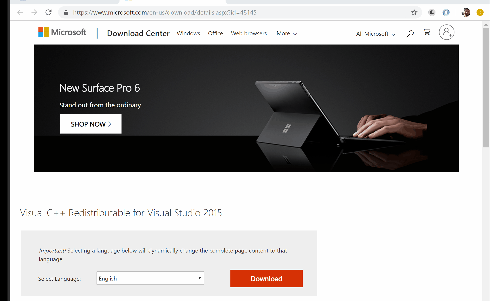

Click on the link above.  Select the `vc_redist_x64.exe` file and click "Download."  Once the file has finished downloading, install it.

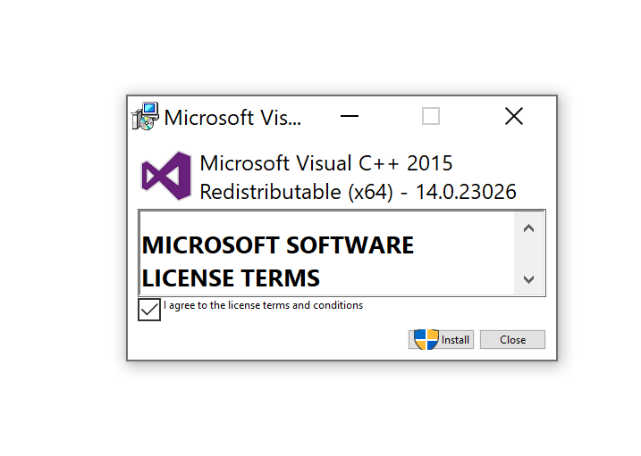

## MySQL Workbench
Ok! Now we are ready to download and install MySQL.  Visit the link below, select your operating system, and choose "Download."

* [MySQL Workbench Download](https://dev.mysql.com/downloads/workbench/)

Select your operating system and hit "Download"
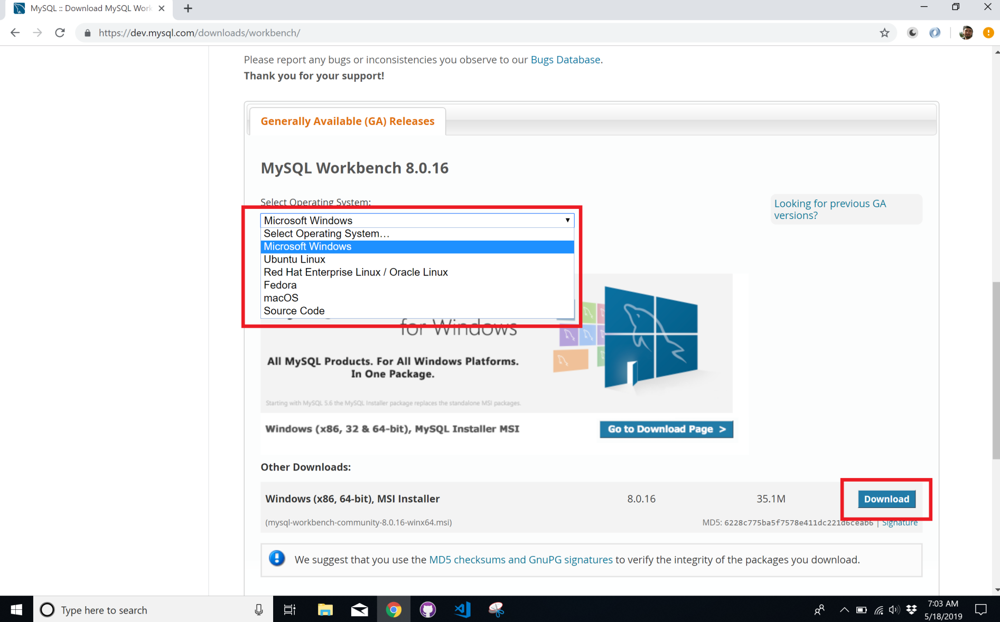

Once the file has finished downloading, run it and follow the install prompts.  All choices are fine left on default.

## Connecting to the Server
Once you've installed MySQL Workbench, open it.  When it comes up you should see the main screen, which looks something like:
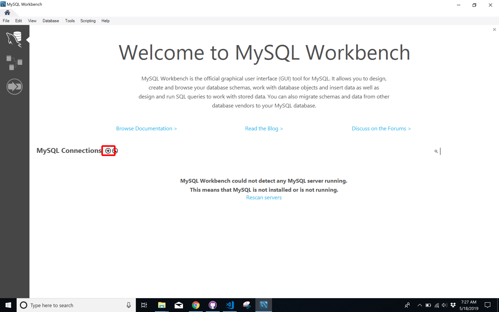

Before we can start querying a database we need to create a database connection.  A "connection" here is all the information MySQL Workbench needs to find the database and what permissions you have regarding data access.


We will be connecting to a database I've setup on a remote computer (connecting to a remote computers is the most common way to interact with a SQL database, however, later I'll show you how to build your own database using CSVs.  This will be hosted on your local PC.

Ok, back to setting up the remote connection.  Click on the circle and plus icon next to "MySQL Connections."  This will cause a screen to pop where you can enter a connection information.  

Enter the following:
```
Connection name: maddatum.com
Hostname: maddatum.com
Username: the username I've provided you
```
Please don't be shy, if you need a username email me at cthomasbrittain at yahoo dot com.  I'll gladly make you one.

Once you've entered the connection information hit "Ok".  You should be brought back to the "Welcome" screen, but now, there will be a connection listed called "maddatum.com".
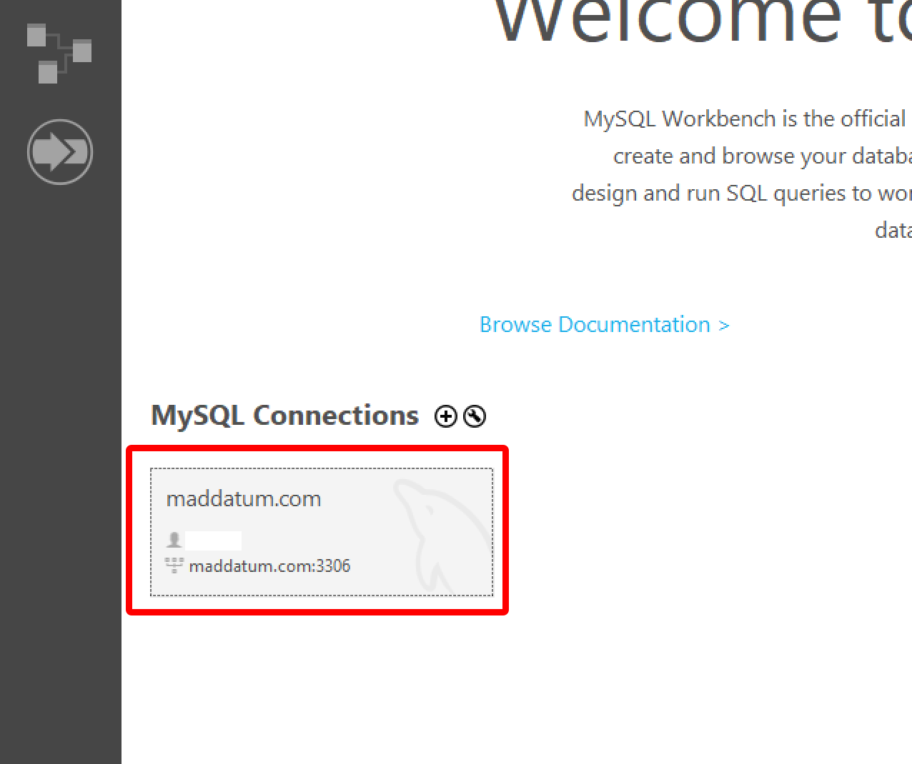

Double click on it.  You will most likely get the following warning.
![sql-connection-warning]](../images/data-analytics-series/mysql_setup_15.PNG)
Click "Continue Anyway" (and if there's an option, check "Dont Show this Message Again").

If the connect was successful you should see a screen like:
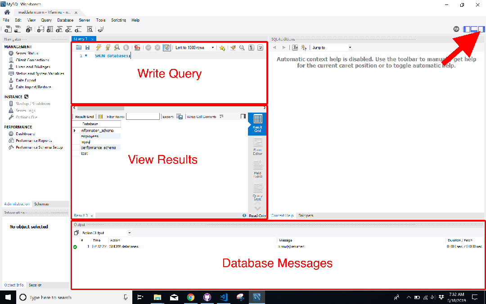

## Show / Use Databases
Alright! Let's get into the action.  Before we start executing queries let me point out a few things in the user interface:
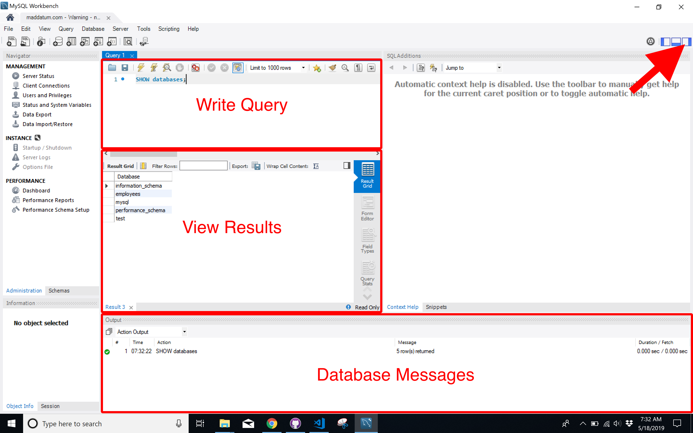

### Write Query
This area is where you will write queries.  Each query should end with a `;`, or the MySQL Workbench will get confused and try to jumble two queries together.

### View Results
This is the area where the result of whatever command you send the SQL will server will be shown.  Often, it will be a table containing data you requested in your query

### Database Messages
Here is where you can spot if you written a query incorrectly, as the database will send a message letting you know.  Also, the database will tell you when it has successfully returned results from a query, how many results, and how long they took to retrieve.  Useful for when you are trying to make a query _fast_.

# Getting Around in MySQL
Lets send a query to the database.  In the query area type:
```sql
SHOW databases;
```
Now, select those text with your mouse and hit the lighting (execute) icon above it.
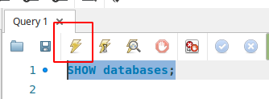

This will return a list of all the databases found on this server.  You should see this in the `View Results` area.  Each SQL server can have multiple databases on it, and they often do.  For right now we want to focus on the `employees` database.
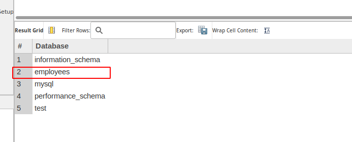

To select a database type `USE` and then the name of the database.  In our case it will be:
```sql
USE employees;
```
Now, highlight the text and hit the execute button.

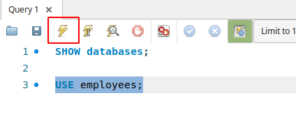

This will show the following in the database messages:

```
13:21:55	USE employees	0 row(s) affected	0.0031 sec
13:21:55	Error loading schema content	Error Code: 1146 Table 'performance_schema.user_variables_by_thread' doesn't exist	
```
Don't worry about the error, that's a product of my hasty setup.  The important message is the `USE employees` message.  This means you are now connected to the `employees` database.  Any query you write in this session will not be sent to this specific database.

But, now what?  We've no idea of what's on the database.  No worries, we've a command to see the tables found on this database.  If you are not familiar with the term "table," don't worry.  Just think of a table as a single spreadsheet.  It's a bit more complicated and we will investigate their structure further in a bit.  But, right now, the spreadsheet analogy works.

To see all the tables this database contains execute the command:
```sql
SHOW tables;
```
This should return the following table names
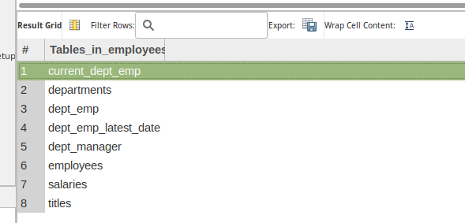

By now, you know the next question, "But how do I know what's in a table?"

You can use the `DESCRIBE` command to get more information about a table.  Let's take a look at the `departments` tables.

Type and execute:
```sql
DESCRIBE departments;
```
This should return:

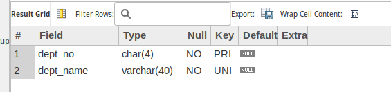
The `Field` column here gives you the names of all the `fields` in the `departments` table.  What's a field?  As with table, we will go into them with more depth later.  But for now, think of a field as a named column in a spreadsheet.


# Our First Query!
Now we know the database, table, and field names, let's write our first query!

Still in the query area type and execute:
```sql
SELECT departments.dept_no, departments.dept_name
FROM departments
```
This will return all the entries for the fields (columns) `dept_no` and `dept_name` for the table (spreadsheet) called `departments`.  You did it! You're a SQL'er. 
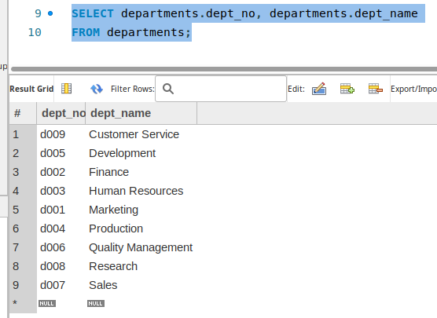

# What Comes Next?
Lot's to come! We will learn a bit more about SQL, it's parts, their proper names.  We'll also dive into the "proper" SQL names for different data parts.  And we'll write tons more queries.

Please feel free to ask any questions in the comments.  I'll answer them ASAP.
