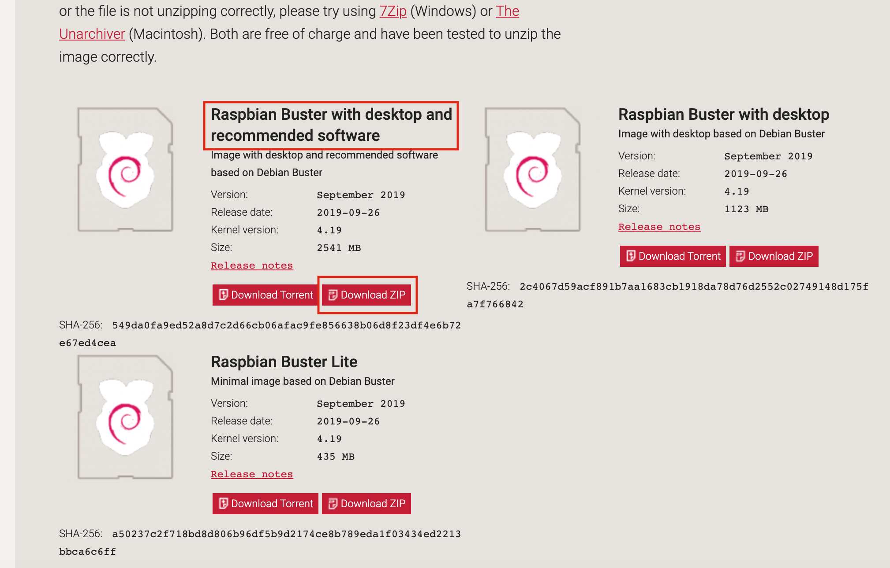
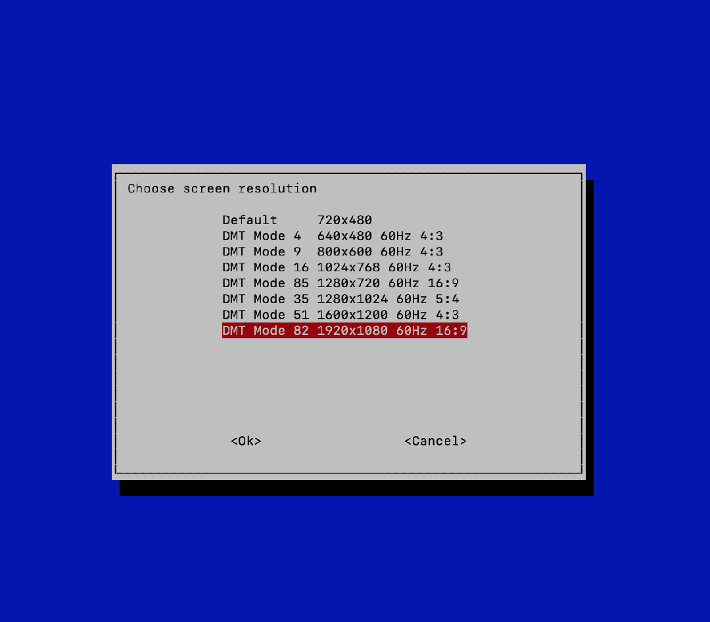
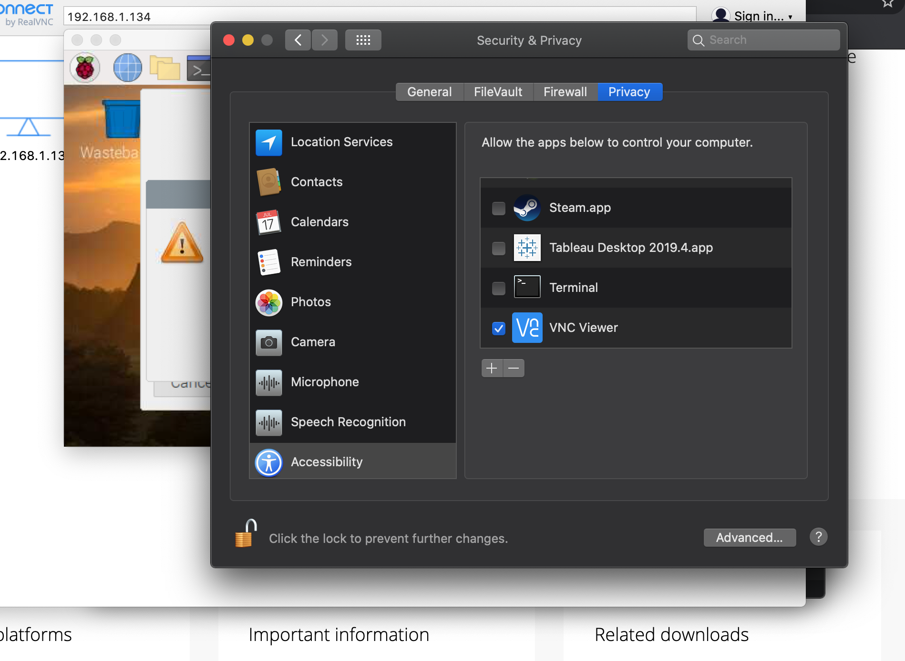
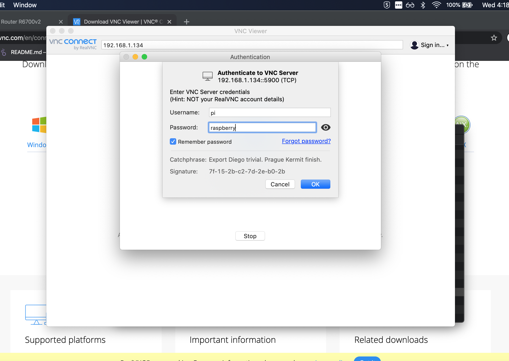

This post shows how to setup a Raspberry Pi 3B+ for operating a [Tensorflow](https://www.tensorflow.org/) CNN model using a [Pi Camera Module v2.0](https://www.raspberrypi.org/products/camera-module-v2/).

## Raspberry Pi Setup
I will be focusing on the Raspberry Pi 3B+, but don't worry if you are using a different Pi.  Just let me know in the comments below and I'll try to get instructions for your particular Pi added.  

1. Download [Raspbian Buster with desktop and recommended software](https://www.raspberrypi.org/downloads/raspbian/)



2. Write the image to a card with at least 8gb.  I use [Etcher](https://www.balena.io/etcher/).
3. Once the image is finished, and before you plug the card into the Pi, open the SD card and create a file called `ssh`.  No extension.  This will enable `ssh` on boot.
4. Plug the card in to the Pi.
5. Plug a LAN cable into the Pi
6. Attach your PiCam.
7. Turn the Pi on.
8. Find the ip of your Pi and `ssh` into it with the following:

```bash
ssh pi@your_pi_ip
```
The password will be `raspberry`

9. Once on the Pi, run the following
```bash
sudo raspi-config
```
This should open a old school GUI.  

Enable the following under `Interfacing Options`
```
Camera
VNC
```
The camera will allow us to use the PiCamera and VNC will allow us to open a a remote desktop environment, which should make it easier adjusting the PiCamera.

(Optional) When working with a remote desktop environment, too high of a resolution can cause responsiveness issues with the VNC client (RealVNC).  To preven this, the Raspbian setup automatically adjusts the Pi resolution to the lowest.  Unfortunately, I find this troublesome when trying to do computer vision stuff from the Pi.  The following will allow you to adjust the resolution--just keep in mind, if it's too high there could be trouble.  Oh, one note here, this is the main reason I'm using a LAN connection to my Pi, as it allows greater throughput than WiFi.

Still in `raspi-config` open `Advanced Options`.  Navigate to `Resolution` and change it to what you'd like.  (I'm going with the highest).


Once you've finished setting these options, exit.  At the end it will ask if you want to reboot, say "Yes."

10. Download and install [RealVNC Viewer](https://www.realvnc.com/en/connect/download/viewer/).
11. Open RealVNC and set the ip to your Pi. Don't include your user name, like we did when `ssh`'ing, because RealVNC is about to ask us for it.  Once you've typed in the ip hit "Enter" or "Return."
12. RealVNC will warn you about singing into your Pi, as it's not a credentialed source.  No worries.  Hit continue.

Note, if you're on a Mac, it's going to ask you to give RealVNC access to keys or something.  (Shesh, Mac, thank you for the security, but, well, shesh.)



13. Enter your credentials.  
```
username: pi
password: raspberry
```


14. This should open your Pi's desktop environment.  It will ask you a few setup questions, go ahead and take care of it.  Note, if you change your password, you will need to update RealVNC (if you had it "Remember My Password").

## Tensorflow Setup
Here's where it gets real.

Open terminal, either in the VNC Pi desktop, or through `ssh`.  Then enter the following commands.
```bash
pip3 install pip3 install https://github.com/lhelontra/tensorflow-on-arm/releases/download/v1.14.0-buster/tensorflow-1.14.0-cp37-none-linux_armv7l.whl
```
The above installs a Tensorflow 1.14 for Python 3.7.x on the Raspberry Pi 3b+ from `ihelontra`'s private Tensorflow ARM builds.  I've found this better, as Google seems to break the installs often.

If you want another combination Tensorflow, Python, and Pi, you can see `ihelontra`'s other `whl` files:

* [tensorflow-on-arm](https://github.com/lhelontra/tensorflow-on-arm)

The script wheel is installed in '/home/pi/.local/bin' which is not on PATH. Consider adding this directory to PATH or, if you prefer to suppress this warning, use --no-warn-script-location.


## Pi Setup
Install `imutils`
```
pip3 intall imutils
```