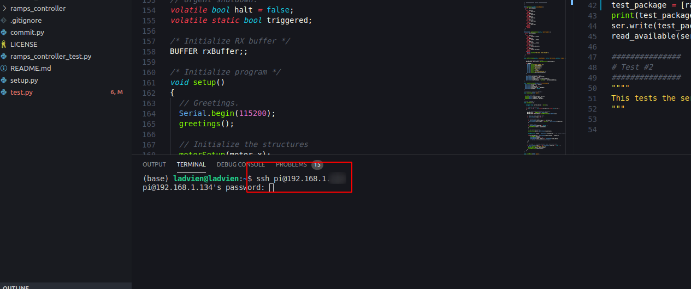
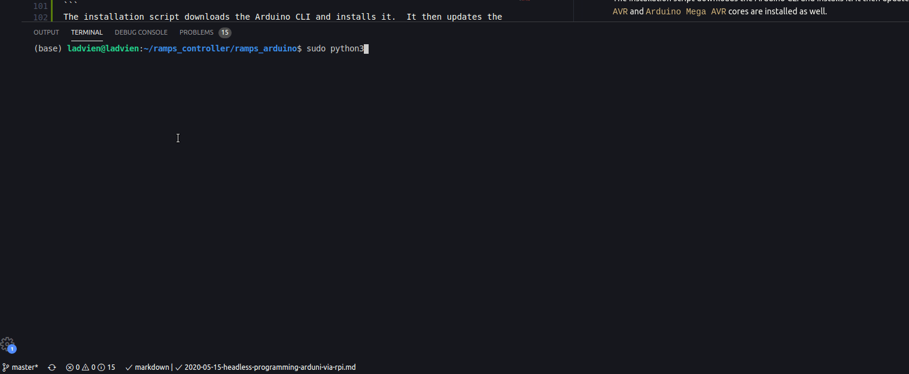

I've been working on an automated system for sorting LEGOs.  It seems like a simple enough task, however, the nuances of implementation are ugly.  I have prototypical solutions for a few of these challenges, such as identifying the LEGO and creating training data for supporting the classifier.  But one of the trickier problems has vexed me: How do we get the LEGO from a container to the classifier?

The answer is obvious, right? A conveyor belt.  They are ubiquitous in manufacturing, so I thought, "Simple.  I'll toss a conveyor belt together real quick and that'll solve that."  Hah.  

After a month and a half of failed attempts, I've eventually created a working prototype.


The system consists of 5 parts:

1. Raspberry Pi
2. Arduino Mega2560
3. RAMPs 1.4 with A4988s
4. Conveyor belt
5. NEMA17 Stepper Motor and Mount

Covering all parts will be too much for one article, so **in this article I'll focus on the setting up the environment** and in a subsequent article I'll review the firmware, software, and physical build.

## Remote VSCode (sshfs)
I hate trying to program on computers other than my workstation; I've also found it problematic to write a program for a Raspberry Pi on a PC.  To get the best of both worlds I use `sshfs`.  It lets me mount Raspberry Pi folders as local folder, enabling editing Raspberry Pi files from my workstation. Nice!


The setup is pretty simple, depending on your workstation's OS.

Luckily, DigitalOcean has already put together a multi-OS walkthrough of setting up `sshfs`

* [How To Use SSHFS to Mount Remote File Systems Over SSH](https://www.digitalocean.com/community/tutorials/how-to-use-sshfs-to-mount-remote-file-systems-over-ssh)

Once you have `sshfs` setup, you can create a directory and mount the entire Raspberry Pi.

For me, running Linux Mint, it was:
```
sshfs pi@192.168.1.x:/home/pi ~/rpi
```
A few notes on the above command:
* The `192.168.1.x` should be replaced with the `ip` of your Raspberry Pi
* `~/rpi` is the local directory where you are going to mount the Raspberry Pi.

If all goes well, you should be able to open your Raspberry Pi files in Visual Studio Code (or IDE of choice) by navigating to the `~/rpi` directory.

To run files, you still have to `ssh` into the Pi.  I usually do this by creating an integrated terminal in Visual Studio Code.



## Arduino CLI Setup
Now I had a way to edit Raspberry Pi files on my PC, but I still needed to be able to connect my Arduino to the Pi and program it from my workstation.  The route I see many people take for doing something like this would be to use a VNC program like RealVNC to access the Pi's desktop remotely.  Gross.  Give my command line back.

Enter [[Arduino's command line interface (CLI)](https://github.com/arduino/arduino-cli)](https://github.com/arduino/arduino-cli).

Now I had all the needed pieces to make for comfortable coding:
* Code the Pi from my workstation using VSCode
* Any software written would be native to the Pi's ARM core.
* I could upload new firmware from the Raspberry Pi to the Arduino; enabling quick iterations

I was pretty excited.  I just need to put the pieces together a little.

## Python Convenience Scripts
First, I had to get the Arduino CLI running on the Raspberry Pi.  That turned out pretty painless.  In fact, I turned the installation into a Python script for you.

### Script for Installing Arduino CLI
You can download my entire setup using `git`.  From your Raspberry Pi's command line run:
```bash
git clone https://github.com/ladvien/ramps_controller.git
cd ramps_controller
python3 arduino-cli_setup.py
```

Or if you prefer to add it to your own Python script:

```python
# 
import os, sys

# Install arduino-cli
os.system('curl -fsSL https://raw.githubusercontent.com/arduino/arduino-cli/master/install.sh | BINDIR=/bin sh')

# Configure arduino-cli
os.system('arduino-cli config init')

# Update the core.
os.system('arduino-cli core update-index')

# Add Arduino AVR and Mega cores.
os.system('arduino-cli core install arduino:avr')
os.system('arduino-cli core install arduino:megaavr')
```
The installation script downloads the Arduino CLI and installs it.  It then updates the Arduino core libraries.  Lastly, it ensure the `AVR` and `Arduino Mega AVR` cores are installed as well.

### Script for Uploading using Arduino CLI
You should now be set to compile and install new firmware directly from the Raspberry Pi to the Arduino Mega2560.  I've also created a firmware installation script, which eases installing new code.

```bash
python3 install_sketch.py
```

At the root of the install script are an Arduino CLI command to compile and then upload:
```python
# Compile
os.system('arduino-cli compile -b arduino:avr:mega ramps_sketch')

# Upload
command_str = f'arduino-cli -v upload -p {write_port} --fqbn arduino:avr:mega ramps_sketch'
os.system(command_str)
```
Feel free to hack the script for other projects.  You can replace the `arduino:avr:mega` with other chipsets and program tons of different devices using the same method.



## Arduino Mega2560 Firmware


### Six-Bit Communication

### Motor Polling


