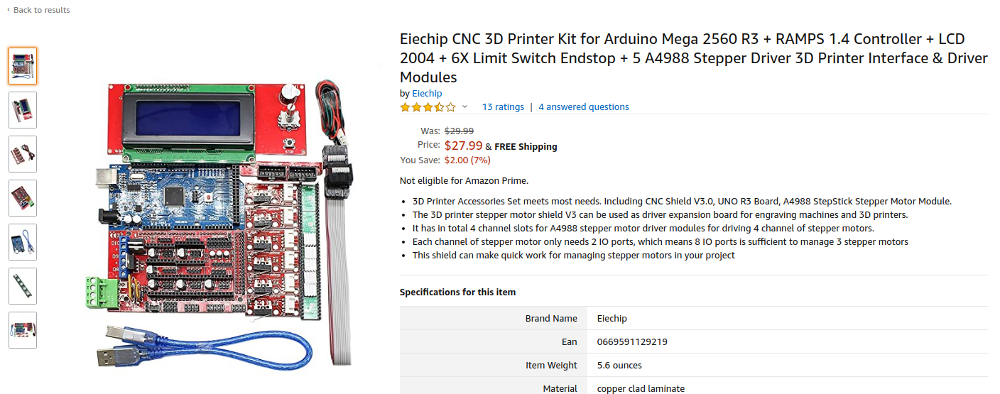

This article is part of a series documenting an attempt to create a LEGO sorting machine.  This portion covers the Arduino Mega2560 firmware I've written to control a RAMPS 1.4 stepper motor board.

## Goal
To move forward with the LEGO sorting machine I needed a way to drive a conveyor belt.  Stepper motors were a fairly obvious choice.  They provide plenty of torque and finite control.  This was great, as several other parts of the LEGO classifier system would need steppers motors as well-e.g.,turn table and dispensing hopper.  Of course, one of the overall goals of this project is to keep the tools accessible.  After some research I decided to meet both goals by purchasing an Ardunio / RAMPs combo package intended for 3D printers.



* [Amazon RAMPs Kits](https://www.amazon.com/s?k=CNC+3D+Printer+Kit+for+Arduino+Mega+2560+R3+RAMPS+1.4&ref=nb_sb_noss)

At the time of the build, these kits were around $28-35 and included:
* Arduino Mega2560
* 4 x Endstops
* 5 x Stepers Drivers (A4988)
* RAMPSs 1.4 board
* Display
* Cables & wires

Seemed like a good deal.  I bought a couple of them. 

I would eventually need:
* 3 x NEMA17 stepper motors
* 12v, 10A Power Supply Unit (PSU)

Luckily, I had the PSU and a few stepper motors lying about the house. 

### Physical Adjustments
Wiring everything up wasn't too bad.  You follow about any RAMPs wiring diagram.  However, I did need to make two adjustments before starting on the firmware.

First, underneath each of the stepper drivers there are three drivers for setting the microsteps of the respective driver.  Having all three jumpers enables maximum microsteps, but would cause the speed of the motor to be limited by the clock cycles of the Arduino--more on that soon.


I've also increased the amperage to the stepper.  This allowed me to drive the entire belt from one NEMA17. 

To set the amperage, get a small phillips screwdriver, two alligator clips, and a multimeter.  Power on your RAMPs board **and carefully** attach the negative probe to the RAMPs `GND`.  Attach the positive probe to an alligator clip and attach the other end to the shaft of your screwdriver.  Use the screwdriver to turn the tiny potentiometer on the stepper driver.  Watch the voltage on the multimeter--we want to use the lowest amperage which effectively drives the conveyor belt.  We are watching the voltage, as it is related to the amperage we are feeding the motors.

```
current_limit = Vref x 2.5
```

Anyway, I found the lowest point for my motor, without skipping steps, was around ~`0.801v`.  

```
current_limit = 0.801 x 2.5
current_limit = 2.0025
```

The your `current_limit` will vary depending on the drag of your conveyor belt and the quality of your stepper motor. To ensure a long-life of your motor, **do not set the amperage higher than needed to do the job.**


## Arduino Code
When I bought the RAMPs board I started thinking, "I should see if we could re-purpose Marlin to drive the conveyor belt easily."  I took one look at the source and said, "Oh hell no."  Learning how to hack Marlin to drive a conveyor belt seemed like learning heart surgery to hack your heart into a gas pump. So, I decided roll my own RAMPs firmware.

My design goals were simple:
* Motors operate independently
* Controlled with small packets via UART
* Include four commands: motor select, direction, speed, duration

That's it.  I prefer to keep stuff as simple as possible, unless absolutely necessary.

I should point out, this project builds on a previous attempt at firmware:

* [Raspbery Pi, Arduino, RAMPS Turntable ](https://ladvien.com/generating-lego-training-data-cnn/)

But that code was flawed.  It was not written with concurrent and independent motor operation in mind.  The result, only one motor could be controlled at a time.

Ok, on to the new code.

### Main

The firmware follows this procedure:

1. Check if a new movement packet has been received.
2. Decode the packet
3. Load direction, steps, and delay (speed) into the appropriate motor struct.
4. Check if a motor has steps to take **and** the timing window for the next step is open.
5. If a motor has steps waiting to be taken, move the motor one step and decrement the respective motor's step counter.
6. Repeat forever.

```cpp
/* Main */
void loop()
{
  if (rxBuffer.packet_complete) {
    // If packet is packet_complete
    handleCompletePacket(rxBuffer);
    // Clear the buffer for the next packet.
    resetBuffer(&rxBuffer);
  }
  
  // Start the motor
  pollMotor();
}
```

### serialEvent

Some code not in the main loop is the the UART RX handler.  It is activated by an RX interrupt.  If the interrupt fires, the new data is quickly loaded into the `rxBuffer`.  If the incoming data contains a `0x03` character, this signals the packet is complete and ready to be decoded.

Here's the packet template:
```cpp
MOTOR_PACKET = CMD_TYPE MOTOR_NUM DIR STEPS_1 STEPS_2 MILLI_BETWEEN 0x03
```
Each motor movement packet consists of seven bytes and five values:
1. `CMD_TYPE` = drive or halt
2. `MOTOR_NUM` = the motor selected X, Y, Z, E0, E1
3. `DIR` = direction of the motor
4. `STEPS_1` = the high 6-bits of of steps to take
5. `STEPS_2` = the low 6-bits of steps to take
6. `MILLI_BETWEEN` = number of milliseconds between each step (speed control)
7. `0x03` = this signals the end of the packet (`ETX`)

Each of these bytes are encoded by left-shifting the bits by two. This means each of the bytes in the packet can only represent 64 values (`2^6 = 64`).

Why add this complication?  Well, we want to be able to send commands to control the firmware, rather than the motors.  The most critical is knowing when the end of a packet is reached.  I'm using the `ETX` char, `0x03` to signal the end of a packet. If we didn't reserve the `0x03` byte then what happens if we send command to the firmware to move the motor 3 steps?  Nothing good.

Here's the flow of a processed command:
```md
1. CMD_TYPE       = DRIVE (0x01)
2. MOTOR_NUM      = X     (0x01)
3. DIR            = CW    (0x01)
4. STEPS          = 4095  (0x0FFF)
5. MILLI_BETWEEN  = 1     (0x01)
```
Note, the maximum value of the `STEPS` byte is greater than 8-bits.  To handle this, we break it into two bytes.  
```md
1. CMD_TYPE       = DRIVE (0x01)
2. MOTOR_NUM      = X     (0x01)
3. DIR            = CW    (0x01)
4. STEPS_1        = 3F
5. STEPS_2        = 3F
5. MILLI_BETWEEN  = 1     (0x01)
```
Here's a sample motor packet before encoding:
```cpp
uint8_t packet[7] = {0x01, 0x01, 0x01, 0x3F, 0x3F, 0x05, 0x03}
```
Now, we have to shift all of the bytes left by two bits, this will ensure `0x00` through `0x03` are reserved for metacommuncation.

This process is a bit easier to see in binary:

**Before** shift:
```md
1. CMD_TYPE       = 0000 0001
2. MOTOR_NUM      = 0000 0001
3. DIR            = 0000 0001
4. STEPS_1        = 0011 1111
5. STEPS_2        = 0011 1111
5. MILLI_BETWEEN  = 0000 0001
```

**After** shift:
```md
1. CMD_TYPE       = 0000 0100
2. MOTOR_NUM      = 0000 0100
3. DIR            = 0000 0100
4. STEPS_1        = 1111 1100
5. STEPS_2        = 1111 1100
5. MILLI_BETWEEN  = 0000 0100
```

And back to hex:
```md
1. CMD_TYPE       = 0x07
2. MOTOR_NUM      = 0000 0100
3. DIR            = 0000 0100
4. STEPS_1        = 1111 1100
5. STEPS_2        = 1111 1100
5. MILLI_BETWEEN  = 0000 0100
```

And after encoding:
```cpp
uint8_t packet[7] = {0x07, 0x04,  0x07,  0xFF, 0xFF, 0x17, 0x03}
```
Notice the last byte is not encoded, as this is a reserved command character.

Here are the `decode` and `encode` functions. Fairly straightforward bitwise operations.
```cpp
uint8_t decode(uint8_t value) {
  return (value >> 2) &~ 0xC0;
}

uint8_t encode(uint8_t value) {
  return (value << 2) | 0x03;
}
```

And the serial handling as a whole:
```cpp
void serialEvent() {

  // Get all the data.
  while (Serial.available()) {

    // Read a byte
    uint8_t inByte = (uint8_t)Serial.read();

    if (inByte == END_TX) {
      rxBuffer.packet_complete = true;
    } else {
      // Store the byte in the buffer.
      inByte = decodePacket(inByte);
      rxBuffer.data[rxBuffer.index] = inByte;
      rxBuffer.index++;
    }
  }
}
```

### handleCompletePacket
When a packet is waiting to be decoded, the `handleCompletePacket()` will be executed.  The first thing the method does is check the `packet_type`.  Keeping it simple, there are only two and I've not implemented the second one yet (`HALT_CMD`)

```cpp
#define DRIVE_CMD       (char)0x01
#define HALT_CMD        (char)0x02
```


```cpp
void handleCompletePacket(BUFFER rxBuffer) {
    
    uint8_t packet_type = rxBuffer.data[0];
      
    switch (packet_type) {
      case DRIVE_CMD:

          // Unpack the command.
          uint8_t motorNumber =  rxBuffer.data[1];
          uint8_t direction =  rxBuffer.data[2];
          uint16_t steps = ((uint8_t)rxBuffer.data[3] << 6)  | (uint8_t)rxBuffer.data[4];
          unsigned long microSecondsDelay = rxBuffer.data[5] * 1000; // Delay comes in as milliseconds.

          if (microSecondsDelay < MINIMUM_STEPPER_DELAY) { microSecondsDelay = MINIMUM_STEPPER_DELAY; }

          // Should we move this motor.
          if (steps > 0) {
            // Set motor state.
            setMotorState(motorNumber, direction, steps, microSecondsDelay);
          }
          
          // Let the master know command is in process.
          sendAck();
        break;
      default:
        sendNack();
        break;
    }
}
```


### pollMotor

```cpp
/* Write to MOTOR */
void pollMotor() {
    unsigned long current_micros = micros();

    // Loop over all motors.
    for (int i = 0; i < int(sizeof(all_motors)/sizeof(int)); i++)
    {

      // Get motor and motorState for this motor.
      MOTOR motor = getMotor(all_motors[i]);
      MOTOR_STATE* motorState = getMotorState(all_motors[i]);
      
      // Check if motor needs to move.
      if (motorState->steps > 0) {

        // Initial step timer.
        if (motorState->next_step_at == SENTINEL) {
          motorState->next_step_at = micros() + motorState->step_delay;
        }

        // Enable motor.
        if (motorState->enabled == false) {
          enableMotor(motor, motorState);
        }

        // Set motor direction.
        setDirection(motor, motorState->direction);

        unsigned long window = motorState->step_delay;  // we should be within this time frame

        if(current_micros - motorState->next_step_at < window) {         
            writeMotor(motor);
            motorState->steps -= 1;
            motorState->next_step_at += motorState->step_delay;
            // Serial.println(motorState->steps);
        }
      }

      // If steps are finished, disable motor and reset state.
      if (motorState->steps == 0 && motorState->enabled == true ) {
        Serial.println("Disabled motor");
        disableMotor(motor, motorState);
        resetMotorState(motorState);
      }
    }
}
```

### Motor


