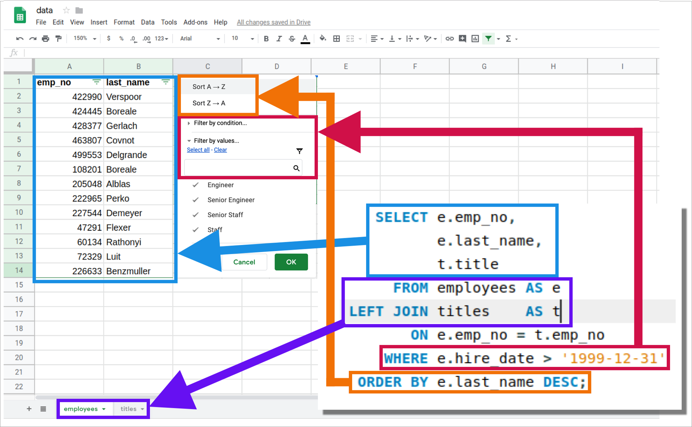

Welcome back! Alright, now we know how to connect to a remote server from within MySQL Workbench, let's start writing some queries.

Here's a common SQL query:
```sql
    SELECT e.emp_no,
		   e.last_name,
           t.title
      FROM employees AS e
 LEFT JOIN titles 	 AS t
        ON e.emp_no = t.emp_no
     WHERE e.hire_date > '1999-12-31'
  ORDER BY e.last_name DESC;
```
This query produces the following table when run on our `employees` database.

| row_num   |   emp_no | last_name   | title           |
|---:|---------:|:------------|:----------------|
|  0 |    47291 | Flexer      | Staff           |
|  1 |    60134 | Rathonyi    | Staff           |
|  2 |    72329 | Luit        | Staff           |
|  3 |   108201 | Boreale     | Senior Engineer |
|  4 |   205048 | Alblas      | Senior Staff    |
|  5 |   222965 | Perko       | Senior Staff    |
|  6 |   226633 | Benzmuller  | Staff           |
|  7 |   227544 | Demeyer     | Senior Staff    |
|  8 |   422990 | Verspoor    | Engineer        |
|  9 |   424445 | Boreale     | Engineer        |
| 10 |   428377 | Gerlach     | Engineer        |
| 11 |   463807 | Covnot      | Engineer        |
| 12 |   499553 | Delgrande   | Engineer        |

When the data are presented like this, it appear similar to our traditional Excel spreadsheet, right?  

Let's go ahead and compare the SQL query and a spreadsheet.



Now, here in a few weeks when you are SQL writing machine you'll notice this analogy between Excel and a SQL query breaks down.  But for now, let the above image comfort you in knowing the core functions of SQL are similar to those of a spreadsheet

* Selecting columns
* Filtering columns and rows
* Ordering rows
* Combining data sets

However, SQL has a lot of superpowers an Excel spreadsheets doesn't.  Of course, the tradeoff is you must leave behind the comfort of a graphical user interface.  But don't let it scare you off--it only takes a 3-4 months to get used to, but then you'll realize how much those graphical interfaces have been chaining you down.

Alright, but to the queries.  Let's take a look at the different parts of the query above.

# SELECT
The `SELECT` statement is how you choose what turns up in the results section.  If don't put something in the `SELECT` area, then you will not get anything.  It is most often used to retrieve data, called fields, from specific table within a database.

### Select Area
You may ask, what is the "SELECT area."  It is everything between the word `SELECT` until `FROM`.
```sql
SELECT -------------------------------
       -- ALL THIS IS THE SELECT AREA
       -------------------------------
FROM
```

### Select Fields
Each item you put in the `SELECT` area should be followed by a comma.  

For example:
```sql
    SELECT  emp_no,
            last_name,
            title
...
```
The code above requests three different fields be returned in the result set: `emp_no`, `last_name`, and `title`. 

I should point out, if you forget a comma it can get messy.  Often, the SQL server will send an error message, **but not always**.  As we will see later in this series.

### Select Calculations
The `SELECT` does more than retrieve data from tables within a database.  It can also perform on-the-fly calculations, such as

```sql
SELECT 1 + 1,
       2 *25,
       55 / 75,
```
This should return the following:

|    |   1 + 1 |   2 *25 |   55 / 75 |
|---:|--------:|--------:|----------:|
|  0 |       2 |      50 |    0.7333 |


# FIELD

Field is column
Table names
Fail query
Style guides


```
SELECT employees.emp_no,
       employees.first_name,
       employees.last_name
FROM employees
```


# FROM
```sql
SELECT *
FROM employees
```


# ORDER BY
```
SELECT employees.emp_no,
       employees.first_name,
       employees.last_name
FROM employees
ORDER BY employees.emp_no
```

```
SELECT employees.emp_no,
       employees.first_name,
       employees.last_name
FROM employees
ORDER BY employees.emp_no DESC
```

```
SELECT employees.emp_no,
       employees.first_name,
       employees.last_name
FROM employees
ORDER BY employees.emp_no ASC
```

```
SELECT employees.emp_no,
       employees.first_name,
       employees.last_name
FROM employees
ORDER BY employees.emp_no, employees.first_name
```

# WHERE
```
SELECT employees.emp_no,
       employees.first_name,
       employees.last_name
FROM employees
WHERE employees.emp_no = 10006
ORDER BY employees.emp_no, employees.first_name
```

# JOIN
