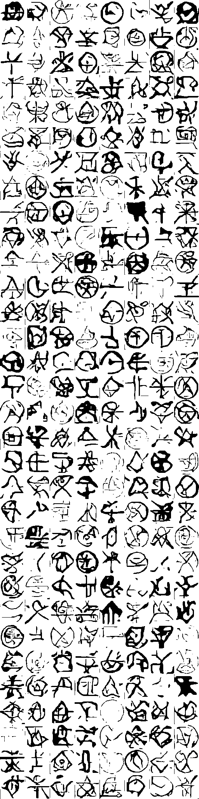
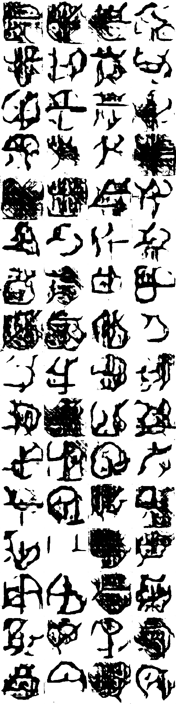

Often, I'll get whims and spend far too long on bringing it to fruition.  This is one of those projects.  There isn't much reason other than lolz and learning.

## What was in my Head
I like folklore.  Of special interest is folklore dealing with magic.  Spells, witches, and summoning the dead, all pique my interests.  I'm guessing I love folklore because it is far removed from what I do every day, engineer data.  I know it might burst the aspirations of young data engineers reading this, but someone has to tell the truth, data engineering, on occasion, can get a bit boring.

To change things up, I thought I'd mix my interest and profession.  I decided to use a generative adversarial network ([GAN](https://en.wikipedia.org/wiki/Generative_adversarial_network)) to see if a computer could learn to make new magic symbols on its own.  After a few days of hacking, here are some highlights:

